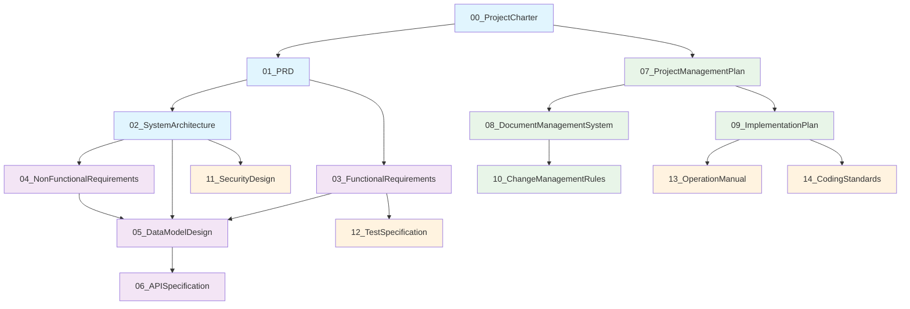

# ERP知識RAGシステム - ドキュメント管理体系・規則

---
doc_type: "document_management_system"
complexity: "high"
estimated_effort: "継続的管理プロセス"
prerequisites: ["00_ProjectCharter.md", "07_ProjectManagementPlan.md"]
implementation_priority: "critical"
ai_assistance_level: "full_automation_possible"
version: "1.0.0"
author: "Claude Code"
created_date: "2025-01-21"
status: "approved"
approval_authority: "Project Stakeholders"
---

## 📋 ドキュメント管理体系概要

### 管理体系の目的
本文書は「ERP知識RAGシステム（ERPFTS）」プロジェクトにおける全ドキュメントの体系的管理、品質保証、継続性確保のための包括的規則を定義する。プロジェクトの知識継続性と作業再開性を最優先に、体系的なドキュメント管理フレームワークを構築する。

### 管理原則
```yaml
基本原則:
  完全性: 全プロジェクト知識の文書化
  一貫性: 統一された規則・形式の適用
  追跡可能性: 変更履歴・依存関係の完全記録
  継続性: 担当者変更時の円滑な引き継ぎ
  品質保証: 継続的な品質維持・向上

管理スコープ:
  - プロジェクト計画・管理文書
  - 技術設計・仕様書
  - 実装ガイド・規約
  - テスト・品質管理文書
  - 運用・保守文書
```

## 📂 ドキュメント分類体系

### ドキュメント階層構造
```
ERPFTS/docs/
├── 00_ProjectCharter.md              # プロジェクト基盤文書
├── 01_PRD.md                         # プロダクト要件定義
├── 02_SystemArchitecture.md          # システムアーキテクチャ
├── 03_FunctionalRequirements.md      # 機能要件仕様
├── 04_NonFunctionalRequirements.md   # 非機能要件仕様
├── 05_DataModelDesign.md             # データモデル設計
├── 06_APISpecification.md            # API仕様書
├── 07_ProjectManagementPlan.md       # プロジェクト管理計画
├── 08_DocumentManagementSystem.md    # 本文書（管理体系）
├── 09_ImplementationPlan.md          # 実装計画・Phase管理
├── 10_ChangeManagementRules.md       # 変更・バージョン管理
├── 11_SecurityDesign.md              # セキュリティ設計
├── 12_TestSpecification.md           # テスト仕様書
├── 13_OperationManual.md             # 知識管理運用手順
├── 14_CodingStandards.md             # コーディング規約・Git運用
├── templates/                         # ドキュメントテンプレート
├── diagrams/                          # 図表・画像ファイル
└── archive/                           # 廃止・旧版ドキュメント
```

### ドキュメントカテゴリ定義
```yaml
Category A - 基盤文書 (Foundation):
  範囲: プロジェクト憲章、PRD、システムアーキテクチャ
  重要度: Critical
  更新頻度: 低（重要な方針変更時のみ）
  承認要件: 全ステークホルダー合意必要

Category B - 設計文書 (Design):
  範囲: 機能要件、非機能要件、データモデル、API仕様
  重要度: High
  更新頻度: 中（開発進捗に応じて）
  承認要件: 技術責任者 + PM承認

Category C - 管理文書 (Management):
  範囲: プロジェクト管理、ドキュメント管理、実装計画
  重要度: High
  更新頻度: 高（進捗・状況に応じて）
  承認要件: PM + ステークホルダー承認

Category D - 実装文書 (Implementation):
  範囲: セキュリティ設計、テスト仕様、運用手順、コーディング規約
  重要度: Medium
  更新頻度: 中（実装・運用段階で）
  承認要件: 技術責任者承認
```

## 🔗 ドキュメント依存関係マップ

### 依存関係図


### 詳細依存関係マトリクス
| 文書 | 直接依存 | 間接依存 | 影響度 | 更新トリガー |
|------|----------|----------|--------|--------------|
| **00_ProjectCharter** | - | 全文書 | Critical | 重大方針変更 |
| **01_PRD** | ProjectCharter | 設計文書群 | High | 要件変更 |
| **02_SystemArchitecture** | PRD | データ・API・セキュリティ | High | アーキテクチャ変更 |
| **03_FunctionalRequirements** | PRD, Architecture | データモデル、テスト | High | 機能追加・変更 |
| **04_NonFunctionalRequirements** | Architecture | 全実装文書 | Medium | 性能・品質要件変更 |
| **05_DataModelDesign** | Architecture, FRS | API、セキュリティ | High | データ構造変更 |
| **06_APISpecification** | DataModel | 実装・テスト | Medium | API変更 |
| **07_ProjectManagementPlan** | ProjectCharter | 管理文書群 | High | 計画変更 |
| **08_DocumentManagementSystem** | PMPlan | 変更管理 | Medium | 管理プロセス変更 |
| **09_ImplementationPlan** | PMPlan | 運用・規約 | High | 実装方針変更 |
| **10_ChangeManagementRules** | DocMgmt | - | Low | プロセス改善 |
| **11_SecurityDesign** | Architecture | 実装文書 | Medium | セキュリティ要件変更 |
| **12_TestSpecification** | FRS | - | Medium | テスト戦略変更 |
| **13_OperationManual** | ImplementationPlan | - | Low | 運用手順変更 |
| **14_CodingStandards** | ImplementationPlan | - | Low | 技術標準変更 |

## 📝 ドキュメント作成・更新規則

### ドキュメントライフサイクル
```yaml
作成段階:
  1. 企画・計画:
     - テンプレート選択・カスタマイズ
     - アウトライン作成・レビュー
     - 依存文書の確認・整合性チェック
  
  2. 作成・執筆:
     - 規定フォーマットに従った執筆
     - 依存関係の明記・リンク設定
     - 図表・コード例の作成
  
  3. レビュー・承認:
     - 内容レビュー（技術・ビジネス観点）
     - 一貫性チェック（他文書との整合性）
     - 最終承認・公開

更新段階:
  1. 変更要求・影響分析:
     - 変更理由・範囲の明確化
     - 依存文書への影響評価
     - 更新計画・スケジュール策定
  
  2. 更新実行:
     - バージョン管理（旧版保持）
     - 更新内容の記録
     - 関連文書の同期更新
  
  3. 検証・反映:
     - 更新内容の検証
     - 関係者への通知
     - ナレッジベース更新

廃止段階:
  - 廃止理由・日時の記録
  - アーカイブ移動
  - 参照元の更新・削除
```

### 文書品質基準
```yaml
内容品質:
  完全性: 必要な情報が過不足なく記載
  正確性: 技術的・事実的な正確さ
  明確性: 曖昧さのない明確な表現
  一貫性: 用語・形式の統一
  実用性: 実際の作業で活用可能

形式品質:
  テンプレート準拠: 規定フォーマット使用
  メタデータ完備: ヘッダー情報完全記載
  リンク整合性: 参照・依存関係の正確性
  バージョン情報: 更新履歴・変更内容明記
  アクセシビリティ: 読みやすさ・検索性

管理品質:
  承認状況: 適切な承認プロセス完了
  依存関係: 他文書との関係明確化
  更新頻度: 適切なタイミングでの更新
  バックアップ: 消失リスクの回避
```

## 🔄 変更管理プロセス

### 変更分類・影響レベル
```yaml
Major変更 (影響度: Critical):
  定義: アーキテクチャ・要件の根本的変更
  例: システム構成変更、主要機能追加・削除
  承認: 全ステークホルダー + PM
  通知: 全プロジェクトメンバー
  依存文書: 5文書以上の更新必要

Minor変更 (影響度: Medium):
  定義: 機能詳細・実装方法の変更
  例: API仕様変更、データ構造調整
  承認: 技術責任者 + PM
  通知: 開発チーム + 関係者
  依存文書: 2-4文書の更新必要

Patch変更 (影響度: Low):
  定義: 誤字脱字・補足・明確化
  例: 表記統一、説明追加、リンク修正
  承認: 文書作成者
  通知: 関係者のみ
  依存文書: 更新不要または1文書のみ
```

### 変更要求フロー

```mermaid
flowchart TD
    A[変更要求] --> B[影響分析]
    B --> C{影響レベル}
    C -->|Major| D[全ステークホルダー承認]
    C -->|Minor| E[技術責任者承認]
    C -->|Patch| F[作成者判断]
    D --> G[更新計画策定]
    E --> G
    F --> H[直接更新]
    G --> I[依存文書特定]
    I --> J[更新実行]
    J --> K[整合性検証]
    K --> L[承認・公開]
    H --> L
    L --> M[変更通知]
    M --> N[完了]
```


### 変更履歴管理
```yaml
変更記録形式:
  日時: YYYY-MM-DD HH:MM:SS
  変更者: 担当者名・役割
  変更タイプ: Major/Minor/Patch
  変更箇所: セクション・ページ番号
  変更内容: 変更前→変更後の概要
  変更理由: 背景・必要性
  影響範囲: 関連文書・システムへの影響
  承認者: 承認者名・承認日時

変更ログ例:
  2025-01-21 14:30:00 | Claude Code (AI) | Major
  セクション: 2.3 データベース設計
  内容: PostgreSQL → SQLite + Chroma DBハイブリッド構成
  理由: 軽量化・デプロイ容易性向上
  影響: 05_DataModelDesign.md, 06_APISpecification.md更新必要
  承認: PM田中 (2025-01-21 15:00:00)
```

## 📋 ドキュメント品質保証

### 品質チェックリスト
```yaml
作成時チェックポイント:
  □ テンプレートに従ったヘッダー情報記載
  □ 目的・スコープ・対象読者の明記
  □ 前提条件・依存関係の明確化
  □ 図表・コード例の適切な配置
  □ 参考文献・外部リンクの記載
  □ 用語集・略語一覧との整合性
  □ Implementation Notes for AI の記載

更新時チェックポイント:
  □ バージョン番号の適切な更新
  □ 更新内容・理由の明記
  □ 依存文書への影響確認・更新
  □ 内部リンク・参照の整合性維持
  □ 変更履歴への適切な記録
  □ 承認プロセスの完了

定期品質監査:
  □ 月次: リンク切れ・参照エラーチェック
  □ 四半期: 内容の正確性・最新性確認
  □ 半年: 依存関係の再評価
  □ 年次: ドキュメント体系全体の見直し
```

### 自動品質チェック
```python
# ドキュメント品質自動チェックスクリプト
import re
import os
from datetime import datetime

class DocumentQualityChecker:
    def __init__(self, docs_dir="/Users/andokohei/Documents/dev/ERPFTS/docs"):
        self.docs_dir = docs_dir
        self.issues = []
    
    def check_document_header(self, file_path):
        """ドキュメントヘッダーの必須項目チェック"""
        required_fields = [
            'doc_type', 'complexity', 'estimated_effort',
            'implementation_priority', 'version', 'author',
            'created_date', 'status'
        ]
        
        with open(file_path, 'r', encoding='utf-8') as f:
            content = f.read()
        
        missing_fields = []
        for field in required_fields:
            if f"{field}:" not in content:
                missing_fields.append(field)
        
        if missing_fields:
            self.issues.append({
                'file': file_path,
                'type': 'missing_header_fields',
                'details': missing_fields
            })
    
    def check_internal_links(self, file_path):
        """内部リンクの整合性チェック"""
        with open(file_path, 'r', encoding='utf-8') as f:
            content = f.read()
        
        # Markdownリンクパターン抽出
        link_pattern = r'\[([^\]]+)\]\(([^)]+\.md)\)'
        links = re.findall(link_pattern, content)
        
        for link_text, link_path in links:
            if not link_path.startswith('http'):
                full_path = os.path.join(self.docs_dir, link_path)
                if not os.path.exists(full_path):
                    self.issues.append({
                        'file': file_path,
                        'type': 'broken_internal_link',
                        'details': f"Link to {link_path} is broken"
                    })
    
    def check_version_consistency(self):
        """バージョン情報の一貫性チェック"""
        versions = {}
        
        for file_name in os.listdir(self.docs_dir):
            if file_name.endswith('.md'):
                file_path = os.path.join(self.docs_dir, file_name)
                with open(file_path, 'r', encoding='utf-8') as f:
                    content = f.read()
                
                version_match = re.search(r'version:\s*"([^"]+)"', content)
                if version_match:
                    versions[file_name] = version_match.group(1)
        
        # バージョン形式チェック (semantic versioning)
        version_pattern = r'^\d+\.\d+\.\d+$'
        for file_name, version in versions.items():
            if not re.match(version_pattern, version):
                self.issues.append({
                    'file': file_name,
                    'type': 'invalid_version_format',
                    'details': f"Version {version} does not follow semantic versioning"
                })
    
    def generate_quality_report(self):
        """品質チェックレポート生成"""
        self.issues = []
        
        # 全ドキュメントをチェック
        for file_name in os.listdir(self.docs_dir):
            if file_name.endswith('.md'):
                file_path = os.path.join(self.docs_dir, file_name)
                self.check_document_header(file_path)
                self.check_internal_links(file_path)
        
        self.check_version_consistency()
        
        # レポート生成
        report = {
            'check_date': datetime.now().isoformat(),
            'total_documents': len([f for f in os.listdir(self.docs_dir) if f.endswith('.md')]),
            'issues_found': len(self.issues),
            'issues': self.issues
        }
        
        return report

# 使用例
checker = DocumentQualityChecker()
quality_report = checker.generate_quality_report()
```

## 👥 コラボレーション・権限管理

### ロール別権限
```yaml
プロジェクトマネージャー (PM):
  読み取り: 全文書
  編集: 管理文書 (Category C)
  承認: Major変更 (全カテゴリ)
  特別権限: アーカイブ・復元

技術責任者 (Tech Lead):
  読み取り: 全文書
  編集: 設計・実装文書 (Category B, D)
  承認: Minor変更 (技術文書)
  特別権限: 技術アーキテクチャ変更

開発者 (Developer):
  読み取り: 技術文書
  編集: 実装文書 (Category D) 
  承認: Patch変更 (担当範囲)
  制限: 基盤・設計文書は読み取りのみ

ステークホルダー (Stakeholder):
  読み取り: 基盤・管理文書 (Category A, C)
  編集: なし
  承認: Major変更 (基盤文書)
  制限: 技術詳細文書はアクセス不可

AI Assistant (Claude):
  読み取り: 全文書
  編集: 全文書 (承認プロセス後)
  承認: なし (承認権限なし)
  特別権限: 一貫性チェック・自動更新
```

### Git ワークフロー
```yaml
ブランチ戦略:
  main: 承認済み最新文書
  develop: 開発中文書統合
  feature/doc-name: 個別文書更新
  hotfix/critical-fix: 緊急修正

プルリクエストルール:
  必須レビュー:
    - Major変更: 2名以上 (PM + Tech Lead)
    - Minor変更: 1名以上 (カテゴリ責任者)
    - Patch変更: セルフレビュー可

  自動チェック:
    - Markdown構文チェック
    - リンク整合性検証
    - 文書品質スコア算出
    - 依存関係整合性確認

  マージ条件:
    - 全自動チェック通過
    - 必須レビュー完了
    - 依存文書更新完了 (必要に応じて)
```

## 📚 ナレッジベース・検索

### 文書検索システム
```yaml
検索機能:
  フルテキスト検索:
    - タイトル・本文・メタデータ
    - 日本語・英語対応
    - ファジー検索・類義語展開
  
  カテゴリ検索:
    - 文書タイプ別
    - 優先度別
    - 作成者別
    - 更新日別
  
  関連性検索:
    - 依存関係による関連文書
    - タグベースの関連性
    - 参照・被参照関係

インデックス戦略:
  - タイトル: 高重み (10.0)
  - 見出し: 中重み (5.0)  
  - 本文: 標準重み (1.0)
  - メタデータ: 高重み (8.0)
  - 更新頻度: 鮮度重み
```

### タグ・分類体系
```yaml
プライマリタグ:
  - #foundation (基盤)
  - #design (設計)
  - #management (管理)
  - #implementation (実装)

セカンダリタグ:
  - #architecture (アーキテクチャ)
  - #api (API関連)
  - #security (セキュリティ)
  - #quality (品質管理)
  - #operation (運用)

ステータスタグ:
  - #draft (草案)
  - #review (レビュー中)
  - #approved (承認済み)
  - #deprecated (廃止予定)
  - #archived (アーカイブ)
```

## 🔄 継続改善・最適化

### パフォーマンス指標
```yaml
効率性指標:
  文書作成時間: 新規作成 vs 更新時間
  レビュー時間: 承認までの所要時間
  検索成功率: 目的文書発見率
  リンク健全性: 切れリンク発生率

品質指標:
  内容正確性: エラー・不整合発生率
  完全性: 必須項目記載率
  最新性: 更新遅延発生率
  利用価値: アクセス頻度・満足度

継続性指標:
  引き継ぎ時間: 新規参加者の理解時間
  作業再開性: 中断後の復帰効率
  ナレッジ損失: 担当者変更時の情報欠損
```

### 定期見直しプロセス
```python
# 月次ドキュメント管理レビュー
def monthly_document_review():
    """月次ドキュメント管理状況レビュー"""
    metrics = {
        'creation_updates': count_document_changes(),
        'link_health': check_link_integrity(),
        'access_patterns': analyze_access_logs(),
        'quality_scores': calculate_quality_metrics()
    }
    
    improvements = identify_improvement_areas(metrics)
    action_plan = generate_action_plan(improvements)
    
    return {
        'review_date': datetime.now().isoformat(),
        'metrics': metrics,
        'improvements': improvements,
        'action_plan': action_plan
    }

# 四半期文書体系見直し
def quarterly_structure_review():
    """四半期ドキュメント構造・プロセス見直し"""
    current_structure = analyze_document_structure()
    dependency_analysis = check_dependency_complexity()
    process_efficiency = measure_process_efficiency()
    
    recommendations = generate_structure_recommendations()
    
    return {
        'structure_analysis': current_structure,
        'dependency_health': dependency_analysis,
        'process_metrics': process_efficiency,
        'recommendations': recommendations
    }
```

## 🤖 Implementation Notes for AI

### Critical Implementation Paths
1. **文書テンプレート標準化**: Markdown + YAML frontmatter → 一貫性確保
2. **自動品質チェック**: Python scripts → CI/CD統合
3. **依存関係管理**: グラフ構造 → 影響分析自動化
4. **バージョン管理**: Git + semantic versioning → 変更追跡

### Key Dependencies
- **文書管理**: Git, Markdown, YAML front matter
- **品質チェック**: Python, regex, file system tools
- **依存性分析**: networkx, graphviz (visualization)
- **検索システム**: Full-text search, tagging system

### Testing Strategy
- **整合性テスト**: リンク・参照の妥当性検証
- **品質テスト**: 文書構造・内容品質の自動チェック
- **プロセステスト**: 変更管理ワークフローの検証
- **継続性テスト**: 引き継ぎ・復旧シナリオテスト

### Common Pitfalls
- **循環依存**: 文書間の不適切な相互参照
- **同期ずれ**: 関連文書の更新タイミング差
- **アクセス権管理**: 過度な制限による作業効率低下
- **バージョン混乱**: 複数バージョンの並行管理

### 実装優先順位
1. **Phase 1**: 基本テンプレート、命名規則、Git管理
2. **Phase 2**: 品質チェック自動化、依存関係管理
3. **Phase 3**: 高度検索、ダッシュボード、分析機能

---

**Version**: 1.0.0 | **Last Updated**: 2025-01-21 | **Next Review**: 2025-02-21