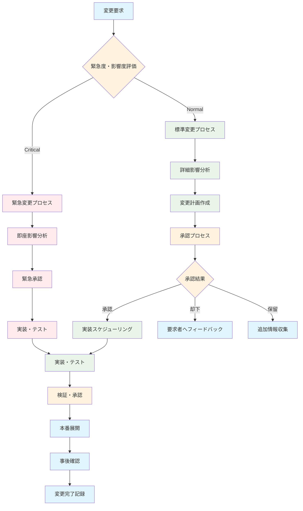

# ERP知識RAGシステム - 変更履歴・バージョン管理ルール

---
doc_type: "change_management_rules"
complexity: "medium"
estimated_effort: "継続的管理プロセス"
prerequisites: ["00_ProjectCharter.md", "07_ProjectManagementPlan.md", "08_DocumentManagementSystem.md"]
implementation_priority: "critical"
ai_assistance_level: "full_automation_possible"
version: "1.0.0"
author: "Claude Code"
created_date: "2025-01-21"
status: "approved"
approval_authority: "Project Stakeholders"
---

## 📋 変更管理・バージョン管理概要

### 管理目的
本文書は「ERP知識RAGシステム（ERPFTS）」プロジェクトにおける変更履歴の完全追跡、バージョン管理の一貫性確保、および作業継続性の保証を目的とする包括的な変更管理ルールを定義する。プロジェクト全体の変更を体系的に管理し、任意の時点での状態復元と影響分析を可能にする。

### 管理原則
```yaml
変更管理基本原則:
  完全性: 全変更の記録・追跡
  一貫性: 統一されたバージョニングルール
  透明性: 変更理由・影響の明確な記録
  可逆性: 任意バージョンへの復元可能性
  継続性: 担当者変更時の円滑な引き継ぎ

適用スコープ:
  - ドキュメント（技術・管理・運用）
  - ソースコード（フロントエンド・バックエンド）
  - 設定ファイル（環境・デプロイ）
  - データベーススキーマ
  - インフラストラクチャ（IaC）
```

## 📊 バージョニング戦略

### セマンティックバージョニング
```yaml
バージョン形式: MAJOR.MINOR.PATCH

MAJOR (X.0.0):
  定義: 互換性を破る重大な変更
  例:
    - システムアーキテクチャの根本変更
    - API仕様の破壊的変更
    - データモデルの大幅変更
    - ユーザーインターフェースの全面改修
  
  承認要件: 全ステークホルダー合意
  通知範囲: 全プロジェクトメンバー
  影響評価: 必須・詳細分析

MINOR (0.X.0):
  定義: 下位互換性のある機能追加
  例:
    - 新機能の追加
    - 既存機能の拡張
    - 新しいAPIエンドポイント追加
    - パフォーマンス改善
  
  承認要件: PM + 技術責任者
  通知範囲: 開発チーム + 関係者
  影響評価: 中程度・標準分析

PATCH (0.0.X):
  定義: バグ修正・軽微な改善
  例:
    - バグ修正
    - 誤字脱字修正
    - ドキュメント更新
    - セキュリティパッチ
  
  承認要件: 技術責任者または文書作成者
  通知範囲: 関係者のみ
  影響評価: 軽微・簡易確認
```

### コンポーネント別バージョニング
```yaml
ドキュメントバージョニング:
  形式: X.Y.Z-YYYYMMDD
  例: 1.2.3-20250121
  
  バージョンアップ規則:
    - 内容の根本的変更: MAJOR
    - セクション追加・大幅更新: MINOR  
    - 誤字修正・軽微な更新: PATCH
    - 日付は最終更新日を記録

ソフトウェアバージョニング:
  形式: X.Y.Z-<ブランチ>+<ビルド番号>
  例: 1.0.0-main+20250121.1
  
  リリースタイプ:
    - alpha: 内部開発版
    - beta: テスト版
    - rc: リリース候補版
    - stable: 安定版

データベースバージョニング:
  形式: Migration_YYYYMMDD_HHMMSS_<説明>
  例: Migration_20250121_143000_add_quality_scores_table
  
  マイグレーション原則:
    - 前進のみ（Forward-only）
    - ロールバック機能必須
    - データ損失防止
    - 段階的実行
```

## 🔄 変更プロセスフロー

### 変更要求から実装まで


### 変更分類・優先度
```yaml
変更分類:
  Emergency (緊急):
    定義: セキュリティ脆弱性、システムダウン、データ損失リスク
    SLA: 申請から実装まで24時間以内
    承認: PM + 技術責任者（事後承認可）
    例: セキュリティパッチ、Critical Bug修正
  
  Standard (標準):
    定義: 計画的な機能追加・改善・保守
    SLA: 申請から実装まで1-2週間
    承認: 影響度に応じた承認プロセス
    例: 新機能追加、パフォーマンス改善
  
  Routine (定常):
    定義: 定期的なメンテナンス・更新
    SLA: 申請から実装まで1週間以内
    承認: 技術責任者または作成者
    例: ドキュメント更新、依存関係更新

影響度評価基準:
  High (高):
    - 複数システムコンポーネントに影響
    - 5名以上のユーザーに影響
    - ダウンタイム発生の可能性
    - データ移行・変換が必要
  
  Medium (中):
    - 単一システムコンポーネントに影響
    - 特定ユーザーグループに影響
    - 既存機能の変更・拡張
    - 設定変更が必要
  
  Low (低):
    - 局所的な変更
    - ユーザーへの影響最小限
    - 内部処理の改善
    - 文書・コメント更新
```

## 📝 変更記録フォーマット

### 変更ログエントリ標準
```yaml
変更ログエントリ構造:
  変更ID: CHG-YYYY-NNNN (例: CHG-2025-0001)
  タイムスタンプ: YYYY-MM-DD HH:MM:SS JST
  変更者情報:
    - 名前・役割
    - 連絡先
    - 承認者
  
  変更内容:
    - 変更タイプ: Emergency/Standard/Routine
    - 影響度: High/Medium/Low
    - 変更箇所: ファイル名・行番号・セクション
    - 変更前の状態
    - 変更後の状態
  
  背景・理由:
    - 変更の必要性
    - ビジネス価値・技術的価値
    - 参考資料・根拠
  
  影響分析:
    - 影響を受けるコンポーネント
    - 依存関係への影響
    - リスク・副作用
    - テスト必要範囲
  
  検証・テスト:
    - 実施したテスト内容
    - テスト結果
    - 確認者・承認者
    - 残課題・フォローアップ事項
```

### 変更ログ例
```yaml
変更ID: CHG-2025-0001
日時: 2025-01-21 14:30:00 JST
変更者: Claude Code (AI Assistant)
承認者: 田中PM (2025-01-21 15:00:00)

変更タイプ: Standard
影響度: Medium
バージョン: 05_DataModelDesign.md 1.0.0 → 1.1.0

変更箇所:
  ファイル: /docs/05_DataModelDesign.md
  セクション: 2.3 データベース構成
  行番号: 26-35

変更内容:
  変更前: PostgreSQL単体構成
  変更後: SQLite + Chroma DBハイブリッド構成
  
  詳細:
    - 軽量化のためSQLiteをメタデータ管理に採用
    - ベクトル検索はChroma DB専用化
    - 開発・テスト環境での構築容易性向上

変更理由:
  - デプロイメント複雑性の軽減
  - 開発環境構築時間の短縮
  - 小規模運用での運用コスト削減
  - MVP段階での技術リスク軽減

影響分析:
  影響コンポーネント:
    - 06_APISpecification.md (データベース接続部分)
    - 実装予定のデータアクセス層
    - 開発環境セットアップスクリプト
  
  依存関係:
    - SQLAlchemy設定の変更必要
    - データマイグレーション戦略の見直し
    - バックアップ戦略の調整

  リスク:
    - SQLiteの同時アクセス制限
    - 将来的なPostgreSQL移行の複雑さ
    - パフォーマンス特性の違い

検証・テスト:
  実施済み:
    - ドキュメント整合性チェック
    - 依存関係の確認・更新計画策定
    - 技術検証（SQLite + Chroma DB連携）
  
  フォローアップ:
    - 06_APISpecification.md の更新
    - SQLite制限の詳細調査
    - PostgreSQL移行計画の策定

ステータス: 完了
次回レビュー: 2025-02-21
```

## 🔀 Git ワークフロー・ブランチ戦略

### ブランチ管理戦略
```yaml
メインブランチ:
  main:
    - 本番環境と同等の安定版
    - 常にリリース可能な状態を維持
    - 直接コミット禁止・PR必須
    - 保護ルール: レビュー必須、ステータスチェック必須
  
  develop:
    - 開発中機能の統合ブランチ
    - feature ブランチのマージ先
    - 定期的に main へマージ
    - 統合テスト実行対象

開発ブランチ:
  feature/<機能名>:
    - 新機能・改善の開発用
    - develop からブランチ作成
    - 完了後 develop へマージ
    - 例: feature/semantic-search
  
  docs/<文書名>:
    - ドキュメント更新専用
    - main または develop からブランチ作成
    - レビュー後該当ブランチへマージ
    - 例: docs/api-specification-update

メンテナンスブランチ:
  hotfix/<修正名>:
    - 緊急修正用
    - main からブランチ作成
    - main と develop 両方へマージ
    - 例: hotfix/security-patch-001
  
  release/<バージョン>:
    - リリース準備用
    - develop からブランチ作成
    - バグ修正・最終調整のみ
    - 例: release/1.0.0
```

### コミット規約
```yaml
コミットメッセージ形式:
  <type>(<scope>): <subject>
  
  <body>
  
  <footer>

Type (必須):
  feat: 新機能追加
  fix: バグ修正
  docs: ドキュメント変更
  style: コードスタイル変更（機能影響なし）
  refactor: リファクタリング
  test: テスト追加・修正
  chore: ビルド・設定変更

Scope (推奨):
  - api: API関連
  - ui: ユーザーインターフェース
  - db: データベース関連
  - docs: ドキュメント
  - config: 設定ファイル

Subject (必須):
  - 50文字以内
  - 動詞で開始（現在形）
  - 末尾にピリオド不要
  - 英語または日本語

Body (任意):
  - 変更理由・詳細説明
  - 72文字で改行
  - What/Why を記載

Footer (任意):
  - Breaking Change: 破壊的変更の説明
  - Closes #123: 関連Issue番号
  - Co-authored-by: 共同作業者
```

### プルリクエスト運用ルール
```yaml
PR作成時要件:
  タイトル:
    - 変更内容を簡潔に表現
    - [BREAKING] プレフィックス（破壊的変更時）
    - Issue番号を含める（例: #123 を修正）
  
  説明文テンプレート:
    ## 変更内容
    - [ ] 機能追加
    - [ ] バグ修正
    - [ ] ドキュメント更新
    - [ ] リファクタリング
    
    ## 変更理由
    
    ## 影響範囲
    
    ## テスト内容
    
    ## レビューポイント
    
    ## チェックリスト
    - [ ] テストが通ることを確認
    - [ ] ドキュメントを更新
    - [ ] Breaking Change がある場合は明記

レビュー要件:
  必須レビュー数:
    - ドキュメント変更: 1名以上
    - コード変更: 2名以上
    - 重要な変更: 3名以上
  
  レビュー観点:
    - 機能要件の満足
    - コード品質・可読性
    - セキュリティリスク
    - パフォーマンス影響
    - ドキュメント整合性
  
  承認条件:
    - 全必須レビュー完了
    - CI/CDパイプライン成功
    - Conflict解決済み
    - 関連ドキュメント更新済み

マージ戦略:
  マージ方式:
    - Squash and merge: feature ブランチ
    - Merge commit: release, hotfix ブランチ
    - Rebase and merge: 単純な修正
  
  マージ後処理:
    - ブランチ削除
    - 関連Issue クローズ
    - 次期対応が必要な場合は新Issue作成
```

## 📋 変更追跡・監査

### 変更履歴データベース
```yaml
変更履歴テーブル設計:
  change_log:
    id: UUID (Primary Key)
    change_id: VARCHAR(20) # CHG-YYYY-NNNN
    timestamp: TIMESTAMP
    change_type: ENUM(Emergency, Standard, Routine)
    impact_level: ENUM(High, Medium, Low)
    
    author_name: VARCHAR(100)
    author_role: VARCHAR(50)
    approver_name: VARCHAR(100)
    approval_timestamp: TIMESTAMP
    
    component_type: ENUM(Document, Code, Database, Config)
    component_name: VARCHAR(255)
    file_path: TEXT
    
    version_before: VARCHAR(50)
    version_after: VARCHAR(50)
    
    change_summary: TEXT
    change_reason: TEXT
    impact_analysis: TEXT
    
    git_commit_hash: VARCHAR(40)
    git_branch: VARCHAR(100)
    pull_request_id: INTEGER
    
    test_results: TEXT
    rollback_plan: TEXT
    
    status: ENUM(Planned, InProgress, Completed, Failed, Rolled Back)
    created_at: TIMESTAMP
    updated_at: TIMESTAMP

変更ファイル履歴テーブル:
  change_files:
    id: UUID (Primary Key)
    change_log_id: UUID (Foreign Key)
    file_path: TEXT
    change_type: ENUM(Added, Modified, Deleted, Renamed)
    lines_added: INTEGER
    lines_deleted: INTEGER
    file_hash_before: VARCHAR(64)
    file_hash_after: VARCHAR(64)
```

### 自動変更追跡
```python
# 変更自動追跡システム
import hashlib
import json
from datetime import datetime
from typing import Dict, List, Optional

class ChangeTracker:
    def __init__(self, database_connection):
        self.db = database_connection
        self.current_session = None
    
    def start_change_session(self, change_type: str, author: str, description: str) -> str:
        """変更セッション開始"""
        change_id = self.generate_change_id()
        
        self.current_session = {
            'change_id': change_id,
            'timestamp': datetime.now(),
            'change_type': change_type,
            'author': author,
            'description': description,
            'files_changed': [],
            'git_commits': []
        }
        
        return change_id
    
    def track_file_change(self, file_path: str, change_type: str):
        """ファイル変更追跡"""
        if not self.current_session:
            raise ValueError("No active change session")
        
        file_info = {
            'file_path': file_path,
            'change_type': change_type,
            'timestamp': datetime.now(),
            'hash_before': self.calculate_file_hash(file_path + '.backup'),
            'hash_after': self.calculate_file_hash(file_path)
        }
        
        self.current_session['files_changed'].append(file_info)
    
    def finalize_change_session(self, approver: str, test_results: str) -> Dict:
        """変更セッション完了"""
        if not self.current_session:
            raise ValueError("No active change session")
        
        # データベースに記録
        change_record = {
            **self.current_session,
            'approver': approver,
            'approval_timestamp': datetime.now(),
            'test_results': test_results,
            'status': 'Completed'
        }
        
        self.save_to_database(change_record)
        
        # セッションリセット
        completed_session = self.current_session
        self.current_session = None
        
        return completed_session
    
    def generate_change_id(self) -> str:
        """変更ID生成"""
        year = datetime.now().year
        count = self.get_change_count_for_year(year) + 1
        return f"CHG-{year}-{count:04d}"
    
    def calculate_file_hash(self, file_path: str) -> str:
        """ファイルハッシュ計算"""
        try:
            with open(file_path, 'rb') as f:
                return hashlib.sha256(f.read()).hexdigest()
        except FileNotFoundError:
            return ""
    
    def get_change_count_for_year(self, year: int) -> int:
        """年間変更数取得"""
        query = """
        SELECT COUNT(*) FROM change_log 
        WHERE EXTRACT(YEAR FROM timestamp) = %s
        """
        result = self.db.execute(query, (year,))
        return result.fetchone()[0]
    
    def save_to_database(self, change_record: Dict):
        """データベース保存"""
        # メイン変更ログ保存
        main_query = """
        INSERT INTO change_log (
            change_id, timestamp, change_type, impact_level,
            author_name, approver_name, approval_timestamp,
            change_summary, test_results, status
        ) VALUES (%s, %s, %s, %s, %s, %s, %s, %s, %s, %s)
        """
        
        self.db.execute(main_query, (
            change_record['change_id'],
            change_record['timestamp'],
            change_record['change_type'],
            'Medium',  # デフォルト値
            change_record['author'],
            change_record['approver'],
            change_record['approval_timestamp'],
            change_record['description'],
            change_record['test_results'],
            change_record['status']
        ))
        
        # ファイル変更履歴保存
        for file_change in change_record['files_changed']:
            file_query = """
            INSERT INTO change_files (
                change_log_id, file_path, change_type,
                file_hash_before, file_hash_after
            ) VALUES (%s, %s, %s, %s, %s)
            """
            
            self.db.execute(file_query, (
                change_record['change_id'],
                file_change['file_path'],
                file_change['change_type'],
                file_change['hash_before'],
                file_change['hash_after']
            ))

# 使用例
tracker = ChangeTracker(database_connection)

# 変更開始
change_id = tracker.start_change_session(
    change_type="Standard",
    author="Claude Code",
    description="データモデル設計書の構成変更"
)

# ファイル変更追跡
tracker.track_file_change(
    "/docs/05_DataModelDesign.md",
    "Modified"
)

# 変更完了
completed_change = tracker.finalize_change_session(
    approver="田中PM",
    test_results="ドキュメント整合性チェック完了"
)
```

## 📈 変更分析・レポート

### 変更統計・トレンド分析
```python
# 変更分析レポート生成
class ChangeAnalytics:
    def __init__(self, database_connection):
        self.db = database_connection
    
    def generate_monthly_report(self, year: int, month: int) -> Dict:
        """月次変更レポート生成"""
        
        # 基本統計
        basic_stats = self.get_basic_statistics(year, month)
        
        # 変更タイプ別分析
        type_analysis = self.analyze_by_change_type(year, month)
        
        # 影響度別分析
        impact_analysis = self.analyze_by_impact_level(year, month)
        
        # 担当者別分析
        author_analysis = self.analyze_by_author(year, month)
        
        # トレンド分析
        trend_analysis = self.analyze_trends(year, month)
        
        return {
            'period': f"{year}-{month:02d}",
            'basic_statistics': basic_stats,
            'change_type_analysis': type_analysis,
            'impact_analysis': impact_analysis,
            'author_analysis': author_analysis,
            'trend_analysis': trend_analysis,
            'recommendations': self.generate_recommendations(basic_stats, trend_analysis)
        }
    
    def get_basic_statistics(self, year: int, month: int) -> Dict:
        """基本統計情報取得"""
        query = """
        SELECT 
            COUNT(*) as total_changes,
            COUNT(CASE WHEN change_type = 'Emergency' THEN 1 END) as emergency_changes,
            COUNT(CASE WHEN change_type = 'Standard' THEN 1 END) as standard_changes,
            COUNT(CASE WHEN change_type = 'Routine' THEN 1 END) as routine_changes,
            COUNT(CASE WHEN status = 'Completed' THEN 1 END) as completed_changes,
            COUNT(CASE WHEN status = 'Failed' THEN 1 END) as failed_changes,
            AVG(EXTRACT(EPOCH FROM (approval_timestamp - timestamp))/3600) as avg_approval_time_hours
        FROM change_log 
        WHERE EXTRACT(YEAR FROM timestamp) = %s 
        AND EXTRACT(MONTH FROM timestamp) = %s
        """
        
        result = self.db.execute(query, (year, month)).fetchone()
        
        return {
            'total_changes': result[0],
            'emergency_changes': result[1],
            'standard_changes': result[2],
            'routine_changes': result[3],
            'completed_changes': result[4],
            'failed_changes': result[5],
            'success_rate': (result[4] / result[0] * 100) if result[0] > 0 else 0,
            'average_approval_time_hours': round(result[6], 2) if result[6] else 0
        }
    
    def analyze_trends(self, year: int, month: int) -> Dict:
        """トレンド分析"""
        # 過去3ヶ月との比較
        trend_query = """
        SELECT 
            DATE_TRUNC('month', timestamp) as month,
            COUNT(*) as change_count,
            COUNT(CASE WHEN status = 'Failed' THEN 1 END) as failed_count
        FROM change_log 
        WHERE timestamp >= %s - INTERVAL '3 months'
        AND timestamp < %s + INTERVAL '1 month'
        GROUP BY DATE_TRUNC('month', timestamp)
        ORDER BY month
        """
        
        current_date = f"{year}-{month:02d}-01"
        results = self.db.execute(trend_query, (current_date, current_date)).fetchall()
        
        trend_data = []
        for result in results:
            trend_data.append({
                'month': result[0].strftime('%Y-%m'),
                'change_count': result[1],
                'failed_count': result[2],
                'success_rate': ((result[1] - result[2]) / result[1] * 100) if result[1] > 0 else 0
            })
        
        return {
            'monthly_trend': trend_data,
            'trend_direction': self.calculate_trend_direction(trend_data),
            'quality_improvement': self.analyze_quality_trend(trend_data)
        }
    
    def generate_recommendations(self, basic_stats: Dict, trend_analysis: Dict) -> List[str]:
        """改善提案生成"""
        recommendations = []
        
        # 成功率が低い場合
        if basic_stats['success_rate'] < 95:
            recommendations.append(
                f"変更成功率が{basic_stats['success_rate']:.1f}%と低下しています。"
                "事前テストの強化やレビュープロセスの見直しを検討してください。"
            )
        
        # 承認時間が長い場合
        if basic_stats['average_approval_time_hours'] > 24:
            recommendations.append(
                f"平均承認時間が{basic_stats['average_approval_time_hours']:.1f}時間と長期化しています。"
                "承認フローの簡素化や自動化を検討してください。"
            )
        
        # 緊急変更が多い場合
        emergency_ratio = (basic_stats['emergency_changes'] / basic_stats['total_changes'] * 100) if basic_stats['total_changes'] > 0 else 0
        if emergency_ratio > 20:
            recommendations.append(
                f"緊急変更の割合が{emergency_ratio:.1f}%と高くなっています。"
                "計画的な変更管理と予防保守の強化を検討してください。"
            )
        
        return recommendations
```

### 変更リスク評価
```yaml
リスク評価基準:
  技術リスク:
    - 変更の複雑性
    - 影響範囲の広さ
    - テストカバレッジ
    - ロールバック可能性
  
  スケジュールリスク:
    - 変更所要時間
    - 依存関係の複雑さ
    - リソース可用性
    - 外部要因依存
  
  品質リスク:
    - 過去の失敗率
    - レビュー品質
    - テスト網羅性
    - 運用への影響

リスクスコア計算:
  Total Risk Score = (Technical Risk × 0.4) + (Schedule Risk × 0.3) + (Quality Risk × 0.3)
  
  スコア範囲: 1-10
  - 1-3: 低リスク (緑)
  - 4-6: 中リスク (黄)
  - 7-10: 高リスク (赤)

リスク軽減策:
  高リスク変更:
    - 追加レビュー必須
    - 段階的実装
    - 詳細テスト計画
    - ロールバック手順準備
  
  中リスク変更:
    - 標準レビュープロセス
    - 基本テスト実施
    - 影響監視
  
  低リスク変更:
    - 簡易レビュー
    - 基本動作確認
    - 事後監視
```

## 🔄 ロールバック・復旧戦略

### ロールバック手順
```yaml
ロールバック分類:
  Hot Rollback (緊急復旧):
    - 対象: 本番環境での重大問題
    - 時間制限: 30分以内
    - 手順: 自動化スクリプト使用
    - 承認: 技術責任者のみ
  
  Warm Rollback (計画復旧):
    - 対象: 計画的な変更取り消し
    - 時間制限: 4時間以内
    - 手順: 標準手順書に従い
    - 承認: PM + 技術責任者
  
  Cold Rollback (完全復旧):
    - 対象: 複雑な変更の完全取り消し
    - 時間制限: 24時間以内
    - 手順: カスタム復旧計画
    - 承認: 全ステークホルダー

ロールバック実行手順:
  1. 問題状況の確認・記録
  2. ロールバック影響範囲の特定
  3. 関係者への緊急通知
  4. データバックアップの確認
  5. ロールバック実行
  6. 動作確認・検証
  7. サービス復旧確認
  8. 事後分析・改善計画策定
```

### 自動ロールバック機能
```python
# 自動ロールバックシステム
class AutoRollbackSystem:
    def __init__(self, database_connection, git_repository):
        self.db = database_connection
        self.git = git_repository
        self.rollback_triggers = []
    
    def register_rollback_trigger(self, condition: str, action: str):
        """ロールバックトリガー登録"""
        self.rollback_triggers.append({
            'condition': condition,
            'action': action,
            'enabled': True
        })
    
    def monitor_system_health(self):
        """システム健全性監視"""
        health_metrics = self.collect_health_metrics()
        
        for trigger in self.rollback_triggers:
            if trigger['enabled'] and self.evaluate_condition(trigger['condition'], health_metrics):
                self.execute_rollback(trigger['action'])
    
    def execute_rollback(self, rollback_plan: str):
        """ロールバック実行"""
        rollback_id = self.generate_rollback_id()
        
        try:
            # ロールバック開始ログ
            self.log_rollback_start(rollback_id, rollback_plan)
            
            # Git履歴から復旧対象確定
            target_commit = self.identify_stable_commit()
            
            # データベース状態の保存
            self.backup_current_state(rollback_id)
            
            # ロールバック実行
            self.perform_rollback(target_commit, rollback_plan)
            
            # 動作確認
            verification_result = self.verify_rollback_success()
            
            if verification_result['success']:
                self.log_rollback_success(rollback_id, verification_result)
                self.notify_rollback_completion(rollback_id)
            else:
                self.log_rollback_failure(rollback_id, verification_result)
                self.escalate_rollback_failure(rollback_id)
                
        except Exception as e:
            self.log_rollback_error(rollback_id, str(e))
            self.emergency_escalation(rollback_id, e)
    
    def identify_stable_commit(self) -> str:
        """安定版コミット特定"""
        # 最新のmainブランチから安定したコミットを特定
        stable_commits = self.git.get_commits_with_tag('stable')
        
        if stable_commits:
            return stable_commits[0]
        
        # タグがない場合は最新のテスト通過コミットを使用
        return self.git.get_latest_tested_commit()
    
    def perform_rollback(self, target_commit: str, rollback_plan: str):
        """実際のロールバック処理"""
        if rollback_plan == 'git_revert':
            self.git.revert_to_commit(target_commit)
        elif rollback_plan == 'database_restore':
            self.restore_database_from_backup()
        elif rollback_plan == 'service_restart':
            self.restart_services()
        elif rollback_plan == 'full_rollback':
            self.git.revert_to_commit(target_commit)
            self.restore_database_from_backup()
            self.restart_services()
    
    def verify_rollback_success(self) -> Dict:
        """ロールバック成功確認"""
        verification_tests = [
            self.test_database_connectivity(),
            self.test_api_endpoints(),
            self.test_search_functionality(),
            self.test_user_interface()
        ]
        
        all_passed = all(test['passed'] for test in verification_tests)
        
        return {
            'success': all_passed,
            'test_results': verification_tests,
            'timestamp': datetime.now()
        }
```

## 🤖 Implementation Notes for AI

### Critical Implementation Paths
1. **変更追跡自動化**: Git hooks + データベース記録 → 完全な変更履歴
2. **バージョン管理統一**: セマンティックバージョニング + 自動タグ付け
3. **承認ワークフロー**: GitHub PR + レビュー要件 → 品質保証
4. **ロールバック機能**: 自動検知 + 段階的復旧 → 障害最小化

### Key Dependencies
- **バージョン管理**: Git, GitHub, semver
- **変更追跡**: Python scripts, PostgreSQL/SQLite
- **自動化**: GitHub Actions, CI/CD pipelines
- **監視**: 健全性チェック、アラートシステム

### Testing Strategy
- **変更プロセステスト**: ワークフロー検証、承認プロセステスト
- **ロールバックテスト**: 障害シミュレーション、復旧手順検証
- **整合性テスト**: データ整合性、バージョン整合性
- **監査テスト**: 変更履歴完全性、追跡可能性

### Common Pitfalls
- **変更記録漏れ**: 手動変更の記録忘れ
- **バージョン不整合**: 異なるコンポーネント間のバージョン齟齬
- **ロールバック複雑化**: 複雑な依存関係による復旧困難
- **承認遅延**: 承認プロセスのボトルネック

### 実装優先順位
1. **Phase 1**: 基本Git workflow、簡易変更追跡
2. **Phase 2**: 自動変更記録、承認ワークフロー自動化
3. **Phase 3**: 高度分析、予測的ロールバック

---

**Version**: 1.0.0 | **Last Updated**: 2025-01-21 | **Next Review**: 2025-02-21