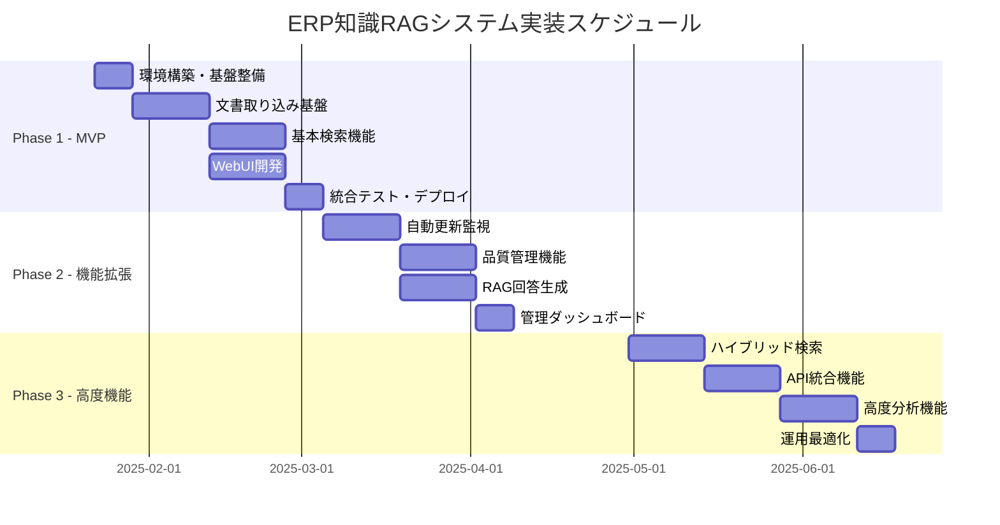
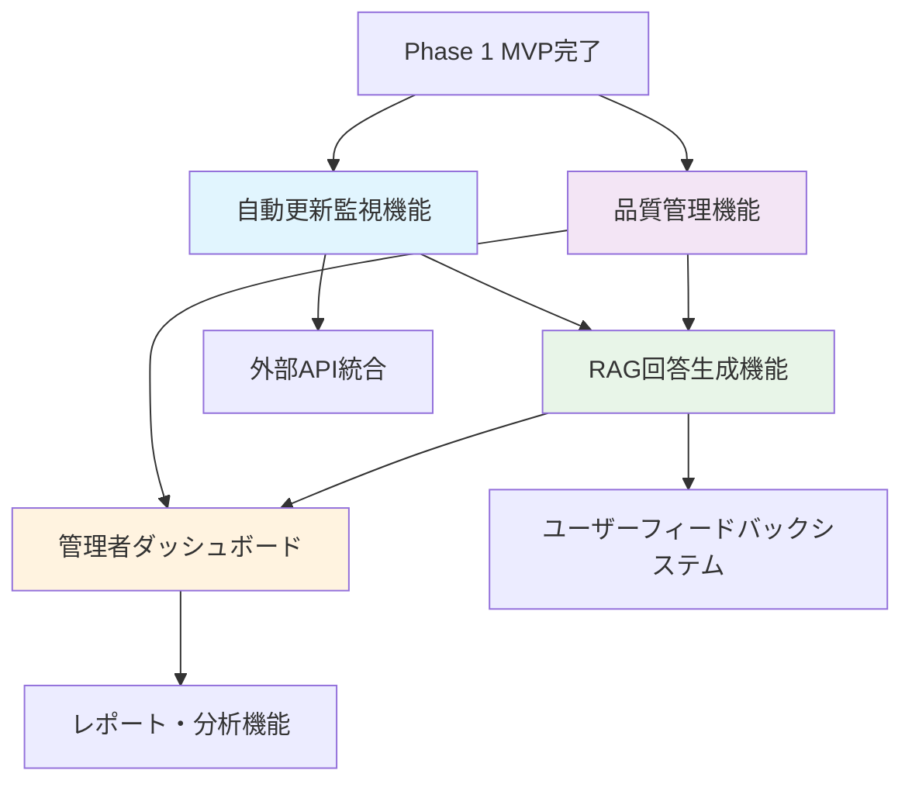

# ERP知識RAGシステム - 実装計画・Phase管理書

---
doc_type: "implementation_plan"
complexity: "high"
estimated_effort: "継続的管理プロセス"
prerequisites: ["00_ProjectCharter.md", "07_ProjectManagementPlan.md", "08_DocumentManagementSystem.md"]
implementation_priority: "critical"
ai_assistance_level: "full_automation_possible"
version: "1.0.0"
author: "Claude Code"
created_date: "2025-01-21"
status: "approved"
approval_authority: "Project Stakeholders"
---

## 📋 実装計画概要

### 計画の目的
本文書は「ERP知識RAGシステム（ERPFTS）」の段階的実装における具体的な実行計画、Phase管理戦略、リソース配分、および進捗管理体系を定義する。プロジェクト憲章および管理計画に基づき、確実な価値提供と品質確保を実現する実装ロードマップを提供する。

### 実装戦略の基本方針
```yaml
段階的価値提供:
  - MVP（Minimum Viable Product）による早期価値実現
  - 段階的機能拡張による継続的改善
  - ユーザーフィードバックに基づく適応的開発

リスク管理:
  - 技術的リスクの早期特定・軽減
  - 依存関係の最小化・並行化
  - 品質ゲートによる品質保証

資源最適化:
  - 限られたリソースでの最大効果
  - スキル要件に応じた作業配分
  - 外部依存の最小化
```

## 🗓️ Phase管理戦略

### 全体スケジュール概要


### Phase定義・目標
```yaml
Phase 1 - MVP (最小実用製品) - 6週間:
  目標: 基本的な知識検索システムの構築
  成功基準:
    - 3つ以上のソースからの文書取り込み完了
    - セマンティック検索機能の動作確認
    - 10件以上の実用的な検索結果提供
    - WebUIでの基本操作完了
  
  主要機能:
    - 文書取り込み機能（PDF、Web）
    - セマンティック検索機能
    - Web検索インターフェース
    - ソース管理機能

Phase 2 - 機能拡張 (Feature Extension) - 4週間:
  目標: 自動化・品質管理による運用効率化
  成功基準:
    - 24時間以内の自動更新実現
    - 品質スコア3.5以上のコンテンツ80%達成
    - RAG回答生成機能の満足度4.0/5.0
    - 管理ダッシュボードでの運用状況可視化
  
  主要機能:
    - 自動更新監視機能
    - 品質管理・評価機能
    - RAG回答生成機能
    - 管理者ダッシュボード

Phase 3 - 高度機能 (Advanced Features) - 継続開発:
  目標: 検索精度向上・運用最適化
  成功基準:
    - ハイブリッド検索精度95%以上
    - API応答時間1秒以内達成
    - システム稼働率99.0%達成
    - 運用自動化90%達成
  
  主要機能:
    - ハイブリッド検索機能
    - API インターフェース
    - 高度分析・レポート機能
    - 運用自動化・最適化
```

## 📊 Phase 1 - MVP実装計画

### 週別詳細スケジュール
```yaml
Week 1 - 環境構築・基盤整備:
  目標: 開発・テスト環境の完全構築
  
  Day 1-2: 開発環境セットアップ
    - Python 3.11+ 環境構築
    - 必要ライブラリのインストール・検証
    - データベース（SQLite + Chroma）セットアップ
    - Git リポジトリ・ブランチ戦略構築
  
  Day 3-4: 基盤アーキテクチャ実装
    - データベーススキーマ作成・初期化
    - 基本設定システム実装
    - ログシステム・エラーハンドリング
    - 単体テストフレームワーク構築
  
  Day 5-7: 統合・検証
    - 環境統合テスト実行
    - パフォーマンステスト基盤構築
    - CI/CD パイプライン基本構築
    - 開発ドキュメント整備

Week 2-3: 文書取り込み基盤開発
  目標: 多様なソースからの文書取り込み自動化
  
  Week 2 Day 1-3: コア処理実装
    - ソース管理システム実装
    - 文書抽出エンジン（PDF/Web）実装
    - テキスト前処理・正規化機能
    - チャンク分割ロジック実装
  
  Week 2 Day 4-7: 品質・拡張性
    - 品質評価システム基本実装
    - エラー処理・リトライロジック
    - 並列処理・パフォーマンス最適化
    - 単体・統合テスト実施
  
  Week 3 Day 1-4: 埋め込み生成
    - 埋め込みモデル統合（multilingual-e5-large）
    - ベクトルデータベース連携
    - バッチ処理・進捗管理
    - メタデータ管理システム
  
  Week 3 Day 5-7: テスト・検証
    - End-to-End テスト実行
    - パフォーマンステスト・ボトルネック特定
    - データ品質検証
    - ドキュメント更新

Week 4-5: 検索機能・UI開発
  目標: ユーザーが利用可能な検索システム完成
  
  Week 4 Day 1-3: 検索エンジン実装
    - セマンティック検索API実装
    - 検索結果ランキング・フィルタリング
    - 検索ログ・分析機能
    - 検索パフォーマンス最適化
  
  Week 4 Day 4-7: WebUI基本実装
    - Streamlit基盤UI構築
    - 検索インターフェース実装
    - 結果表示・ページネーション
    - レスポンシブデザイン対応
  
  Week 5 Day 1-4: UI機能拡張
    - フィルタリング・ソート機能
    - ユーザーフィードバック機能
    - 検索履歴・お気に入り機能
    - アクセシビリティ対応
  
  Week 5 Day 5-7: 統合・ポリッシュ
    - フロントエンド・バックエンド統合
    - UIUXの最適化・調整
    - エラーハンドリング・ユーザビリティ向上
    - ユーザー受入テスト準備

Week 6: 統合テスト・デプロイ準備
  目標: 本番環境でのシステム稼働開始
  
  Day 1-2: 統合テスト
    - システム全体の統合テスト
    - パフォーマンス・負荷テスト
    - セキュリティテスト実施
    - データ整合性検証
  
  Day 3-4: デプロイ準備
    - 本番環境構築・設定
    - データ移行スクリプト実行
    - セキュリティ設定・権限管理
    - モニタリング・アラート設定
  
  Day 5-7: 本番リリース・検証
    - 本番環境デプロイ実行
    - スモークテスト・健全性確認
    - ユーザートレーニング・サポート
    - Phase 1 完了報告・振り返り
```

### Phase 1 成果物・品質基準
```yaml
技術成果物:
  - 文書取り込みシステム（PDFとWeb対応）
  - ベクトルデータベース（1000+チャンク）
  - セマンティック検索API
  - WebUI（Streamlit）
  - 基本管理機能

品質基準:
  - テストカバレッジ: 80%以上
  - 検索レスポンス時間: 3秒以内
  - システム稼働率: 95%以上
  - ユーザー満足度: 4.0/5.0以上

運用成果物:
  - 運用手順書
  - トラブルシューティングガイド
  - ユーザーマニュアル
  - システム監視ダッシュボード
```

## 📈 Phase 2 - 機能拡張実装計画

### 実装優先順位・依存関係


### 週別実装計画
```yaml
Week 1: 自動更新監視機能
  目標: ソースの自動監視・更新システム構築
  
  主要タスク:
    - GitHub Actions/cron スケジューラー実装
    - RSS/Web更新検知ロジック
    - 増分更新・差分処理システム
    - 障害通知・復旧機能
    - 更新履歴・統計管理
  
  成功基準:
    - 6時間間隔での自動チェック実現
    - 更新検出精度95%以上
    - 障害時の自動復旧機能
    - 更新処理時間30秒/文書以内

Week 2: 品質管理機能
  目標: コンテンツ品質の自動評価・改善システム
  
  主要タスク:
    - 品質評価アルゴリズム実装
    - 自動品質スコアリング
    - 低品質コンテンツ検出・フラグ
    - 品質改善ワークフロー
    - 品質トレンド分析・レポート
  
  成功基準:
    - 品質スコア算出精度90%以上
    - 低品質コンテンツ検出率95%以上
    - 品質改善効果測定可能
    - 品質レポート自動生成

Week 3: RAG回答生成機能
  目標: 自然言語質問への高品質回答生成
  
  主要タスク:
    - LLM統合（GPT-4/Claude）
    - プロンプトテンプレート最適化
    - コンテキスト構築・管理
    - 回答品質評価・フィードバック
    - ソース引用・信頼性管理
  
  成功基準:
    - 回答生成時間5秒以内
    - 回答品質満足度4.0/5.0以上
    - ソース引用正確性95%以上
    - 多言語対応（日本語・英語）

Week 4: 管理者ダッシュボード
  目標: システム状態・利用状況の統合管理画面
  
  主要タスク:
    - ダッシュボードUI実装
    - リアルタイム統計・メトリクス
    - アラート・通知システム
    - ユーザー・権限管理
    - システム設定・メンテナンス機能
  
  成功基準:
    - リアルタイム更新（5秒間隔）
    - 主要メトリクス可視化完了
    - アラート通知機能動作
    - 管理操作の完全ログ記録
```

## 🚀 Phase 3 - 高度機能実装計画

### 継続開発戦略
```yaml
開発アプローチ:
  - アジャイル開発による2週間スプリント
  - ユーザーフィードバック駆動開発
  - A/Bテストによる機能検証
  - 段階的ロールアウト

優先順位決定要因:
  - ユーザー要望・満足度への影響度
  - 技術的実現可能性・工数
  - ビジネス価値・ROI
  - 競合優位性・差別化効果

品質保証戦略:
  - 機能フラグによるカナリーリリース
  - 自動テスト・継続的品質監視
  - ユーザーアクセプタンステスト
  - パフォーマンス・セキュリティ監査
```

### 高度機能実装ロードマップ
```yaml
Sprint 1-2: ハイブリッド検索機能
  - ベクトル検索 + キーワード検索統合
  - 相互ランク融合（RRF）アルゴリズム
  - Cross-Encoder再ランキング
  - 高度フィルタリング・ファセット検索

Sprint 3-4: API統合機能
  - RESTful API設計・実装
  - 認証・認可・レート制限
  - SDK（Python/JavaScript）提供
  - API ドキュメント・開発者ポータル

Sprint 5-6: 高度分析機能
  - 検索トレンド・パターン分析
  - ユーザー行動分析
  - コンテンツ人気度・効果測定
  - 予測分析・推奨システム

Sprint 7-8: 運用最適化
  - 自動スケーリング・負荷分散
  - 高度モニタリング・アラート
  - 災害復旧・バックアップ自動化
  - セキュリティ強化・監査ログ
```

## 👥 リソース配分・役割分担

### チーム構成・スキル要件
```yaml
コア開発チーム（3-4名）:
  AI/ML Engineer:
    - 責任: 検索アルゴリズム、RAG システム、品質評価
    - スキル: Python, LangChain, Vector DB, LLM
    - 工数: 70% Phase 1, 60% Phase 2, 50% Phase 3
  
  Backend Engineer:
    - 責任: API、データベース、インフラ、運用
    - スキル: FastAPI, PostgreSQL, Docker, AWS/GCP
    - 工数: 50% Phase 1, 60% Phase 2, 70% Phase 3
  
  Frontend Engineer:
    - 責任: WebUI、UX、管理画面、ダッシュボード
    - スキル: React/Streamlit, CSS, JavaScript, UI/UX
    - 工数: 40% Phase 1, 50% Phase 2, 40% Phase 3
  
  DevOps Engineer (Part-time):
    - 責任: CI/CD、インフラ、監視、セキュリティ
    - スキル: GitHub Actions, Docker, Kubernetes, 監視ツール
    - 工数: 30% Phase 1, 40% Phase 2, 60% Phase 3

外部・支援リソース:
  Project Manager:
    - 責任: 進捗管理、ステークホルダー調整、品質保証
    - 関与: 週次レビュー、月次報告、リスク管理
  
  Domain Expert:
    - 責任: ERP知識の妥当性確認、品質評価
    - 関与: 要件定義、品質レビュー、ユーザーテスト
  
  QA Engineer:
    - 責任: テスト設計・実行、品質保証
    - 関与: Phase末の統合テスト、受入テスト
```

### 工数見積もり・予算配分
```yaml
Phase 1 - MVP (6週間):
  総工数: 320人時間
  内訳:
    - AI/ML Engineer: 112時間 (70%)
    - Backend Engineer: 80時間 (50%)
    - Frontend Engineer: 64時間 (40%)
    - DevOps Engineer: 48時間 (30%)
    - PM/QA/Expert: 16時間 (レビュー・調整)

Phase 2 - 機能拡張 (4週間):
  総工数: 240人時間
  内訳:
    - AI/ML Engineer: 96時間 (60%)
    - Backend Engineer: 96時間 (60%)
    - Frontend Engineer: 64時間 (50%)
    - DevOps Engineer: 64時間 (40%)
    - PM/QA/Expert: 20時間

Phase 3 - 高度機能 (継続):
  月間工数: 160人時間
  内訳:
    - AI/ML Engineer: 64時間 (50%)
    - Backend Engineer: 80時間 (70%)
    - Frontend Engineer: 48時間 (40%)
    - DevOps Engineer: 64時間 (60%)
    - PM/QA/Expert: 24時間

予算配分:
  人件費: 70% （開発チーム・外部支援）
  インフラ: 20% （AWS/GCP、LLM API、ツール）
  外部サービス: 10% （監視、セキュリティ、サポート）
```

## 📋 進捗管理・品質ゲート

### 進捗追跡システム
```yaml
日次進捗管理:
  - 朝会（Daily Standup）での進捗確認
  - GitHub Issues/Projects での作業可視化
  - ブロッカー・リスクの早期特定
  - 作業見積もり精度の継続改善

週次レビュー:
  - Sprint レビュー・振り返り
  - 成果物品質チェック
  - スケジュール・リソース調整
  - ステークホルダー報告

月次評価:
  - Phase目標達成度評価
  - 品質メトリクス分析
  - ROI・ビジネス価値測定
  - 改善計画策定・実行
```

### 品質ゲート・チェックポイント
```yaml
Phase終了時必須確認項目:

Technical Quality Gates:
  □ コードレビュー100%完了
  □ 単体テストカバレッジ80%以上
  □ 統合テスト全パス
  □ セキュリティテスト完了
  □ パフォーマンステスト基準達成
  □ ドキュメント完全更新

Functional Quality Gates:
  □ 機能仕様100%実装完了
  □ ユーザー受入テスト合格
  □ エラーハンドリング検証完了
  □ データ整合性確認完了
  □ 運用手順書整備完了

Business Quality Gates:
  □ ビジネス要件達成確認
  □ ステークホルダー承認取得
  □ ROI目標達成確認
  □ リスク軽減策実装完了
  □ 次Phase準備完了
```

### KPI・成功指標
```yaml
Phase 1 KPI:
  技術指標:
    - システム稼働率: 95%以上
    - 平均検索レスポンス時間: 3秒以内
    - 文書取り込み成功率: 90%以上
    - テストカバレッジ: 80%以上
  
  ビジネス指標:
    - ユーザー満足度: 4.0/5.0以上
    - 検索成功率: 80%以上
    - 日次アクティブユーザー: 10名以上
    - 問い合わせ解決時間: 50%短縮

Phase 2 KPI:
  技術指標:
    - 自動更新成功率: 95%以上
    - 品質スコア平均: 4.0以上
    - RAG回答生成時間: 5秒以内
    - システム稼働率: 99%以上
  
  ビジネス指標:
    - ユーザー満足度: 4.3/5.0以上
    - RAG回答満足度: 4.0/5.0以上
    - 知識発見効率: 30%向上
    - 運用工数: 40%削減

Phase 3 KPI:
  技術指標:
    - ハイブリッド検索精度: 95%以上
    - API応答時間: 1秒以内
    - システム可用性: 99.5%以上
    - 自動化率: 90%以上
  
  ビジネス指標:
    - ユーザー満足度: 4.5/5.0以上
    - 検索精度: 95%以上
    - 業務効率化: 50%向上
    - プラットフォーム価値創出
```

## 🎯 リスク管理・緩和戦略

### 主要リスク・対策
```yaml
技術リスク:
  埋め込みモデル性能不足:
    - 影響度: High | 発生確率: Medium
    - 対策: 複数モデル比較・評価、ファインチューニング
    - 緊急時代替: OpenAI Ada-002 embedding使用
  
  大量データ処理性能問題:
    - 影響度: Medium | 発生確率: Medium  
    - 対策: 段階的負荷テスト、インデックス最適化
    - 緊急時代替: 処理バッチサイズ調整、キューイング

スケジュールリスク:
  外部API依存遅延:
    - 影響度: Medium | 発生確率: High
    - 対策: モックAPI作成、並行開発
    - 緊急時代替: 機能段階的リリース
  
  リソース不足・スキル不足:
    - 影響度: High | 発生確率: Low
    - 対策: 早期スキル評価、外部支援確保
    - 緊急時代替: スコープ調整、納期延長

品質リスク:
  検索精度不足:
    - 影響度: High | 発生確率: Medium
    - 対策: 継続的品質測定、アルゴリズム改善
    - 緊急時代替: 手動キュレーション、フィードバック収集
  
  セキュリティ脆弱性:
    - 影響度: Critical | 発生確率: Low
    - 対策: セキュリティテスト、外部監査
    - 緊急時代替: アクセス制限、緊急パッチ
```

## 🤖 Implementation Notes for AI

### Critical Implementation Paths
1. **段階的開発**: MVP→機能拡張→高度機能の確実な価値提供
2. **品質ゲート**: 各Phase終了時の厳格な品質確認・承認プロセス
3. **リスク管理**: 技術・スケジュール・品質リスクの予防的対策
4. **継続改善**: フィードバックループによる適応的開発

### Key Dependencies
- **プロジェクト管理**: Jira/GitHub Projects, Slack, 週次レビュー
- **開発管理**: Git workflow, CI/CD, 自動テスト
- **品質管理**: コードレビュー、テストカバレッジ、品質メトリクス
- **リスク管理**: 早期警告システム、緊急時対応計画

### Testing Strategy  
- **段階的テスト**: 単体→統合→システム→受入テスト
- **品質保証**: 自動テスト、継続的品質監視
- **パフォーマンステスト**: 負荷テスト、ストレステスト
- **セキュリティテスト**: 脆弱性スキャン、侵入テスト

### Common Pitfalls
- **スコープクリープ**: 機能追加要求への適切な対応
- **技術債務**: 短期的解決策の長期的影響管理
- **依存関係**: 外部システム・サービスへの過度な依存
- **リソース配分**: スキルミスマッチ・工数見積もり誤差

### 実装優先順位
1. **Phase 1**: MVP機能の確実な実装・品質確保
2. **Phase 2**: 運用効率化・自動化による価値向上
3. **Phase 3**: 高度機能・最適化による競争優位確立

---

**Version**: 1.0.0 | **Last Updated**: 2025-01-21 | **Next Review**: 2025-02-21