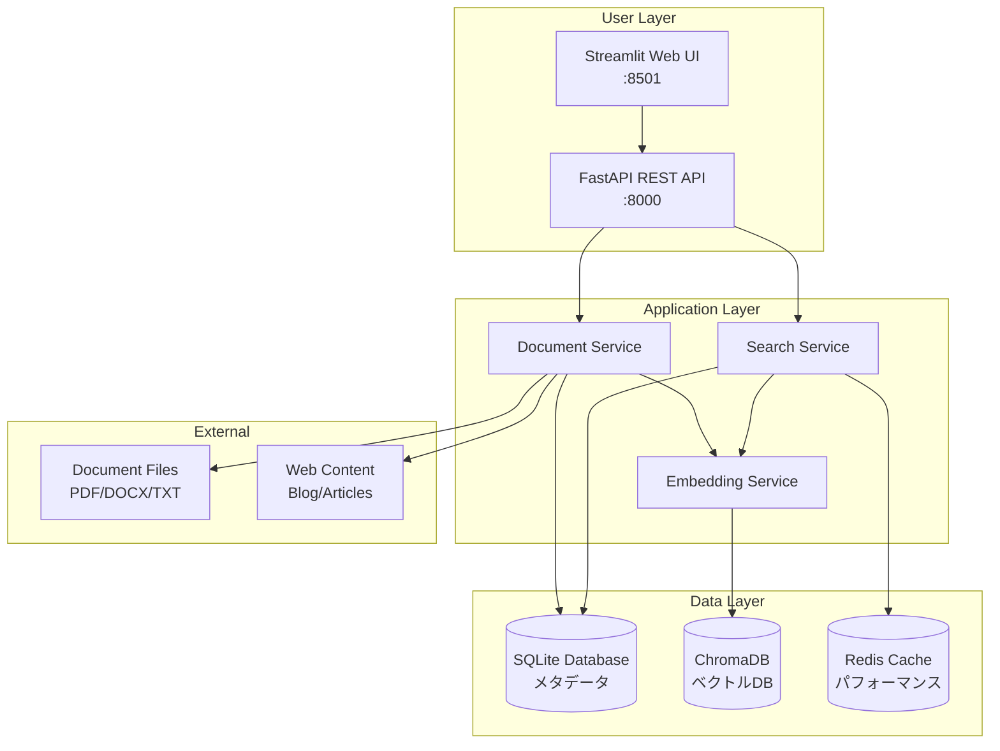
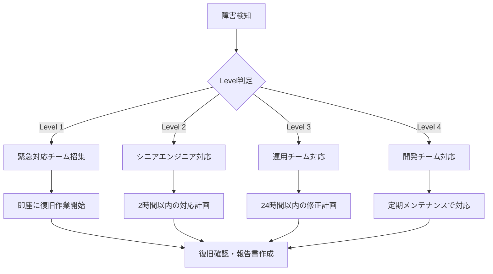
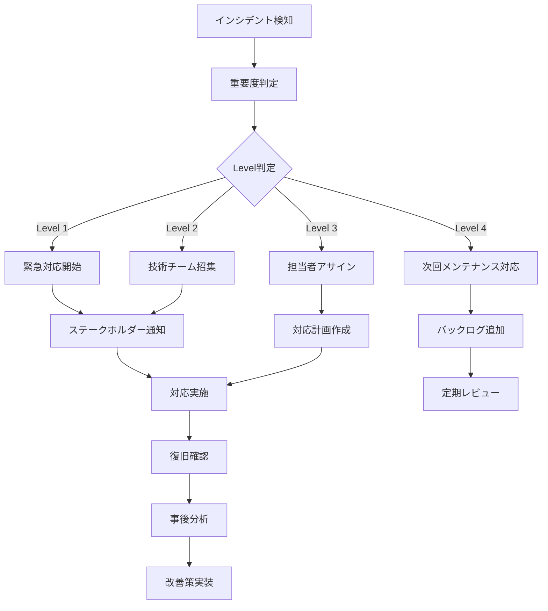

# ERPFTS Phase1 MVP - システム管理者マニュアル

## 📋 概要

本マニュアルは、ERPFTS Phase1 MVPシステムの運用・保守・管理に関する包括的なガイドです。システム管理者、DevOpsエンジニア、技術サポート担当者向けの詳細な運用手順を提供します。

### 🎯 システム管理の目的

- **99%以上のシステム可用性** 維持
- **平均復旧時間（MTTR）30分以内** の障害対応
- **予防保守による障害予防** の実現
- **パフォーマンス最適化** による快適なユーザーエクスペリエンス

---

## 🏗️ システムアーキテクチャ概要

### システム構成図



### 主要コンポーネント

| コンポーネント | 説明 | ポート | 依存関係 |
|---|---|---|---|
| **Streamlit UI** | ユーザーインターフェース | 8501 | FastAPI |
| **FastAPI** | REST APIサーバー | 8000 | SQLite, Redis |
| **SQLite** | メタデータDB | - | ファイルシステム |
| **ChromaDB** | ベクトルDB | - | ファイルシステム |
| **Redis** | キャッシュ（オプション） | 6379 | - |

---

## 🚀 システムセットアップ・デプロイメント

### 1. 初期セットアップ

#### 1.1 環境要件
**ハードウェア要件:**
```yaml
最小要件:
  CPU: 4 cores
  RAM: 8GB
  Storage: 50GB SSD
  Network: 1Gbps

推奨要件:
  CPU: 8 cores
  RAM: 16GB  
  Storage: 100GB NVMe SSD
  Network: 10Gbps
```

**ソフトウェア要件:**
```yaml
必須:
  - Python 3.11+
  - Docker 24.0+
  - Docker Compose 2.0+

オプション:
  - Redis 7.0+ (キャッシュ使用時)
  - Nginx (リバースプロキシ)
  - Prometheus + Grafana (監視)
```

#### 1.2 インストール手順

**1. リポジトリクローン**
```bash
git clone <repository-url>
cd 02_phase1_mvp
```

**2. 環境設定**
```bash
# 環境変数ファイル作成
cp .env.example .env

# 必要に応じて設定値を修正
nano .env
```

**3. Docker環境起動**
```bash
# 開発環境
docker-compose up -d

# プロダクション環境
docker-compose -f docker-compose.prod.yml up -d
```

**4. データベース初期化**
```bash
# データベースマイグレーション
docker-compose exec api alembic upgrade head

# 初期データ投入
docker-compose exec api python -m erpfts.cli.init-db
```

### 2. 環境別設定

#### 2.1 開発環境設定
```yaml
# .env.development
DEBUG=true
LOG_LEVEL=DEBUG
API_RELOAD=true
CACHE_BACKEND=memory
PERFORMANCE_MONITORING=true
RATE_LIMITING=false
```

#### 2.2 ステージング環境設定
```yaml
# .env.staging  
DEBUG=false
LOG_LEVEL=INFO
API_RELOAD=false
CACHE_BACKEND=redis
CACHE_REDIS_URL=redis://redis:6379/0
PERFORMANCE_MONITORING=true
RATE_LIMITING=true
```

#### 2.3 プロダクション環境設定
```yaml
# .env.production
DEBUG=false
LOG_LEVEL=WARNING
API_RELOAD=false
CACHE_BACKEND=redis
CACHE_REDIS_URL=redis://redis:6379/0
PERFORMANCE_MONITORING=true
RATE_LIMITING=true
CORS_ORIGINS=["https://erpfts.company.com"]
```

---

## 🔧 日常運用管理

### 1. システム監視

#### 1.1 ヘルスチェック
**基本ヘルスチェック:**
```bash
# API サーバーの状態確認
curl http://localhost:8000/health

# 詳細ヘルスチェック
curl http://localhost:8000/health/detailed

# パフォーマンス監視
curl http://localhost:8000/performance/system-health
```

**期待されるレスポンス:**
```json
{
  "status": "healthy",
  "timestamp": "2025-01-22T10:00:00Z",
  "components": {
    "database": {"status": "healthy"},
    "vector_db": {"status": "healthy"}, 
    "cache": {"status": "healthy"},
    "embedding_model": {"status": "healthy"}
  },
  "performance": {
    "response_time_ms": 150,
    "memory_usage_mb": 2048,
    "cpu_usage_percent": 25
  }
}
```

#### 1.2 パフォーマンス監視
**主要メトリクス:**
```bash
# リアルタイムメトリクス取得
curl http://localhost:8000/performance/metrics

# リソース使用状況
curl http://localhost:8000/performance/resource-usage

# キャッシュ統計
curl http://localhost:8000/performance/cache-status

# レート制限状況
curl http://localhost:8000/performance/rate-limits
```

**監視すべき閾値:**
| メトリクス | 正常 | 警告 | 危険 |
|---|---|---|---|
| CPU使用率 | < 70% | 70-85% | > 85% |
| メモリ使用率 | < 80% | 80-90% | > 90% |
| API応答時間 | < 2秒 | 2-5秒 | > 5秒 |
| エラー率 | < 1% | 1-5% | > 5% |

#### 1.3 ログ監視
**ログレベル別確認:**
```bash
# エラーログ確認
docker-compose logs api | grep ERROR

# 警告ログ確認  
docker-compose logs api | grep WARNING

# パフォーマンスログ確認
docker-compose logs api | grep "slow_query\|high_memory"

# 直近1時間のログ
docker-compose logs --since 1h api
```

### 2. バックアップ管理

#### 2.1 データベースバックアップ
**SQLiteバックアップ:**
```bash
#!/bin/bash
# backup_sqlite.sh

DATE=$(date +%Y%m%d_%H%M%S)
BACKUP_DIR="/opt/erpfts/backups/sqlite"
DB_PATH="/opt/erpfts/data/erpfts.db"

mkdir -p $BACKUP_DIR

# SQLiteバックアップ
sqlite3 $DB_PATH ".backup $BACKUP_DIR/erpfts_$DATE.db"

# 圧縮
gzip $BACKUP_DIR/erpfts_$DATE.db

# 古いバックアップ削除（30日以上）
find $BACKUP_DIR -name "*.gz" -mtime +30 -delete

echo "SQLite backup completed: erpfts_$DATE.db.gz"
```

**ChromaDBバックアップ:**
```bash
#!/bin/bash
# backup_chromadb.sh

DATE=$(date +%Y%m%d_%H%M%S)
BACKUP_DIR="/opt/erpfts/backups/chromadb"
CHROMA_PATH="/opt/erpfts/data/chroma"

mkdir -p $BACKUP_DIR

# ChromaDB データディレクトリ全体をバックアップ
tar -czf $BACKUP_DIR/chromadb_$DATE.tar.gz -C $(dirname $CHROMA_PATH) $(basename $CHROMA_PATH)

# 古いバックアップ削除（14日以上）
find $BACKUP_DIR -name "*.tar.gz" -mtime +14 -delete

echo "ChromaDB backup completed: chromadb_$DATE.tar.gz"
```

#### 2.2 自動バックアップ設定
**crontab設定例:**
```cron
# /etc/crontab

# SQLiteバックアップ（毎日2時）
0 2 * * * root /opt/erpfts/scripts/backup_sqlite.sh

# ChromaDBバックアップ（毎日3時）
0 3 * * * root /opt/erpfts/scripts/backup_chromadb.sh

# 設定ファイルバックアップ（毎週日曜1時）
0 1 * * 0 root tar -czf /opt/erpfts/backups/config/config_$(date +\%Y\%m\%d).tar.gz /opt/erpfts/config
```

### 3. セキュリティ管理

#### 3.1 アクセス制御
**APIキー管理:**
```bash
# 新しいAPIキー生成
python -c "import secrets; print(secrets.token_urlsafe(32))"

# APIキー更新（.envファイル）
echo "API_SECRET_KEY=<new-key>" >> .env

# サービス再起動
docker-compose restart api
```

**CORS設定確認:**
```python
# src/erpfts/core/config.py
CORS_ORIGINS = [
    "https://erpfts.company.com",
    "https://admin.erpfts.company.com"
]
```

#### 3.2 セキュリティ監視
**不審なアクセス検出:**
```bash
# レート制限違反ログ確認
docker-compose logs api | grep "RateLimitExceeded"

# 異常なリクエストパターン検出
docker-compose logs api | grep -E "(404|500|502|503)" | tail -100

# IPアドレス別アクセス分析
docker-compose logs api | grep -o '\d\+\.\d\+\.\d\+\.\d\+' | sort | uniq -c | sort -nr
```

---

## 🚨 障害対応・トラブルシューティング

### 1. 障害分類と対応レベル

#### 1.1 障害レベル定義
| レベル | 影響範囲 | 対応時間 | 対応者 |
|---|---|---|---|
| **Level 1** | 全システム停止 | 30分以内 | 全技術チーム |
| **Level 2** | 主要機能停止 | 2時間以内 | シニアエンジニア |
| **Level 3** | 一部機能制限 | 24時間以内 | 運用チーム |
| **Level 4** | パフォーマンス劣化 | 72時間以内 | 開発チーム |

#### 1.2 エスカレーション手順


### 2. 一般的な障害パターンと対応

#### 2.1 API サーバーが応答しない
**症状確認:**
```bash
# サービス状態確認
docker-compose ps

# ログ確認
docker-compose logs api --tail 100

# プロセス確認
docker-compose exec api ps aux
```

**対応手順:**
```bash
# 1. 軽微な場合: サービス再起動
docker-compose restart api

# 2. 重篤な場合: 完全再構築
docker-compose down
docker-compose up -d

# 3. 設定確認
docker-compose exec api python -c "from erpfts.core.config import settings; print(settings)"
```

#### 2.2 検索機能が動作しない
**症状確認:**
```bash
# ChromaDB接続確認
docker-compose exec api python -c "
from erpfts.services.embedding_service import EmbeddingService
service = EmbeddingService()
print('ChromaDB connection:', service.collection.count())
"

# 埋め込みモデル確認
docker-compose exec api python -c "
from erpfts.services.embedding_service import EmbeddingService
service = EmbeddingService()
print('Model loaded:', service.model is not None)
"
```

**対応手順:**
```bash
# 1. インデックス再構築
docker-compose exec api python -m erpfts.cli.rebuild-index

# 2. ChromaDBリセット
docker-compose exec api python -c "
import shutil
shutil.rmtree('/app/data/chroma', ignore_errors=True)
"
docker-compose restart api

# 3. 埋め込みモデル再ダウンロード
docker-compose exec api python -c "
from sentence_transformers import SentenceTransformer
model = SentenceTransformer('intfloat/multilingual-e5-large')
"
```

#### 2.3 パフォーマンス劣化
**診断コマンド:**
```bash
# CPU・メモリ使用量確認
docker stats

# ディスク使用量確認
docker-compose exec api df -h

# プロセス詳細確認
docker-compose exec api top

# ネットワーク確認
docker-compose exec api netstat -tuln
```

**対応手順:**
```bash
# 1. キャッシュクリア
curl -X POST http://localhost:8000/performance/cache/clear

# 2. 不要ファイル削除
docker-compose exec api find /tmp -type f -mtime +1 -delete

# 3. メモリ使用量最適化
docker-compose restart api

# 4. データベース最適化
docker-compose exec api python -c "
from erpfts.db.session import get_db_session
db = next(get_db_session())
db.execute('VACUUM;')
db.commit()
"
```

### 3. 緊急時復旧手順

#### 3.1 完全システム復旧
**データ損失がない場合:**
```bash
#!/bin/bash
# emergency_recovery.sh

echo "=== 緊急復旧開始 ==="

# 1. 全サービス停止
docker-compose down

# 2. データ整合性確認
sqlite3 /opt/erpfts/data/erpfts.db "PRAGMA integrity_check;"

# 3. バックアップからの復旧確認
if [ -f "/opt/erpfts/backups/sqlite/latest.db.gz" ]; then
    echo "バックアップファイルが利用可能"
else
    echo "警告: バックアップファイルなし"
fi

# 4. サービス再起動
docker-compose up -d

# 5. ヘルスチェック
sleep 30
curl -f http://localhost:8000/health || echo "ヘルスチェック失敗"

echo "=== 緊急復旧完了 ==="
```

**データ損失がある場合:**
```bash
#!/bin/bash
# disaster_recovery.sh

echo "=== 災害復旧開始 ==="

# 1. 全サービス停止
docker-compose down

# 2. データディレクトリバックアップ
mv /opt/erpfts/data /opt/erpfts/data.corrupted.$(date +%Y%m%d_%H%M%S)

# 3. 最新バックアップからの復旧
mkdir -p /opt/erpfts/data

# SQLite復旧
gunzip -c /opt/erpfts/backups/sqlite/latest.db.gz > /opt/erpfts/data/erpfts.db

# ChromaDB復旧
tar -xzf /opt/erpfts/backups/chromadb/latest.tar.gz -C /opt/erpfts/data/

# 4. サービス起動
docker-compose up -d

# 5. データ整合性確認
sleep 60
docker-compose exec api python -m erpfts.cli.verify-data

echo "=== 災害復旧完了 ==="
```

---

## 📊 パフォーマンス最適化

### 1. パフォーマンス監視・分析

#### 1.1 主要パフォーマンス指標
**API パフォーマンス:**
```bash
# 応答時間分析
curl -w "@curl-format.txt" -o /dev/null -s http://localhost:8000/api/v1/search/

# curl-format.txt内容:
#     time_namelookup:  %{time_namelookup}\n
#     time_connect:     %{time_connect}\n
#     time_appconnect:  %{time_appconnect}\n
#     time_pretransfer: %{time_pretransfer}\n
#     time_redirect:    %{time_redirect}\n
#     time_starttransfer: %{time_starttransfer}\n
#     ----------\n
#     time_total:       %{time_total}\n

# 負荷テスト
ab -n 1000 -c 10 http://localhost:8000/health
```

**リソース使用量分析:**
```bash
# メモリ使用量詳細
docker-compose exec api python -c "
import psutil
process = psutil.Process()
print(f'Memory: {process.memory_info().rss / 1024 / 1024:.1f} MB')
print(f'CPU: {process.cpu_percent()}%')
"

# ディスクI/O分析  
iostat -x 1 5

# ネットワーク分析
iftop -i eth0
```

#### 1.2 ボトルネック特定
**プロファイリング:**
```python
# performance_profile.py
import cProfile
import pstats
from erpfts.services.search_service import SearchService

def profile_search():
    service = SearchService()
    results = service.search("プロジェクト管理 リスク")
    return results

if __name__ == "__main__":
    cProfile.run('profile_search()', 'search_profile.stats')
    
    stats = pstats.Stats('search_profile.stats')
    stats.sort_stats('cumulative')
    stats.print_stats(20)
```

### 2. 最適化手法

#### 2.1 キャッシュ最適化
**Redis設定チューニング:**
```redis
# redis.conf
maxmemory 2gb
maxmemory-policy allkeys-lru
save 900 1
save 300 10
save 60 10000
```

**アプリケーションキャッシュ設定:**
```python
# 検索結果キャッシュTTL調整
CACHE_SEARCH_TTL = 3600  # 1時間

# 埋め込みキャッシュTTL調整  
CACHE_EMBEDDING_TTL = 86400  # 24時間

# メタデータキャッシュTTL調整
CACHE_METADATA_TTL = 1800  # 30分
```

#### 2.2 データベース最適化
**SQLite設定:**
```sql
-- pragma設定
PRAGMA journal_mode = WAL;
PRAGMA synchronous = NORMAL;
PRAGMA cache_size = 10000;
PRAGMA temp_store = MEMORY;
```

**ChromaDB最適化:**
```python
# collection設定
collection = client.get_or_create_collection(
    name="knowledge_chunks",
    metadata={
        "hnsw:space": "cosine",
        "hnsw:construction_ef": 200,
        "hnsw:M": 16
    }
)
```

#### 2.3 アプリケーション最適化
**非同期処理の活用:**
```python
# バッチ処理最適化
async def process_documents_batch(documents: List[str]):
    tasks = [process_document(doc) for doc in documents]
    results = await asyncio.gather(*tasks, return_exceptions=True)
    return results

# 接続プール設定
DATABASE_POOL_SIZE = 20
DATABASE_MAX_OVERFLOW = 30
```

---

## 🔄 メンテナンス・アップデート

### 1. 定期メンテナンス

#### 1.1 日次メンテナンス
```bash
#!/bin/bash
# daily_maintenance.sh

echo "=== 日次メンテナンス開始 ==="

# 1. ログローテーション
docker-compose exec api find /var/log -name "*.log" -mtime +7 -delete

# 2. 一時ファイル削除
docker-compose exec api find /tmp -type f -mtime +1 -delete

# 3. データベース統計更新
docker-compose exec api python -c "
from erpfts.db.session import get_db_session
db = next(get_db_session())
db.execute('ANALYZE;')
db.commit()
"

# 4. キャッシュ統計確認
curl -s http://localhost:8000/performance/cache-status | jq '.cache_stats.hit_rate'

echo "=== 日次メンテナンス完了 ==="
```

#### 1.2 週次メンテナンス
```bash
#!/bin/bash
# weekly_maintenance.sh

echo "=== 週次メンテナンス開始 ==="

# 1. データベース最適化
docker-compose exec api python -c "
from erpfts.db.session import get_db_session
db = next(get_db_session())
db.execute('VACUUM;')
db.commit()
"

# 2. インデックス再構築（軽量）
docker-compose exec api python -m erpfts.cli.optimize-index

# 3. パフォーマンス統計レポート
curl -s http://localhost:8000/performance/metrics | jq > /opt/erpfts/reports/weekly_$(date +%Y%m%d).json

# 4. ディスク使用量チェック
df -h | grep -E "(80%|90%|95%)" && echo "警告: ディスク使用量が高くなっています"

echo "=== 週次メンテナンス完了 ==="
```

#### 1.3 月次メンテナンス
```bash
#!/bin/bash
# monthly_maintenance.sh

echo "=== 月次メンテナンス開始 ==="

# 1. 完全バックアップ作成
/opt/erpfts/scripts/backup_complete.sh

# 2. セキュリティアップデート確認
docker-compose pull
docker images --format "table {{.Repository}}\t{{.Tag}}\t{{.CreatedAt}}"

# 3. ログ分析レポート作成
python /opt/erpfts/scripts/generate_monthly_report.py

# 4. 容量計画分析
du -sh /opt/erpfts/data/*

echo "=== 月次メンテナンス完了 ==="
```

### 2. システムアップデート

#### 2.1 アプリケーションアップデート
```bash
#!/bin/bash
# app_update.sh

echo "=== アプリケーションアップデート開始 ==="

# 1. 現在のバージョン記録
echo "Current version:" > /opt/erpfts/update_log.txt
docker-compose exec api python -c "from erpfts import __version__; print(__version__)" >> /opt/erpfts/update_log.txt

# 2. バックアップ作成
/opt/erpfts/scripts/backup_complete.sh

# 3. メンテナンスモード有効
curl -X POST http://localhost:8000/admin/maintenance/enable

# 4. 新しいコードのデプロイ
git pull origin main
docker-compose build --no-cache
docker-compose down
docker-compose up -d

# 5. データベースマイグレーション
docker-compose exec api alembic upgrade head

# 6. ヘルスチェック
sleep 30
if curl -f http://localhost:8000/health; then
    echo "アップデート成功"
    # メンテナンスモード解除
    curl -X POST http://localhost:8000/admin/maintenance/disable
else
    echo "アップデート失敗 - ロールバック実行"
    # ロールバック処理
    /opt/erpfts/scripts/rollback.sh
fi

echo "=== アプリケーションアップデート完了 ==="
```

#### 2.2 ロールバック手順
```bash
#!/bin/bash
# rollback.sh

echo "=== ロールバック開始 ==="

# 1. 現在のサービス停止
docker-compose down

# 2. 前のバージョンに戻す
git checkout HEAD~1

# 3. 前のイメージでサービス起動
docker-compose up -d

# 4. データベースロールバック（必要に応じて）
# docker-compose exec api alembic downgrade -1

# 5. ヘルスチェック
sleep 30
curl -f http://localhost:8000/health && echo "ロールバック成功" || echo "ロールバック失敗"

echo "=== ロールバック完了 ==="
```

---

## 📋 設定管理

### 1. 環境設定

#### 1.1 設定ファイル構造
```
config/
├── environments/
│   ├── development.env
│   ├── staging.env
│   └── production.env
├── docker/
│   ├── docker-compose.yml
│   ├── docker-compose.dev.yml
│   └── docker-compose.prod.yml
└── application/
    ├── logging.yaml
    ├── cache.yaml
    └── security.yaml
```

#### 1.2 重要な設定項目
**データベース設定:**
```yaml
database:
  sqlite:
    path: "/app/data/erpfts.db"
    pool_size: 20
    timeout: 30
  
  chromadb:
    persist_directory: "/app/data/chroma"
    collection_name: "knowledge_chunks"
    distance_function: "cosine"
```

**キャッシュ設定:**
```yaml
cache:
  backend: "redis"  # memory or redis
  redis:
    url: "redis://redis:6379/0"
    max_connections: 100
    socket_keepalive: true
  
  ttl:
    search_results: 3600  # 1 hour
    embeddings: 86400     # 24 hours  
    metadata: 1800        # 30 minutes
```

**パフォーマンス設定:**
```yaml
performance:
  rate_limiting:
    enabled: true
    search_limit: 100      # per user per hour
    upload_limit: 10       # per user per hour
    api_limit: 1000        # per IP per hour
    global_limit: 10000    # per hour
  
  monitoring:
    enabled: true
    metrics_retention_days: 30
    slow_query_threshold: 2.0  # seconds
```

### 2. セキュリティ設定

#### 2.1 認証・認可設定
```yaml
security:
  api_key:
    secret_key: "${API_SECRET_KEY}"
    algorithm: "HS256"
    expire_minutes: 60
  
  cors:
    origins: ["https://erpfts.company.com"]
    methods: ["GET", "POST", "PUT", "DELETE"]
    headers: ["*"]
  
  rate_limiting:
    enabled: true
    default_limit: 100
    burst_limit: 200
```

#### 2.2 ログ設定
```yaml
logging:
  version: 1
  disable_existing_loggers: false
  
  formatters:
    standard:
      format: "%(asctime)s [%(levelname)s] %(name)s: %(message)s"
    
    json:
      format: '{"timestamp": "%(asctime)s", "level": "%(levelname)s", "logger": "%(name)s", "message": "%(message)s"}'
  
  handlers:
    console:
      class: logging.StreamHandler
      level: INFO
      formatter: standard
      stream: ext://sys.stdout
    
    file:
      class: logging.handlers.RotatingFileHandler
      level: WARNING
      formatter: json
      filename: /var/log/erpfts/app.log
      maxBytes: 10485760  # 10MB
      backupCount: 5
  
  loggers:
    erpfts:
      level: INFO
      handlers: [console, file]
      propagate: false
    
    uvicorn:
      level: INFO
      handlers: [console]
      propagate: false
```

---

## 📞 サポート・エスカレーション

### 1. サポート体制

#### 1.1 連絡先情報
```yaml
support_contacts:
  level_1_emergency:
    name: "緊急対応チーム"
    phone: "+81-XX-XXXX-XXXX"
    email: "emergency@company.com"
    response_time: "30分以内"
  
  level_2_technical:
    name: "技術サポートチーム" 
    phone: "+81-XX-XXXX-XXXX"
    email: "tech-support@company.com"
    response_time: "2時間以内"
  
  level_3_general:
    name: "一般サポート"
    email: "support@company.com"
    response_time: "24時間以内"
```

#### 1.2 エスカレーション基準
**Level 1 (緊急):**
- 全システム停止
- データ損失の可能性
- セキュリティインシデント
- 大規模なパフォーマンス劣化

**Level 2 (高):**
- 主要機能の停止
- 一部ユーザーへの影響
- 軽微なデータ不整合
- 予定外のメンテナンス必要

**Level 3 (中):**
- 非重要機能の問題
- パフォーマンス軽微劣化
- ユーザビリティ問題
- 定期メンテナンス関連

**Level 4 (低):**
- 機能改善要求
- ドキュメント更新
- 設定変更依頼

### 2. インシデント管理

#### 2.1 インシデント対応フロー


#### 2.2 インシデント報告書テンプレート
```markdown
# インシデント報告書

## 基本情報
- **インシデントID**: INC-2025-0122-001
- **発生日時**: 2025-01-22 14:30 JST
- **検知方法**: 監視アラート / ユーザー報告
- **重要度**: Level 2
- **影響範囲**: 検索機能停止（全ユーザー）

## 症状
- 検索リクエストが全てタイムアウト
- エラー率が95%に上昇
- ユーザーからの問い合わせ20件

## 原因分析
- **直接原因**: ChromaDBプロセスの異常終了
- **根本原因**: メモリ不足によるOOM Killer発動
- **寄与要因**: 大量ドキュメント処理中の並行検索

## 対応履歴
| 時刻 | 対応者 | 実施内容 | 結果 |
|------|--------|----------|------|
| 14:35 | 田中 | サービス再起動 | 一時復旧 |
| 14:45 | 田中 | メモリ制限増加 | 安定化 |
| 15:00 | 佐藤 | 並行処理制限追加 | 完全復旧 |

## 改善策
1. **短期**: メモリ監視アラート追加
2. **中期**: 処理キューイング機能実装
3. **長期**: スケールアウト対応

## 教訓
- メモリ使用量の継続監視が重要
- 負荷制御機能の必要性
- アラート通知の改善必要
```

---

## 📚 参考資料・チェックリスト

### 1. 日常運用チェックリスト

#### 1.1 始業時チェック (毎日)
```markdown
□ システム稼働状況確認
  □ APIヘルスチェック (http://localhost:8000/health)
  □ UIアクセス確認 (http://localhost:8501)
  □ レスポンス時間確認 (< 2秒)

□ リソース使用量確認
  □ CPU使用率 (< 70%)
  □ メモリ使用率 (< 80%)
  □ ディスク使用率 (< 85%)

□ ログ確認
  □ エラーログ件数確認
  □ 警告ログ内容確認
  □ パフォーマンス問題確認

□ バックアップ状況確認
  □ 前日のバックアップ完了確認
  □ バックアップファイルサイズ確認
```

#### 1.2 週次チェック (毎週月曜)
```markdown
□ システム性能分析
  □ 週次パフォーマンスレポート確認
  □ 利用統計レポート確認
  □ キャッシュ効率確認

□ セキュリティチェック
  □ 不審なアクセスログ確認
  □ レート制限状況確認
  □ セキュリティアラート確認

□ 容量計画
  □ データ増加量トレンド確認
  □ ディスク容量予測
  □ スケーリング必要性検討
```

#### 1.3 月次チェック (毎月1日)
```markdown
□ 総合レビュー
  □ SLA達成状況確認
  □ インシデント分析
  □ 改善提案まとめ

□ アップデート計画
  □ セキュリティアップデート確認
  □ 機能アップデート検討
  □ メンテナンス計画作成

□ ドキュメント更新
  □ 運用手順書更新
  □ 設定変更履歴更新
  □ 知識ベース更新
```

### 2. 緊急事態対応チェックリスト

#### 2.1 システム停止時の対応
```markdown
□ 初期対応 (5分以内)
  □ 症状確認・記録
  □ 影響範囲特定
  □ ステークホルダー通知

□ 診断作業 (15分以内)  
  □ ログ確認
  □ プロセス状態確認
  □ リソース使用量確認
  □ 外部依存関係確認

□ 復旧作業 (30分以内)
  □ サービス再起動
  □ 設定確認・修正
  □ データ整合性確認
  □ 正常性確認

□ 事後対応
  □ 詳細分析
  □ 報告書作成
  □ 改善策検討
```

### 3. 設定変更時のチェックリスト

#### 3.1 設定変更前
```markdown
□ 事前準備
  □ 変更内容文書化
  □ 影響範囲分析
  □ ロールバック計画作成
  □ バックアップ作成

□ テスト計画
  □ テスト環境での確認
  □ 設定項目妥当性確認
  □ 依存関係影響確認
```

#### 3.2 設定変更後
```markdown
□ 動作確認
  □ サービス起動確認
  □ 基本機能動作確認
  □ パフォーマンス確認
  □ ログ出力確認

□ 監視強化
  □ 1時間集中監視
  □ 異常兆候監視
  □ ユーザー影響監視
```

---

**Version**: 1.0.0 | **Last Updated**: 2025-01-22 | **Next Review**: Quarterly Operations Review