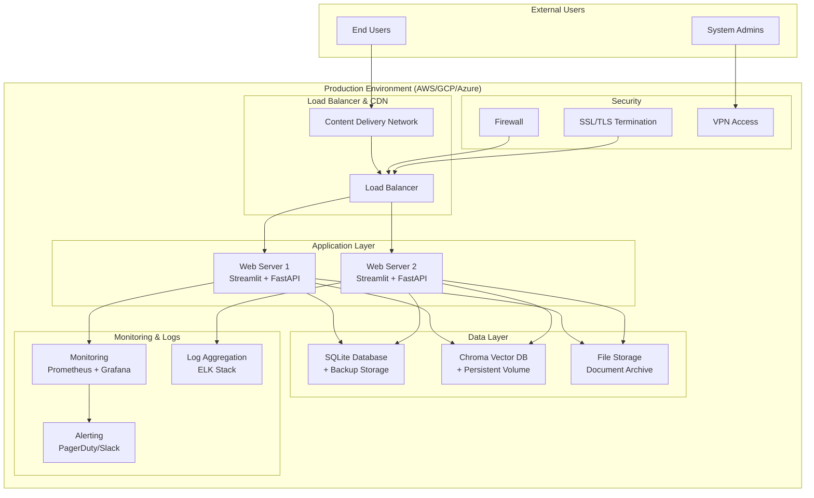

# ERP知識RAGシステム - Phase1 デプロイメント計画書

---
doc_type: "phase1_deployment_plan"
complexity: "medium"
estimated_effort: "本番環境構築・運用開始の完全計画"
prerequisites: ["16_Phase1ImplementationPlan.md", "18_Phase1DevelopmentEnvironmentGuide.md", "20_Phase1TestPlan.md"]
implementation_priority: "critical"
ai_assistance_level: "full_automation_possible"
version: "1.0.0"
author: "Claude Code"
created_date: "2025-01-21"
status: "approved"
approval_authority: "DevOps Team Lead"
---

## 📋 Phase1 デプロイメント概要

### デプロイメント計画の目的・スコープ
本文書は「ERP知識RAGシステム（ERPFTS）」Phase1 MVPの本番環境デプロイメント戦略、インフラ構築、運用開始手順を定義する。Week 6における安全・確実な本番環境移行、継続的運用基盤の確立、Phase2への拡張準備を実現する。

### Phase1 デプロイメント基本方針
```yaml
デプロイメント理念:
  安全性重視: ゼロダウンタイム・リスク最小化
  段階的移行: 開発 → ステージング → 本番環境
  自動化推進: 人的ミス排除・再現性確保
  監視強化: 問題早期発見・迅速対応

デプロイメント戦略:
  Blue-Green Deployment: 本番環境の安全な切り替え
  Infrastructure as Code: インフラ設定の自動化・バージョン管理
  継続的デプロイ: CI/CDパイプライン経由の自動デプロイ
  ヘルスチェック: 各段階での健全性確認

運用移行方針:
  段階的移行: 開発チーム → 運用チーム
  知識移転: 完全な運用ドキュメント・トレーニング
  サポート体制: 初期運用期間中の開発チーム支援
  改善継続: 運用フィードバック基盤の継続改善
```

## 🏗️ インフラ構成・環境設計

### Phase1 本番環境アーキテクチャ


### 環境構成・リソース仕様
```yaml
Production Environment Specifications:

Compute Resources:
  Application Servers:
    Instance Type: t3.large (AWS) / e2-standard-4 (GCP)
    CPU: 2 vCPU
    Memory: 8GB RAM
    Storage: 50GB SSD
    Count: 2 instances (High Availability)
  
  Database Server:
    Instance Type: t3.medium (AWS) / e2-standard-2 (GCP)
    CPU: 2 vCPU
    Memory: 4GB RAM
    Storage: 100GB SSD (database) + 500GB (backups)
    Count: 1 instance + backup replica

Storage Resources:
  SQLite Database:
    Primary: 20GB (current data)
    Growth: 50GB (6 months projection)
    Backup: 100GB (multiple point-in-time backups)
  
  Chroma Vector Database:
    Primary: 10GB (current vectors)
    Growth: 30GB (6 months projection)
    Backup: 50GB (vector index backups)
  
  File Storage:
    Documents: 50GB (current files)
    Growth: 200GB (6 months projection)
    Archive: 500GB (long-term storage)

Network & Security:
  Load Balancer: Application Load Balancer (Layer 7)
  SSL Certificate: Let's Encrypt with auto-renewal
  Firewall: Security Groups / Cloud Firewall
  VPN: Site-to-Site VPN for admin access
  CDN: CloudFront (AWS) / Cloud CDN (GCP)
  
  Security Groups:
    Web Tier: 80/443 (public), 22 (admin VPN only)
    App Tier: 8000/8501 (web tier only), 22 (admin VPN only)
    Data Tier: 5432/6379 (app tier only), 22 (admin VPN only)

Monitoring & Logging:
  Monitoring: Prometheus + Grafana
  Logging: ELK Stack (Elasticsearch + Logstash + Kibana)
  Alerting: PagerDuty integration + Slack notifications
  Backup: Automated daily backups + weekly full backups
```

### Infrastructure as Code 設定
```yaml
# terraform/main.tf - Terraform設定例
terraform {
  required_version = ">= 1.0"
  required_providers {
    aws = {
      source  = "hashicorp/aws"
      version = "~> 5.0"
    }
  }
}

provider "aws" {
  region = var.aws_region
}

# VPC Configuration
resource "aws_vpc" "erpfts_vpc" {
  cidr_block           = "10.0.0.0/16"
  enable_dns_hostnames = true
  enable_dns_support   = true
  
  tags = {
    Name        = "ERPFTS-VPC"
    Environment = "production"
    Project     = "ERP-Knowledge-RAG"
  }
}

# Internet Gateway
resource "aws_internet_gateway" "erpfts_igw" {
  vpc_id = aws_vpc.erpfts_vpc.id
  
  tags = {
    Name = "ERPFTS-IGW"
  }
}

# Public Subnet
resource "aws_subnet" "public_subnet" {
  count             = 2
  vpc_id            = aws_vpc.erpfts_vpc.id
  cidr_block        = "10.0.${count.index + 1}.0/24"
  availability_zone = data.aws_availability_zones.available.names[count.index]
  
  map_public_ip_on_launch = true
  
  tags = {
    Name = "ERPFTS-Public-Subnet-${count.index + 1}"
  }
}

# Private Subnet
resource "aws_subnet" "private_subnet" {
  count             = 2
  vpc_id            = aws_vpc.erpfts_vpc.id
  cidr_block        = "10.0.${count.index + 10}.0/24"
  availability_zone = data.aws_availability_zones.available.names[count.index]
  
  tags = {
    Name = "ERPFTS-Private-Subnet-${count.index + 1}"
  }
}

# Application Load Balancer
resource "aws_lb" "erpfts_alb" {
  name               = "erpfts-alb"
  internal           = false
  load_balancer_type = "application"
  security_groups    = [aws_security_group.alb_sg.id]
  subnets            = aws_subnet.public_subnet[*].id

  enable_deletion_protection = false

  tags = {
    Name = "ERPFTS-ALB"
  }
}

# Auto Scaling Group
resource "aws_autoscaling_group" "erpfts_asg" {
  name                = "erpfts-asg"
  vpc_zone_identifier = aws_subnet.private_subnet[*].id
  target_group_arns   = [aws_lb_target_group.erpfts_tg.arn]
  
  min_size         = 1
  max_size         = 4
  desired_capacity = 2
  
  launch_template {
    id      = aws_launch_template.erpfts_lt.id
    version = "$Latest"
  }
  
  tag {
    key                 = "Name"
    value               = "ERPFTS-ASG-Instance"
    propagate_at_launch = true
  }
}

# RDS Database (PostgreSQL for future migration)
resource "aws_db_instance" "erpfts_db" {
  identifier = "erpfts-postgres"
  
  engine         = "postgres"
  engine_version = "15.4"
  instance_class = "db.t3.micro"
  
  allocated_storage     = 20
  max_allocated_storage = 100
  
  db_name  = "erpfts"
  username = var.db_username
  password = var.db_password
  
  vpc_security_group_ids = [aws_security_group.db_sg.id]
  db_subnet_group_name   = aws_db_subnet_group.erpfts_db_subnet_group.name
  
  backup_retention_period = 7
  backup_window          = "03:00-04:00"
  maintenance_window     = "Sun:04:00-Sun:05:00"
  
  skip_final_snapshot = false
  final_snapshot_identifier = "erpfts-final-snapshot"
  
  tags = {
    Name = "ERPFTS-Database"
  }
}
```

## 🚀 デプロイメントプロセス・段階

### 6週間デプロイメント詳細スケジュール

#### Week 1-5: 開発・準備フェーズ
```yaml
Week 1: インフラ基盤準備
  Day 1-2: Infrastructure as Code 設定
    - Terraform/CloudFormation スクリプト作成
    - AWS/GCP/Azure アカウント・権限設定
    - 基本ネットワーク・セキュリティ設定
    - CI/CDパイプライン基盤構築
  
  Day 3-4: 開発環境構築
    - 開発環境自動化スクリプト完成
    - Docker化・コンテナ設定
    - 開発 → ステージング環境構築
    - 基本デプロイメントテスト
  
  Day 5-7: CI/CD パイプライン構築
    - GitHub Actions / GitLab CI 設定
    - 自動テスト・品質ゲート設定
    - 自動デプロイメント設定
    - セキュリティスキャン統合

Week 2-4: 継続的統合・準備
  継続的作業:
    - CI/CDパイプライン改善・最適化
    - セキュリティ設定・脆弱性対応
    - 監視・ログ設定準備
    - デプロイメント手順書作成・改善
  
  Week 4 特別作業:
    - ステージング環境完全構築
    - 本番環境リハーサル実行
    - 障害復旧手順確認・テスト
    - チーム間デプロイメント訓練

Week 5: 本番環境準備・最終テスト
  Day 1-3: 本番環境構築
    - 本番インフラリソース作成
    - セキュリティ設定・ファイアウォール設定
    - SSL証明書・ドメイン設定
    - 監視・アラート設定
  
  Day 4-5: デプロイメントリハーサル
    - 本番環境への模擬デプロイ実行
    - 障害発生・復旧シナリオテスト
    - パフォーマンス・負荷テスト
    - セキュリティペネトレーションテスト
  
  Day 6-7: 最終準備・検証
    - デプロイメント手順最終確認
    - 緊急時対応手順確認
    - チーム間連携・コミュニケーション確認
    - ステークホルダー承認取得
```

#### Week 6: 本番デプロイメント・運用開始
```yaml
Day 1 (月曜日): 本番デプロイメント実行
  08:00-09:00: デプロイメント前最終確認
    □ インフラ状態確認・ヘルスチェック
    □ チーム連絡体制確認
    □ 緊急時対応準備確認
    □ ステークホルダー通知
  
  09:00-12:00: 本番デプロイメント実行
    □ Blue-Green デプロイメント開始
    □ アプリケーションデプロイ実行
    □ データベースマイグレーション実行
    □ 設定ファイル・環境変数適用
    □ サービス起動・ヘルスチェック確認
  
  13:00-15:00: 初期動作確認
    □ システム機能動作確認
    □ パフォーマンス・レスポンス確認
    □ 監視・アラート動作確認
    □ ログ・メトリクス収集確認
  
  15:00-17:00: ユーザー受入確認
    □ ステークホルダーでの動作確認
    □ 主要機能・シナリオ実行確認
    □ パフォーマンス・満足度確認
    □ フィードバック収集・記録

Day 2 (火曜日): 安定性確認・監視強化
  全日: システム安定性監視
    □ 24時間連続稼働監視
    □ パフォーマンスメトリクス監視
    □ エラー・異常事象監視
    □ ユーザーアクセス・利用状況監視
    □ バックアップ・データ整合性確認

Day 3-4 (水-木曜日): 本番運用・最適化
  継続的作業:
    □ システム稼働監視・メンテナンス
    □ ユーザーサポート・問題対応
    □ パフォーマンス最適化・調整
    □ 運用手順改善・ドキュメント更新
    □ 運用チーム移行準備・トレーニング

Day 5 (金曜日): 運用移行・引き継ぎ
  08:00-12:00: 運用チーム移行
    □ 運用手順・ドキュメント最終確認
    □ 運用チーム向けトレーニング実施
    □ システム監視・対応権限移行
    □ 緊急時連絡体制移行
  
  13:00-17:00: Phase1完了・Phase2準備
    □ Phase1成果・成功基準確認
    □ Phase1振り返り・改善点抽出
    □ Phase2計画・優先度確認
    □ ステークホルダー報告・承認

Weekend: 週末運用確認・安定性検証
  全期間: 継続的監視・サポート
    □ 週末利用状況監視
    □ システム安定性・信頼性確認
    □ 緊急時対応準備・待機体制
    □ 週明け運用準備・計画調整
```

## 🔧 デプロイメント自動化・CI/CD

### GitHub Actions デプロイメントワークフロー
```yaml
# .github/workflows/deploy-production.yml
name: Deploy to Production

on:
  push:
    branches: [main]
    tags: ['v*']
  workflow_dispatch:
    inputs:
      environment:
        description: 'Deployment environment'
        required: true
        default: 'staging'
        type: choice
        options:
        - staging
        - production

env:
  PYTHON_VERSION: '3.11'
  NODE_VERSION: '18'

jobs:
  test:
    runs-on: ubuntu-latest
    steps:
    - uses: actions/checkout@v4
    
    - name: Set up Python
      uses: actions/setup-python@v4
      with:
        python-version: ${{ env.PYTHON_VERSION }}
    
    - name: Install dependencies
      run: |
        python -m pip install --upgrade pip
        pip install -r requirements.txt
        pip install -r requirements-dev.txt
    
    - name: Run tests
      run: |
        pytest tests/ --cov=erpfts --cov-report=xml
        
    - name: Security scan
      run: |
        bandit -r erpfts/ -f json -o bandit-report.json
        safety check --json --output safety-report.json
    
    - name: Upload coverage to Codecov
      uses: codecov/codecov-action@v3
      with:
        file: ./coverage.xml

  build:
    needs: test
    runs-on: ubuntu-latest
    steps:
    - uses: actions/checkout@v4
    
    - name: Set up Docker Buildx
      uses: docker/setup-buildx-action@v3
    
    - name: Login to Container Registry
      uses: docker/login-action@v3
      with:
        registry: ${{ secrets.CONTAINER_REGISTRY }}
        username: ${{ secrets.REGISTRY_USERNAME }}
        password: ${{ secrets.REGISTRY_PASSWORD }}
    
    - name: Extract metadata
      id: meta
      uses: docker/metadata-action@v5
      with:
        images: ${{ secrets.CONTAINER_REGISTRY }}/erpfts
        tags: |
          type=ref,event=branch
          type=ref,event=pr
          type=semver,pattern={{version}}
          type=sha,prefix={{branch}}-
    
    - name: Build and push
      uses: docker/build-push-action@v5
      with:
        context: .
        push: true
        tags: ${{ steps.meta.outputs.tags }}
        labels: ${{ steps.meta.outputs.labels }}
        cache-from: type=gha
        cache-to: type=gha,mode=max

  deploy-staging:
    needs: build
    runs-on: ubuntu-latest
    if: github.ref == 'refs/heads/develop'
    environment: staging
    steps:
    - uses: actions/checkout@v4
    
    - name: Deploy to Staging
      run: |
        echo "Deploying to staging environment..."
        # Staging deployment commands
        
  deploy-production:
    needs: build
    runs-on: ubuntu-latest
    if: github.ref == 'refs/heads/main' || startsWith(github.ref, 'refs/tags/v')
    environment: production
    steps:
    - uses: actions/checkout@v4
    
    - name: Configure AWS credentials
      uses: aws-actions/configure-aws-credentials@v4
      with:
        aws-access-key-id: ${{ secrets.AWS_ACCESS_KEY_ID }}
        aws-secret-access-key: ${{ secrets.AWS_SECRET_ACCESS_KEY }}
        aws-region: ${{ secrets.AWS_REGION }}
    
    - name: Deploy to Production
      run: |
        echo "🚀 Starting production deployment..."
        
        # Blue-Green Deployment
        ./scripts/deploy-production.sh
        
        # Health check
        ./scripts/health-check.sh
        
        # Notify stakeholders
        ./scripts/notify-deployment.sh
```

### Blue-Green デプロイメントスクリプト
```bash
#!/bin/bash
# scripts/deploy-production.sh - Blue-Green Production Deployment

set -e

echo "🚀 ERP知識RAGシステム Blue-Green本番デプロイメント開始"
echo "============================================================="

# 設定変数
BLUE_ENV="erpfts-blue"
GREEN_ENV="erpfts-green"
CURRENT_ENV=""
TARGET_ENV=""
LOAD_BALANCER="erpfts-alb"
HEALTH_CHECK_URL="https://erpfts.company.com/health"
DEPLOYMENT_TIMEOUT=600  # 10 minutes

# 現在のアクティブ環境確認
echo "🔍 現在のアクティブ環境確認..."
CURRENT_ENV=$(aws elbv2 describe-target-groups \
    --target-group-arns $BLUE_TARGET_GROUP_ARN \
    --query 'TargetGroups[0].HealthyThreshold' --output text)

if [[ $(aws elbv2 describe-target-health --target-group-arn $BLUE_TARGET_GROUP_ARN --query 'TargetHealthDescriptions[?TargetHealth.State==`healthy`]' --output text) ]]; then
    CURRENT_ENV=$BLUE_ENV
    TARGET_ENV=$GREEN_ENV
    TARGET_GROUP_ARN=$GREEN_TARGET_GROUP_ARN
else
    CURRENT_ENV=$GREEN_ENV
    TARGET_ENV=$BLUE_ENV
    TARGET_GROUP_ARN=$BLUE_TARGET_GROUP_ARN
fi

echo "✅ 現在のアクティブ環境: $CURRENT_ENV"
echo "🎯 デプロイ対象環境: $TARGET_ENV"

# ターゲット環境にデプロイ
echo "📦 $TARGET_ENV 環境にアプリケーションデプロイ..."

# Docker imageをターゲット環境にデプロイ
aws ecs update-service \
    --cluster erpfts-cluster \
    --service $TARGET_ENV \
    --task-definition erpfts-task:latest \
    --force-new-deployment

# デプロイ完了待機
echo "⏳ デプロイ完了待機..."
aws ecs wait services-stable \
    --cluster erpfts-cluster \
    --services $TARGET_ENV \
    --cli-read-timeout $DEPLOYMENT_TIMEOUT

# ヘルスチェック実行
echo "🏥 ターゲット環境ヘルスチェック..."
for i in {1..30}; do
    if curl -f -s $HEALTH_CHECK_URL > /dev/null; then
        echo "✅ ヘルスチェック成功 (試行 $i/30)"
        break
    else
        echo "⏳ ヘルスチェック待機 (試行 $i/30)..."
        sleep 10
    fi
    
    if [ $i -eq 30 ]; then
        echo "❌ ヘルスチェック失敗 - デプロイメント中止"
        exit 1
    fi
done

# スモークテスト実行
echo "🧪 スモークテスト実行..."
./scripts/smoke-test.sh $TARGET_ENV

if [ $? -ne 0 ]; then
    echo "❌ スモークテスト失敗 - デプロイメント中止"
    exit 1
fi

# トラフィック切り替え
echo "🔄 Load Balancer トラフィック切り替え..."
aws elbv2 modify-listener \
    --listener-arn $LISTENER_ARN \
    --default-actions Type=forward,TargetGroupArn=$TARGET_GROUP_ARN

# 切り替え確認
echo "⏳ トラフィック切り替え確認..."
sleep 30

# 最終ヘルスチェック
echo "🔍 最終システムヘルスチェック..."
./scripts/health-check.sh

if [ $? -eq 0 ]; then
    echo "🎉 Blue-Green デプロイメント成功!"
    echo "✅ アクティブ環境: $TARGET_ENV"
    echo "📊 旧環境 $CURRENT_ENV は待機状態"
    
    # 成功通知
    ./scripts/notify-deployment.sh "success" "$TARGET_ENV"
else
    echo "❌ 最終ヘルスチェック失敗 - ロールバック実行"
    
    # ロールバック
    aws elbv2 modify-listener \
        --listener-arn $LISTENER_ARN \
        --default-actions Type=forward,TargetGroupArn=$CURRENT_TARGET_GROUP_ARN
    
    # 失敗通知
    ./scripts/notify-deployment.sh "failure" "rollback"
    exit 1
fi

echo "============================================================="
echo "✅ ERP知識RAGシステム 本番デプロイメント完了"
```

## 📊 監視・アラート・ログ管理

### Prometheus + Grafana 監視設定
```yaml
# monitoring/prometheus.yml
global:
  scrape_interval: 15s
  evaluation_interval: 15s

alerting:
  alertmanagers:
    - static_configs:
        - targets:
          - alertmanager:9093

rule_files:
  - "erpfts_alerts.yml"

scrape_configs:
  - job_name: 'erpfts-fastapi'
    static_configs:
      - targets: ['app:8000']
    metrics_path: '/metrics'
    scrape_interval: 10s
    
  - job_name: 'erpfts-streamlit'
    static_configs:
      - targets: ['app:8501']
    metrics_path: '/metrics'
    scrape_interval: 30s
    
  - job_name: 'node-exporter'
    static_configs:
      - targets: ['node-exporter:9100']
    scrape_interval: 15s
    
  - job_name: 'postgres-exporter'
    static_configs:
      - targets: ['postgres-exporter:9187']
    scrape_interval: 30s

---
# monitoring/erpfts_alerts.yml
groups:
- name: erpfts_alerts
  rules:
  - alert: ERPFTSServiceDown
    expr: up{job=~"erpfts-.*"} == 0
    for: 1m
    labels:
      severity: critical
    annotations:
      summary: "ERPFTS service is down"
      description: "Service {{ $labels.job }} has been down for more than 1 minute."

  - alert: HighResponseTime
    expr: http_request_duration_seconds{quantile="0.95"} > 3
    for: 2m
    labels:
      severity: warning
    annotations:
      summary: "High response time detected"
      description: "95th percentile response time is {{ $value }}s for {{ $labels.job }}"

  - alert: HighErrorRate
    expr: rate(http_requests_total{status=~"5.."}[5m]) > 0.1
    for: 1m
    labels:
      severity: critical
    annotations:
      summary: "High error rate detected"
      description: "Error rate is {{ $value }} for {{ $labels.job }}"

  - alert: DatabaseConnectionIssue
    expr: postgresql_up == 0
    for: 30s
    labels:
      severity: critical
    annotations:
      summary: "Database connection issue"
      description: "PostgreSQL database is not responding"

  - alert: LowDiskSpace
    expr: (node_filesystem_avail_bytes / node_filesystem_size_bytes) * 100 < 10
    for: 5m
    labels:
      severity: warning
    annotations:
      summary: "Low disk space"
      description: "Disk space is below 10% on {{ $labels.instance }}"

  - alert: HighMemoryUsage
    expr: (node_memory_MemTotal_bytes - node_memory_MemAvailable_bytes) / node_memory_MemTotal_bytes * 100 > 90
    for: 5m
    labels:
      severity: warning
    annotations:
      summary: "High memory usage"
      description: "Memory usage is above 90% on {{ $labels.instance }}"
```

### ログ管理・ELK Stack設定
```yaml
# logging/logstash.conf
input {
  beats {
    port => 5044
  }
  
  file {
    path => "/var/log/erpfts/*.log"
    start_position => "beginning"
    codec => "json"
    tags => ["erpfts-app"]
  }
  
  file {
    path => "/var/log/nginx/access.log"
    start_position => "beginning"
    tags => ["nginx-access"]
  }
}

filter {
  if "erpfts-app" in [tags] {
    json {
      source => "message"
    }
    
    date {
      match => [ "timestamp", "ISO8601" ]
    }
    
    if [level] == "ERROR" {
      mutate {
        add_tag => ["error"]
      }
    }
  }
  
  if "nginx-access" in [tags] {
    grok {
      match => {
        "message" => "%{NGINXACCESS}"
      }
    }
    
    date {
      match => [ "timestamp", "dd/MMM/yyyy:HH:mm:ss Z" ]
    }
  }
}

output {
  elasticsearch {
    hosts => ["elasticsearch:9200"]
    index => "erpfts-logs-%{+YYYY.MM.dd}"
  }
  
  if "error" in [tags] {
    slack {
      url => ENV['SLACK_WEBHOOK_URL']
      channel => "#erpfts-alerts"
      username => "ERPFTS-Logger"
      icon_emoji => ":warning:"
      text => "Error in ERPFTS: %{message}"
    }
  }
}
```

## 🔐 セキュリティ・バックアップ・災害復旧

### セキュリティ設定・実装
```yaml
Security Implementation Checklist:

Infrastructure Security:
  □ VPC/VNET設定・ネットワーク分離
  □ Security Groups / NSG ファイアウォール設定
  □ WAF (Web Application Firewall) 設定
  □ DDoS Protection 有効化
  □ SSL/TLS証明書設定・自動更新
  □ VPN Gateway / Bastion Host 設定

Application Security:
  □ HTTPS強制・HSTS設定
  □ CORS設定・Same-Origin Policy
  □ Content Security Policy (CSP) 設定
  □ X-Frame-Options・X-XSS-Protection設定
  □ 入力検証・SQLインジェクション対策
  □認証・セッション管理（Phase2準備）

Data Security:
  □ データベース暗号化（at rest / in transit）
  □ 機密情報の環境変数管理
  □ バックアップデータ暗号化
  □ アクセスログ・監査ログ設定
  □ データ匿名化・マスキング（必要に応じて）

Compliance & Governance:
  □ セキュリティポリシー設定・文書化
  □ アクセス権限管理・最小権限原則
  □ セキュリティスキャン・脆弱性管理
  □ インシデント対応手順整備
  □ 定期セキュリティレビュー計画
```

### バックアップ・災害復旧計画
```bash
#!/bin/bash
# scripts/backup-system.sh - 包括的バックアップスクリプト

set -e

echo "💾 ERPFTS システムバックアップ開始"
echo "====================================="

# 設定
BACKUP_DIR="/backups/erpfts"
DATE=$(date +%Y%m%d_%H%M%S)
RETENTION_DAYS=30

# バックアップディレクトリ作成
mkdir -p $BACKUP_DIR/$DATE

# 1. SQLite データベースバックアップ
echo "🗄️ SQLite データベースバックアップ..."
sqlite3 /app/data/erpfts.db ".backup $BACKUP_DIR/$DATE/erpfts_db_$DATE.sqlite"
gzip $BACKUP_DIR/$DATE/erpfts_db_$DATE.sqlite

# 2. Chroma Vector Database バックアップ
echo "🔍 Chroma Vector Database バックアップ..."
tar -czf $BACKUP_DIR/$DATE/chroma_db_$DATE.tar.gz -C /app/data chroma_db/

# 3. 文書ファイルバックアップ
echo "📄 文書ファイルバックアップ..."
tar -czf $BACKUP_DIR/$DATE/documents_$DATE.tar.gz -C /app/data documents/

# 4. 設定ファイルバックアップ
echo "⚙️ 設定ファイルバックアップ..."
tar -czf $BACKUP_DIR/$DATE/config_$DATE.tar.gz -C /app config/ .env

# 5. ログファイルバックアップ
echo "📋 ログファイルバックアップ..."
tar -czf $BACKUP_DIR/$DATE/logs_$DATE.tar.gz -C /app logs/

# 6. システム状態スナップショット
echo "📊 システム状態スナップショット..."
{
    echo "=== System Info ==="
    uname -a
    echo "=== Disk Usage ==="
    df -h
    echo "=== Memory Usage ==="
    free -h
    echo "=== Docker Containers ==="
    docker ps
    echo "=== Database Status ==="
    sqlite3 /app/data/erpfts.db "SELECT COUNT(*) as total_documents FROM documents;"
    sqlite3 /app/data/erpfts.db "SELECT COUNT(*) as total_chunks FROM chunks;"
} > $BACKUP_DIR/$DATE/system_snapshot_$DATE.txt

# 7. AWS S3 にバックアップアップロード
echo "☁️ AWS S3 バックアップアップロード..."
aws s3 sync $BACKUP_DIR/$DATE/ s3://erpfts-backups/$DATE/ \
    --exclude "*.tmp" \
    --storage-class STANDARD_IA

# 8. バックアップ検証
echo "✅ バックアップ検証..."
BACKUP_SIZE=$(du -sh $BACKUP_DIR/$DATE | cut -f1)
echo "バックアップサイズ: $BACKUP_SIZE"

# SQLite バックアップ整合性確認
sqlite3 $BACKUP_DIR/$DATE/erpfts_db_$DATE.sqlite.gz "PRAGMA integrity_check;" | head -1
if [ $? -eq 0 ]; then
    echo "✅ SQLite バックアップ整合性確認成功"
else
    echo "❌ SQLite バックアップ整合性確認失敗"
    exit 1
fi

# 9. 古いバックアップクリーンアップ
echo "🧹 古いバックアップクリーンアップ..."
find $BACKUP_DIR -type d -mtime +$RETENTION_DAYS -exec rm -rf {} \;
aws s3 ls s3://erpfts-backups/ | grep "PRE" | awk '{print $2}' | \
    while read dir; do
        if [[ $(date -d "${dir%/}" +%s 2>/dev/null) -lt $(date -d "$RETENTION_DAYS days ago" +%s) ]]; then
            aws s3 rm s3://erpfts-backups/$dir --recursive
        fi
    done

# 10. バックアップ完了通知
echo "📢 バックアップ完了通知..."
curl -X POST -H 'Content-type: application/json' \
    --data "{\"text\":\"✅ ERPFTS バックアップ完了: $DATE (サイズ: $BACKUP_SIZE)\"}" \
    $SLACK_WEBHOOK_URL

echo "✅ ERPFTS システムバックアップ完了"
echo "====================================="
echo "バックアップ場所: $BACKUP_DIR/$DATE"
echo "S3バックアップ: s3://erpfts-backups/$DATE/"
echo "バックアップサイズ: $BACKUP_SIZE"
```

## 📋 運用移行・トレーニング

### 運用チーム移行計画
```yaml
運用移行スケジュール (Week 6 Day 5):

08:00-10:00: 移行準備・最終確認
  □ 運用手順書・ドキュメント最終更新
  □ 運用チーム メンバー参加確認
  □ システム状態・稼働状況確認
  □ 移行チェックリスト準備

10:00-12:00: 運用手順トレーニング
  □ システム概要・アーキテクチャ説明
  □ 日常監視・メンテナンス手順
  □ 障害対応・エスカレーション手順
  □ バックアップ・復旧手順実習

13:00-15:00: 実践トレーニング・ハンズオン
  □ 監視ダッシュボード操作実習
  □ アラート対応シミュレーション
  □ システム再起動・メンテナンス実習
  □ ログ確認・問題調査実習

15:00-16:00: 権限移行・アクセス設定
  □ システム管理権限移行
  □ 監視・アラート通知設定変更
  □ 緊急時連絡先・エスカレーション設定
  □ ドキュメント・パスワード移行

16:00-17:00: 移行完了確認・引き継ぎ完了
  □ 移行チェックリスト完了確認
  □ 質疑応答・不明点解決
  □ 緊急時サポート体制確認
  □ 移行完了報告・承認

運用移行成功基準:
  □ 運用チーム全員の手順理解100%
  □ 緊急時対応シミュレーション成功
  □ システム権限・アクセス移行完了
  □ 運用ドキュメント・手順書完備
  □ 開発チーム サポート体制確立
```

### 運用手順書・ドキュメント
```yaml
運用ドキュメント体系:

1. システム運用手順書:
   - 日常監視・チェック手順
   - 定期メンテナンス手順
   - システム再起動・停止手順
   - パフォーマンス監視・最適化

2. 障害対応マニュアル:
   - 障害分類・優先度判定
   - 障害発生時の初期対応
   - エスカレーション・通知手順
   - 復旧手順・検証方法

3. バックアップ・復旧手順:
   - 日次・週次バックアップ実行
   - バックアップ検証・整合性確認
   - 災害復旧シナリオ・手順
   - データ復旧・ロールバック手順

4. ユーザーサポートガイド:
   - よくある問題・FAQ
   - ユーザー問い合わせ対応
   - システム利用トレーニング
   - 機能改善要望・フィードバック処理

5. システム管理・設定:
   - ユーザー・権限管理
   - ソース追加・削除手順
   - 設定変更・更新手順
   - セキュリティ設定・監査

運用品質基準:
  □ システム稼働率: 99%以上
  □ 障害対応時間: 1時間以内
  □ バックアップ成功率: 100%
  □ ユーザー満足度: 4.0/5.0以上
  □ セキュリティインシデント: ゼロ
```

## 🤖 Implementation Notes for AI

### Critical Deployment Checkpoints
1. **Week 1**: Infrastructure as Code設定・基盤構築
2. **Week 5**: 本番環境構築・デプロイメントリハーサル
3. **Week 6 Day 1**: Blue-Green本番デプロイメント実行
4. **Week 6 Day 5**: 運用移行・チーム引き継ぎ完了

### Deployment Risk Mitigation
- **Blue-Green Strategy**: ゼロダウンタイム・安全な切り替え
- **Automated Testing**: 各段階での自動品質確認
- **Rollback Capability**: 迅速な緊急時復旧
- **Monitoring Integration**: リアルタイム状態監視

### Operational Success Factors
- **Documentation Completeness**: 運用手順の完全性
- **Team Training**: 運用チームの十分な準備
- **Support Structure**: 初期運用期間の開発チーム支援
- **Continuous Improvement**: 運用フィードバック基盤継続改善

### Common Deployment Pitfalls
- **Infrastructure Complexity**: シンプル・管理可能な構成重視
- **Monitoring Gaps**: 包括的監視・アラート設定が重要
- **Documentation Lag**: 実装と並行したドキュメント更新
- **Team Handover**: 十分な移行期間・トレーニング確保

### Success Gates
- **Deployment Success**: 100%成功率・ゼロダウンタイム
- **System Stability**: 48時間連続安定稼働
- **Team Readiness**: 運用チーム100%準備完了
- **Stakeholder Acceptance**: ビジネス価値・満足度確認

---

**Version**: 1.0.0 | **Last Updated**: 2025-01-21 | **Next Review**: Post-Deployment Operations Review