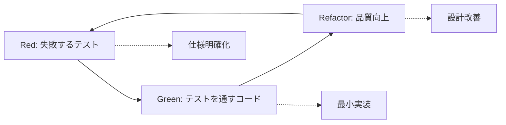

# TDD Development Strategy for ERPFTS Phase1 MVP

---
doc_type: "development_strategy"
complexity: "high"
purpose: "Test-Driven Development strategy and implementation guidelines"
business_value: "コード品質向上・保守性確保・バグ削減・開発効率向上"
target_audience: "Development Team, AI Assistant"
version: "1.0.0"
created_date: "2025-01-22"
status: "active"
references:
  - "t-wada TDD practices: https://github.com/testdouble/contributing-tests/wiki/Testing-Strategies"
  - "TDD by Example - Kent Beck"
  - "Growing Object-Oriented Software, Guided by Tests"
---

## 🎯 TDD戦略の目的とビジネス価値

### なぜTDDを採用するのか
```yaml
品質向上:
  - バグの早期発見・修正コスト削減
  - リファクタリング時の安全性確保
  - 設計品質・可読性向上

開発効率:
  - 仕様の明確化・曖昧性排除
  - デバッグ時間の大幅削減
  - コードレビュー効率向上

保守性:
  - 変更に強いコードベース構築
  - ドキュメントとしてのテストコード
  - 新規参加者のオンボーディング効率化
```

## 🔄 t-wada方式 Red-Green-Refactor サイクル

### 基本サイクル


### Red Phase（失敗するテスト）
```python
# 例：文書検索機能のテスト
def test_document_search_returns_relevant_results():
    """文書検索が関連性の高い結果を返すことをテスト"""
    # Arrange: テストデータ準備
    search_service = SearchService()
    mock_documents = [
        {"id": "1", "content": "ERP implementation best practices"},
        {"id": "2", "content": "Project management methodologies"},
        {"id": "3", "content": "Database design patterns"}
    ]
    search_service.setup_test_data(mock_documents)
    
    # Act: 検索実行
    results = search_service.search("ERP implementation")
    
    # Assert: 期待結果検証
    assert len(results) > 0
    assert results[0]["id"] == "1"
    assert results[0]["similarity_score"] > 0.8
    
    # 最初は失敗する（SearchServiceが未実装のため）
```

**Red Phaseのチェックリスト:**
- [ ] テストが失敗することを確認
- [ ] テストが仕様を正確に表現している
- [ ] テストが読みやすく理解しやすい
- [ ] 最小限のテストから開始

### Green Phase（テストを通すコード）
```python
# 最小限の実装でテストを通す
class SearchService:
    def __init__(self):
        self.documents = []
    
    def setup_test_data(self, documents):
        self.documents = documents
    
    def search(self, query):
        # 最初は最もシンプルな実装
        if query == "ERP implementation":
            return [{"id": "1", "similarity_score": 0.9}]
        return []
```

**Green Phaseのチェックリスト:**
- [ ] 全てのテストが通過する
- [ ] 最小限の実装に留める
- [ ] 品質は後回し（動作することを優先）
- [ ] ハードコーディングも許容

### Refactor Phase（品質向上）
```python
# リファクタリング後の品質の高い実装
class SearchService:
    def __init__(self, embedding_service: EmbeddingService):
        self.embedding_service = embedding_service
        self.documents = []
    
    def setup_test_data(self, documents: List[Dict[str, Any]]):
        self.documents = documents
    
    def search(self, query: str, threshold: float = 0.7) -> List[Dict[str, Any]]:
        query_embedding = self.embedding_service.encode(query)
        results = []
        
        for doc in self.documents:
            doc_embedding = self.embedding_service.encode(doc["content"])
            similarity = self._calculate_similarity(query_embedding, doc_embedding)
            
            if similarity > threshold:
                results.append({
                    "id": doc["id"],
                    "similarity_score": similarity
                })
        
        return sorted(results, key=lambda x: x["similarity_score"], reverse=True)
    
    def _calculate_similarity(self, embed1, embed2) -> float:
        # コサイン類似度計算
        return np.dot(embed1, embed2) / (np.linalg.norm(embed1) * np.linalg.norm(embed2))
```

**Refactor Phaseのチェックリスト:**
- [ ] 全テストが継続して通過
- [ ] コード重複の排除
- [ ] 命名・構造の改善
- [ ] パフォーマンスの最適化

## 🧪 ERPFTS Phase1のテスト戦略

### テスト分類と責務
```yaml
Unit Tests (単体テスト):
  対象: 個別クラス・メソッド
  責務: ビジネスロジックの正確性
  カバレッジ目標: 90%以上
  実行頻度: 開発中常時

Integration Tests (統合テスト):
  対象: 複数コンポーネント連携
  責務: インターフェース・データ流動の検証
  カバレッジ目標: 重要パス100%
  実行頻度: CI/CD時

E2E Tests (エンドツーエンド):
  対象: ユーザージャーニー全体
  責務: システム全体の動作確認
  カバレッジ目標: 主要シナリオ100%
  実行頻度: リリース前
```

### テストディレクトリ構造
```
tests/
├── unit/
│   ├── test_services/
│   │   ├── test_document_service.py
│   │   ├── test_embedding_service.py
│   │   └── test_search_service.py
│   ├── test_models/
│   └── test_utils/
├── integration/
│   ├── test_api_endpoints.py
│   ├── test_database_operations.py
│   └── test_embedding_pipeline.py
├── e2e/
│   ├── test_document_upload_flow.py
│   └── test_search_workflow.py
├── fixtures/
│   ├── sample_documents/
│   └── test_data.py
└── conftest.py
```

## 📝 テスト作成ガイドライン

### 良いテストの特徴（FIRST原則）
```yaml
Fast (高速):
  - 実行時間は可能な限り短く
  - 外部依存を最小化
  - モック・スタブの効果的活用

Independent (独立):
  - テスト間の依存関係を排除
  - 実行順序に依存しない
  - 並列実行可能

Repeatable (再現可能):
  - 環境に依存しない
  - 同一条件で同一結果
  - フレイキーテストの排除

Self-Validating (自己検証):
  - テスト結果が明確（成功/失敗）
  - 人間による判断を不要
  - アサーション明確化

Timely (適時):
  - プロダクションコード直前作成
  - Red-Green-Refactorサイクル遵守
```

### テスト命名規約
```python
# パターン: test_[action]_[condition]_[expected_result]
def test_search_with_valid_query_returns_relevant_documents():
    """有効なクエリでの検索が関連文書を返すことをテスト"""
    pass

def test_search_with_empty_query_raises_validation_error():
    """空クエリでの検索がバリデーションエラーを発生させることをテスト"""
    pass

def test_document_upload_with_unsupported_format_fails():
    """サポート外フォーマットでの文書アップロードが失敗することをテスト"""
    pass
```

## 🛠 実装時のTDD適用例

### DocumentService の TDD実装
```python
# tests/unit/test_services/test_document_service.py
import pytest
from unittest.mock import Mock, patch
from erpfts.services.document_service import DocumentService

class TestDocumentService:
    
    @pytest.fixture
    def document_service(self, mock_db):
        return DocumentService(db=mock_db)
    
    def test_process_document_with_valid_pdf_returns_document_object(self, document_service):
        """RED: 有効なPDFファイルの処理が文書オブジェクトを返すテスト"""
        # Arrange
        mock_file = Mock()
        mock_file.read.return_value = b'%PDF-1.4...'
        filename = "test_document.pdf"
        
        # Act
        result = document_service.process_document(mock_file, filename)
        
        # Assert
        assert result is not None
        assert result.filename == filename
        assert result.processing_status == "completed"
    
    def test_process_document_with_invalid_format_raises_validation_error(self, document_service):
        """RED: 無効フォーマットでの処理がバリデーションエラーを発生"""
        # Arrange
        mock_file = Mock()
        filename = "test_file.xyz"
        
        # Act & Assert
        with pytest.raises(ValidationError):
            document_service.process_document(mock_file, filename)
```

### 段階的実装（Green → Refactor）
```python
# 第1段階: GREEN - テストを通す最小実装
class DocumentService:
    def process_document(self, file, filename):
        if filename.endswith('.xyz'):
            raise ValidationError("Unsupported format")
        
        # ハードコードでテストを通す
        doc = Mock()
        doc.filename = filename
        doc.processing_status = "completed"
        return doc

# 第2段階: REFACTOR - 品質向上
class DocumentService:
    SUPPORTED_FORMATS = ['.pdf', '.docx', '.txt', '.html']
    
    def process_document(self, file: BinaryIO, filename: str) -> Document:
        self._validate_file_format(filename)
        
        # 実際の処理実装
        content = self._extract_content(file, filename)
        chunks = self._create_chunks(content)
        
        return self._create_document_record(filename, content, chunks)
    
    def _validate_file_format(self, filename: str):
        ext = Path(filename).suffix.lower()
        if ext not in self.SUPPORTED_FORMATS:
            raise ValidationError(f"Unsupported format: {ext}")
```

## 🚀 Phase1実装時のTDD適用戦略

### 優先実装順序
```yaml
1. Core Models & Schemas:
   - データモデルのバリデーションテスト
   - Pydanticスキーマの境界値テスト

2. Services Layer:
   - DocumentService: ファイル処理・バリデーション
   - EmbeddingService: ベクトル生成・類似度計算
   - SearchService: ハイブリッド検索ロジック

3. API Endpoints:
   - FastAPIエンドポイントの統合テスト
   - リクエスト/レスポンス検証

4. UI Components:
   - Streamlitコンポーネントの動作テスト
   - ユーザーインタラクション検証
```

### CI/CDパイプライン統合
```yaml
# .github/workflows/test.yml
name: TDD Test Pipeline
on: [push, pull_request]
jobs:
  test:
    runs-on: ubuntu-latest
    steps:
      - name: Run Unit Tests
        run: |
          pytest tests/unit/ -v --cov=src --cov-report=xml
          
      - name: Run Integration Tests  
        run: |
          pytest tests/integration/ -v
          
      - name: Run E2E Tests (on main branch)
        if: github.ref == 'refs/heads/main'
        run: |
          pytest tests/e2e/ -v
```

## 📊 TDD品質メトリクス

### 測定指標
```yaml
テストカバレッジ:
  - 行カバレッジ: 90%以上
  - 分岐カバレッジ: 85%以上
  - 関数カバレッジ: 95%以上

テスト実行時間:
  - 単体テスト: 全体で30秒以内
  - 統合テスト: 全体で2分以内
  - E2Eテスト: 全体で5分以内

品質指標:
  - フレイキーテスト率: 1%以下
  - テスト成功率: 99%以上
  - 平均修正時間: 30分以内
```

## 🎓 TDD学習・導入支援

### 推奨リソース
```yaml
書籍:
  - "Test-Driven Development by Example" - Kent Beck
  - "Growing Object-Oriented Software, Guided by Tests"
  - "実践テスト駆動開発" - Steve Freeman

実践教材:
  - t-wada GitHub: https://github.com/twada
  - TDD Kata Collection
  - Clean Code Practices

コミュニティ:
  - 日本XPユーザーグループ
  - TDD研究会・勉強会
  - アジャイル開発コミュニティ
```

このTDD戦略により、ERPFTS Phase1 MVPの品質向上と継続的改善基盤が確立されます。