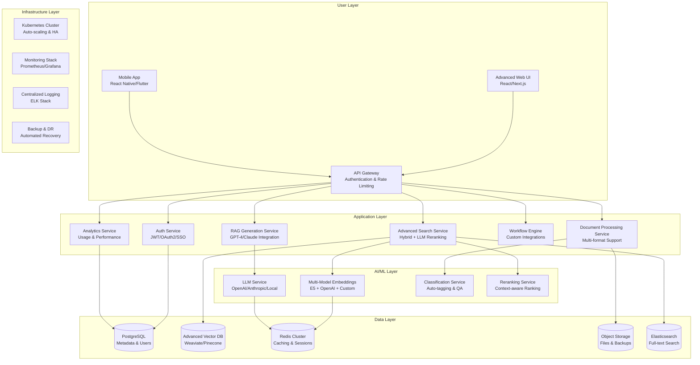

# ERPFTS Phase2 準備・設計・アーキテクチャ検討

## 📋 Phase2概要・戦略的位置づけ

### Phase2の目的・ビジネス価値
```yaml
Phase2 Strategic Goals:
  主要目的: Phase1 MVPからエンタープライズグレードシステムへの進化
  
  ビジネス価値拡大:
    - 検索精度向上: 80% → 95%以上
    - ユーザー生産性: 30% → 60%向上
    - 企業統合度: シングル → マルチシステム統合
    - ROI改善: Phase1基盤投資の本格回収開始
    
  技術的進化:
    - Basic RAG → Advanced RAG (Hybrid Search, Chain-of-Thought)
    - Single User → Multi-tenant Enterprise System
    - Manual → Automated Knowledge Management
    - Reactive → Proactive Intelligence

Market Position:
  競合優位性: 
    - 日本語・国際標準特化の専門RAGシステム
    - エンタープライズ統合・セキュリティ対応
    - AI駆動による継続的知識品質改善
    - カスタマイズ可能なワークフロー統合
```

### Phase1 → Phase2 進化マップ
```yaml
Knowledge Processing Evolution:
  Phase1: "Basic Document Ingestion"
    - PDF・Web基本取り込み
    - シンプルチャンク分割
    - 基本品質フィルタ
  
  Phase2: "Intelligent Knowledge Curation"
    - Advanced Document Processors (Office, Email, Wiki)
    - Semantic Chunking with Context
    - AI-Powered Quality Assessment
    - Auto-Classification & Tagging

Search Evolution:
  Phase1: "Semantic Vector Search"
    - Single embedding model search
    - Basic similarity ranking
    - Simple filters
  
  Phase2: "Hybrid Intelligent Search"
    - Vector + Keyword Hybrid Search
    - Multi-modal search (Text + Images + Tables)
    - Contextual reranking with LLM
    - Personalized search with user behavior

RAG Evolution:
  Phase1: "Search & Retrieve"
    - Pure search functionality
    - Static result presentation
    - No generation capabilities
  
  Phase2: "Generate & Reason"
    - RAG Answer Generation
    - Chain-of-Thought reasoning
    - Multi-step query decomposition
    - Source attribution & fact-checking

Enterprise Evolution:
  Phase1: "Single User System"
    - Local deployment
    - Basic UI access
    - No authentication
  
  Phase2: "Enterprise Platform"
    - Multi-tenant architecture
    - SSO/LDAP integration
    - Role-based access control
    - Audit trails & compliance
```

## 🏗️ Phase2 アーキテクチャ設計

### システムアーキテクチャ概要図


### Phase2 核心技術スタック決定
```yaml
Frontend Technology Stack:
  Primary: "React 18 + Next.js 14 + TypeScript"
    理由: 
      - エンタープライズグレードのパフォーマンス・SEO
      - TypeScript による型安全性・開発効率
      - Server-side Rendering対応
      - 豊富なエンタープライズUI component library
    
  Alternative Options:
    - Vue.js 3 + Nuxt.js: より学習コストが低い
    - Svelte + SvelteKit: 最高のパフォーマンス
    
  UI Framework: "Ant Design Enterprise + Tailwind CSS"
    理由: エンタープライズ向け機能豊富・アクセシビリティ対応

Backend Technology Stack:
  API Framework: "FastAPI + SQLAlchemy 2.0 + Pydantic v2"
    継続理由: 
      - Phase1との継続性・既存資産活用
      - 高速開発・自動ドキュメント生成
      - 型安全性・バリデーション
    
  New Additions:
    - Celery + Redis: 非同期タスク処理
    - Alembic: データベースマイグレーション
    - Prometheus + Grafana: メトリクス・監視

AI/ML Technology Stack:
  Vector Database: "Weaviate Enterprise"
    Phase1からの移行理由:
      - Multi-vector support (複数embedding model対応)
      - Built-in ML modules (classification, Q&A)
      - GraphQL API + RESTful API
      - Enterprise features (backup, monitoring)
    
  Embedding Models: "Multi-model Strategy"
    - Primary: sentence-transformers/multilingual-e5-large
    - Secondary: OpenAI text-embedding-3-large  
    - Specialized: Japanese-specific fine-tuned models
    
  LLM Integration: "Multi-provider Strategy"
    - OpenAI GPT-4 Turbo (primary)
    - Anthropic Claude 3 (secondary)
    - Local deployment option (Llama 2/3)

Data Storage Strategy:
  Primary Database: "PostgreSQL 15+ with pgvector"
    移行理由:
      - SQLiteからのスケールアップ
      - ACID compliance・トランザクション保証
      - 豊富なextensions (pgvector, full-text search)
      - エンタープライズ向け機能
    
  Search Engine: "Elasticsearch 8.x"
    新規追加理由:
      - 高速full-text search
      - Advanced aggregations・analytics
      - Multi-language support
      - Vector search capabilities
    
  Cache Strategy: "Redis Cluster"
    スケールアップ理由:
      - 高可用性・水平スケーリング
      - Session store・rate limiting
      - Real-time analytics

Infrastructure & DevOps:
  Container Orchestration: "Kubernetes"
    新規導入理由:
      - Auto-scaling・high availability
      - Rolling deployments・blue-green deployments
      - Service mesh (Istio) for microservices
      - Cost optimization・resource efficiency
    
  Cloud Strategy: "Multi-cloud Ready"
    - Primary: AWS EKS
    - Secondary: Azure AKS
    - On-premise: Self-managed Kubernetes
    
  CI/CD Pipeline: "GitLab CI/CD + ArgoCD"
    強化理由:
      - GitOps workflow
      - Automated testing・security scanning
      - Infrastructure as Code (Terraform)
      - Multi-environment deployment
```

## 🚀 Phase2 機能仕様・要件定義

### 高度検索機能 (Advanced Search Features)
```yaml
Hybrid Search Engine:
  Vector + Keyword Combined Search:
    実装方式: "Reciprocal Rank Fusion (RRF)"
    性能目標: 検索精度95%以上・レスポンス1秒以内
    機能詳細:
      - Semantic vector search (embedding-based)
      - Full-text keyword search (Elasticsearch-based)
      - Intelligent fusion ranking algorithm
      - User query intent detection & routing
    
  Multi-modal Search:
    対応形式:
      - Text: 自然言語・キーワード・構造化クエリ
      - Image: OCR text extraction・visual similarity
      - Table: Structured data search・column filtering
      - Code: Syntax-aware search・API documentation
    
    実装技術:
      - CLIP models for image-text understanding
      - Table extraction & indexing (Camelot/Tabula)
      - Code parsing & AST analysis

Contextual Reranking:
  LLM-Powered Reranking:
    目的: クエリコンテキストに基づく結果の再順序
    手法: 
      - Query expansion with LLM
      - Result relevance scoring with GPT-4
      - User feedback learning
      - Temporal relevance adjustment
    
  Personalized Search:
    機能:
      - User search history analysis
      - Role-based result filtering
      - Team knowledge preferences
      - Learning path recommendations

Advanced Query Processing:
  Query Understanding:
    - Intent classification (fact-finding, how-to, comparison)
    - Entity extraction & normalization
    - Query expansion with synonyms
    - Multi-language query translation
    
  Query Decomposition:
    - Complex query → sub-queries
    - Multi-step reasoning
    - Dependency resolution
    - Parallel sub-query execution
```

### RAG生成機能 (RAG Generation Features)
```yaml
Answer Generation Engine:
  Direct Answer Generation:
    機能: ユーザークエリに対する直接的な回答生成
    技術スタック:
      - OpenAI GPT-4 Turbo (primary)
      - Anthropic Claude 3 (fallback)
      - Custom prompt engineering
      - Source attribution & citation
    
    品質保証:
      - Fact-checking against sources
      - Hallucination detection
      - Confidence scoring
      - Source relevance validation
    
  Multi-step Reasoning:
    Chain-of-Thought Processing:
      - Step-by-step problem decomposition
      - Intermediate reasoning steps
      - Logic validation
      - Final answer synthesis
    
    Use Cases:
      - Complex analysis questions
      - Multi-document synthesis
      - Comparative analysis
      - Root cause analysis

Conversation & Context Management:
  Conversational RAG:
    機能:
      - Multi-turn conversation support
      - Context preservation across turns
      - Follow-up question handling
      - Clarification requests
    
    実装:
      - Session-based context storage
      - Context window management
      - Reference resolution
      - Topic drift detection
    
  Knowledge Graph Integration:
    目的: 関連概念・エンティティの接続可視化
    技術:
      - Auto-generated knowledge graphs
      - Entity relationship mapping
      - Graph-based reasoning
      - Visual exploration interface

Quality Assurance & Validation:
  Answer Quality Scoring:
    評価軸:
      - Factual accuracy
      - Completeness
      - Clarity & readability
      - Source alignment
    
  Human-in-the-Loop Validation:
    機能:
      - Expert review workflows
      - Quality feedback collection
      - Answer improvement suggestions
      - Community validation
```

### エンタープライズ統合 (Enterprise Integration)
```yaml
Authentication & Authorization:
  Single Sign-On (SSO):
    対応プロトコル:
      - SAML 2.0
      - OpenID Connect / OAuth 2.0
      - LDAP / Active Directory
      - Azure AD / Okta integration
    
  Role-Based Access Control (RBAC):
    Role定義:
      - System Administrator: 全システム管理権限
      - Knowledge Manager: コンテンツ管理・品質管理
      - Power User: 高度検索・分析機能
      - Standard User: 基本検索・閲覧機能
      - Guest User: 限定コンテンツアクセス
    
    Permission Matrix:
      - Content access by department/project
      - Feature access by role level
      - Data export/sharing permissions
      - Administrative function access

Multi-tenant Architecture:
  Tenant Isolation:
    方式: "Schema-based Multi-tenancy"
    理由: データ分離・セキュリティ・カスタマイズ性
    実装:
      - Tenant-specific database schemas
      - Isolated vector collections
      - Custom branding & configuration
      - Separate analytics & reporting
    
  Resource Management:
    - Tenant-specific resource quotas
    - Usage monitoring & billing
    - Performance isolation
    - Backup & recovery per tenant

Enterprise Integrations:
  Microsoft 365 Integration:
    対応サービス:
      - SharePoint: Document libraries sync
      - Teams: Chat integration & bot
      - Outlook: Email knowledge extraction
      - OneDrive: Personal file indexing
    
  Slack/Teams Bot Integration:
    機能:
      - In-chat knowledge search
      - Auto-answers for common questions
      - Meeting summary & action items
      - Knowledge sharing workflows
    
  CRM/ERP Integration:
    - Salesforce knowledge base sync
    - SAP documentation integration
    - Custom API webhooks
    - Real-time data synchronization

Compliance & Security:
  Data Privacy & GDPR:
    機能:
      - Personal data detection & masking
      - Right to be forgotten
      - Data processing consent management
      - Cross-border data transfer controls
    
  Audit & Compliance:
    - Complete audit trails
    - Access logs & monitoring
    - Data lineage tracking
    - Compliance reporting
    
  Security Features:
    - End-to-end encryption
    - API rate limiting & DDoS protection
    - Vulnerability scanning
    - Penetration testing ready
```

## 📊 Phase2 データアーキテクチャ設計

### データフロー・統合戦略
```yaml
Data Ingestion Pipeline:
  Multi-source Data Connectors:
    Enterprise Sources:
      - Microsoft SharePoint/OneDrive
      - Google Workspace (Drive, Docs, Sheets)
      - Atlassian Confluence/Jira
      - Slack/Microsoft Teams
      - Email archives (Exchange/Gmail)
      - CRM/ERP systems
    
    Processing Pipeline:
      Input → Format Detection → Content Extraction → 
      Language Detection → Quality Assessment → 
      Semantic Chunking → Multi-model Embedding → 
      Vector Storage + Full-text Indexing
    
  Real-time vs Batch Processing:
    Real-time: "Kafka + Stream Processing"
      - New document alerts
      - Chat/email integration
      - User behavior tracking
      - System monitoring events
    
    Batch Processing: "Airflow + Celery"
      - Bulk document processing
      - Periodic re-indexing
      - Analytics aggregation
      - Backup & archival

Vector Database Architecture:
  Weaviate Configuration:
    Multi-Class Schema:
      - Documents: Core document objects
      - Chunks: Document segments with embeddings
      - Users: User profiles & preferences
      - Organizations: Tenant/department data
      - Analytics: Usage & performance metrics
    
    Multi-Vector Strategy:
      - Primary: multilingual-e5-large (1024 dim)
      - Secondary: OpenAI text-embedding-3-large (3072 dim)
      - Specialized: domain-specific fine-tuned models
      - Image: CLIP ViT-L/14 (768 dim)
    
    Cross-reference & Modules:
      - ref2vec: Document-chunk relationships
      - text2vec: Text semantic vectors
      - qna: Q&A extraction module
      - sum: Summarization module

Search Index Architecture:
  Elasticsearch Configuration:
    Index Strategy:
      - Primary Index: documents_v{version}
      - Chunk Index: chunks_v{version}
      - User Index: users_v{version}
      - Analytics Index: analytics_v{version}
    
    Multi-language Support:
      - Japanese: kuromoji analyzer
      - English: english analyzer
      - Auto-detection: lang-detect plugin
      - Cross-language search capability
    
    Performance Optimization:
      - Shard strategy by tenant/volume
      - Replica configuration for HA
      - Index lifecycle management
      - Hot-warm-cold architecture

Caching Strategy:
  Multi-layer Caching:
    L1 - Application Cache: "FastAPI Cache"
      - API response caching (5-60 minutes)
      - User session data
      - Frequently accessed metadata
    
    L2 - Redis Cache: "Redis Cluster"
      - Search result caching (1-24 hours)
      - Embedding vectors (hot data)
      - User preference data
      - Rate limiting counters
    
    L3 - CDN Cache: "CloudFlare/AWS CloudFront"
      - Static assets (images, CSS, JS)
      - Document previews
      - Public API responses
      - Global content distribution
```

### データモデル設計
```yaml
Core Data Models:

Organization (Multi-tenant):
  Fields:
    - id: UUID (primary key)
    - name: String (organization name)
    - domain: String (email domain)
    - settings: JSON (custom configurations)
    - subscription_tier: Enum (free, pro, enterprise)
    - created_at/updated_at: Timestamp
  
  Relationships:
    - Users: One-to-many
    - DocumentCollections: One-to-many
    - Analytics: One-to-many

User (Enhanced from Phase1):
  Fields:
    - id: UUID (primary key)
    - organization_id: UUID (foreign key)
    - email: String (unique)
    - role: Enum (admin, manager, user, guest)
    - preferences: JSON (search settings, UI preferences)
    - last_active: Timestamp
  
  New Features:
    - SSO integration fields
    - Role-based permissions
    - Usage analytics tracking
    - Personalization data

Document (Enhanced):
  Fields:
    - id: UUID (primary key)
    - organization_id: UUID (foreign key)
    - title: String
    - source_type: Enum (file, web, api, integration)
    - source_metadata: JSON (original location, author, etc.)
    - processing_status: Enum (pending, processing, completed, failed)
    - quality_score: Float (AI-assessed quality)
    - classification_tags: Array[String] (auto-generated)
    - access_level: Enum (public, internal, restricted, confidential)
  
  New Features:
    - Multi-format support metadata
    - Quality assessment scores
    - Auto-classification results
    - Access control integration

DocumentChunk (Enhanced):
  Fields:
    - id: UUID (primary key)
    - document_id: UUID (foreign key)
    - content: Text
    - chunk_type: Enum (paragraph, table, image, code)
    - semantic_index: Integer (position in semantic flow)
    - embeddings: JSON (multiple embedding vectors)
    - quality_indicators: JSON (readability, completeness, etc.)
    - relationships: JSON (references to other chunks)
  
  Vector Embeddings:
    - primary_embedding: Array[Float] (e5-large)
    - secondary_embedding: Array[Float] (openai)
    - specialized_embeddings: JSON (domain-specific)

SearchSession (New):
  Purpose: Track user search behavior for personalization
  Fields:
    - id: UUID (primary key)
    - user_id: UUID (foreign key)
    - query: String
    - query_intent: Enum (factual, procedural, analytical)
    - results_clicked: Array[UUID] (chunk IDs)
    - satisfaction_score: Integer (1-5)
    - session_duration: Integer (seconds)
    - created_at: Timestamp

ConversationThread (New):
  Purpose: Support conversational RAG functionality
  Fields:
    - id: UUID (primary key)
    - user_id: UUID (foreign key)
    - title: String (auto-generated summary)
    - context: JSON (conversation history)
    - created_at/updated_at: Timestamp
  
  Messages:
    - id: UUID
    - thread_id: UUID (foreign key)
    - role: Enum (user, assistant)
    - content: Text
    - sources: Array[UUID] (referenced chunk IDs)
    - timestamp: Timestamp
```

## 🔧 Phase2 技術実装戦略

### Phase1 → Phase2 マイグレーション計画
```yaml
Migration Strategy Overview:
  Approach: "Parallel System + Gradual Migration"
  Timeline: 8-12 weeks
  Risk Mitigation: Zero-downtime transition
  
  Migration Phases:
    Phase 2.1 (2-3 weeks): Infrastructure Setup
      - New technology stack deployment
      - Parallel environment construction
      - Data migration tooling development
      - Basic integration testing
    
    Phase 2.2 (3-4 weeks): Data Migration
      - SQLite → PostgreSQL migration
      - ChromaDB → Weaviate migration
      - Document re-processing with new pipeline
      - Embedding regeneration with multi-model
    
    Phase 2.3 (2-3 weeks): Feature Development
      - Advanced search implementation
      - RAG generation capability
      - Enterprise features development
      - UI/UX enhancement
    
    Phase 2.4 (1-2 weeks): Testing & Deployment
      - Integration testing
      - Performance testing
      - User acceptance testing
      - Production deployment

Technical Migration Details:

Database Migration:
  SQLite → PostgreSQL:
    Tools: "Custom migration scripts + SQLAlchemy"
    Strategy:
      1. Schema mapping & conversion
      2. Data validation & integrity checks
      3. Index recreation & optimization
      4. Performance baseline establishment
    
    Key Considerations:
      - Foreign key constraint handling
      - Data type conversions
      - Index strategy optimization
      - Connection pooling setup

Vector Database Migration:
  ChromaDB → Weaviate:
    Strategy: "Rebuild with Enhancement"
    Reasoning:
      - Different schema design
      - Multi-model embedding support
      - Enterprise features requirement
    
    Process:
      1. Export existing embeddings & metadata
      2. Re-process documents with new pipeline
      3. Generate multi-model embeddings
      4. Weaviate schema creation & data import
      5. Performance optimization & testing

Code Architecture Refactoring:
  Microservices Transition:
    Current: "Monolithic FastAPI application"
    Target: "Microservices with API Gateway"
    
    Service Decomposition:
      - auth-service: Authentication & authorization
      - document-service: Document processing & management
      - search-service: Advanced search & ranking
      - rag-service: Answer generation & reasoning
      - analytics-service: Usage analytics & insights
      - integration-service: External system connectors
    
    Inter-service Communication:
      - Synchronous: HTTP/REST APIs
      - Asynchronous: Kafka message broker
      - Service discovery: Kubernetes services
      - Load balancing: Istio service mesh

Frontend Migration:
  Streamlit → React/Next.js:
    Migration Strategy: "Complete Rewrite"
    Reasoning:
      - Enterprise UX requirements
      - Mobile responsiveness
      - Advanced interactions
      - Performance optimization
    
    Development Approach:
      - Component-based architecture
      - Design system implementation
      - Progressive Web App (PWA)
      - Server-side rendering (SSR)
```

### 開発環境・DevOps強化
```yaml
Development Environment Enhancement:

Local Development:
  Docker Compose Stack:
    Services:
      - PostgreSQL with pgvector
      - Weaviate vector database
      - Elasticsearch cluster
      - Redis cluster
      - Kafka broker
      - Monitoring stack (Prometheus/Grafana)
    
    Developer Experience:
      - One-command environment startup
      - Hot reload for all services
      - Integrated debugging support
      - Test data seeding scripts

CI/CD Pipeline Enhancement:
  GitLab CI/CD Configuration:
    Stages:
      1. Code Quality: lint, format, type-check
      2. Unit Testing: service-specific tests
      3. Integration Testing: cross-service tests
      4. Security Scanning: SAST, DAST, dependency check
      5. Build & Package: Docker image creation
      6. Deploy to Staging: automated deployment
      7. E2E Testing: full system validation
      8. Deploy to Production: manual approval gate
    
    Quality Gates:
      - Code coverage: 80%+ for all services
      - Security vulnerabilities: Zero critical/high
      - Performance benchmarks: Response time < 1s
      - Integration test success: 100%

Kubernetes Deployment:
  Infrastructure as Code:
    Tools: "Terraform + Helm Charts"
    
    Kubernetes Resources:
      - Namespaces: dev, staging, production
      - Deployments: auto-scaling services
      - Services: load balancing & discovery
      - Ingress: SSL termination & routing
      - ConfigMaps: environment configuration
      - Secrets: credentials & certificates
    
    Monitoring & Observability:
      - Prometheus: metrics collection
      - Grafana: visualization & alerting
      - Jaeger: distributed tracing
      - ELK Stack: centralized logging
      - Kubernetes Dashboard: cluster management

Security Implementation:
  Application Security:
    Authentication:
      - JWT with refresh tokens
      - OAuth 2.0 / OIDC integration
      - Multi-factor authentication (MFA)
      - Session management & timeout
    
    Authorization:
      - Role-based access control (RBAC)
      - Resource-level permissions
      - API rate limiting
      - Request validation & sanitization
    
    Data Protection:
      - Encryption at rest (AES-256)
      - Encryption in transit (TLS 1.3)
      - PII detection & masking
      - Audit logging & monitoring
    
  Infrastructure Security:
    Container Security:
      - Base image vulnerability scanning
      - Runtime security monitoring
      - Network policy enforcement
      - Secrets management (Vault/K8s secrets)
    
    Network Security:
      - Service mesh (Istio) for mTLS
      - Network segmentation
      - DDoS protection
      - WAF (Web Application Firewall)
```

## 📈 Phase2 性能・スケーラビリティ目標

### 性能要件定義
```yaml
Response Time Targets:
  Search Performance:
    Simple Search: < 500ms (95th percentile)
    Complex Search: < 1000ms (95th percentile)
    RAG Generation: < 3000ms (95th percentile)
    Conversational Turn: < 2000ms (95th percentile)
  
  System Performance:
    API Response: < 200ms (non-LLM endpoints)
    Page Load Time: < 2000ms (first meaningful paint)
    Time to Interactive: < 3000ms
    Search Result Display: < 100ms (after search completion)

Throughput Targets:
  Concurrent Users:
    Small Organization: 50 concurrent users
    Medium Organization: 200 concurrent users
    Large Organization: 1000 concurrent users
    Enterprise: 5000+ concurrent users
  
  Request Handling:
    Search Requests: 1000 req/sec per instance
    Document Processing: 100 docs/minute
    API Requests: 5000 req/sec (total)
    Real-time Updates: 10000 events/sec

Scalability Architecture:
  Horizontal Scaling:
    API Services:
      - Auto-scaling based on CPU/memory usage
      - Load balancing with session affinity
      - Circuit breaker pattern for fault tolerance
      - Health checks & graceful shutdown
    
    Database Scaling:
      - PostgreSQL read replicas
      - Connection pooling (PgBouncer)
      - Query optimization & indexing
      - Partitioning for large datasets
    
    Vector Database Scaling:
      - Weaviate cluster with sharding
      - Replication for high availability
      - Vector compression techniques
      - Query result caching
    
    Search Engine Scaling:
      - Elasticsearch cluster with multiple nodes
      - Index sharding by tenant/time
      - Query optimization & caching
      - Hot-warm-cold architecture

Resource Management:
  Memory Optimization:
    Embedding Models:
      - Model quantization (FP16/INT8)
      - Batch processing optimization
      - Memory-mapped model loading
      - GPU memory management
    
    Application Memory:
      - Connection pooling
      - Object pooling for expensive operations
      - Memory profiling & leak detection
      - Garbage collection optimization
  
  Storage Optimization:
    Vector Storage:
      - Vector compression (PCA/LSH)
      - Hierarchical indexing
      - Storage tiering (hot/warm/cold)
      - Efficient serialization formats
    
    Document Storage:
      - Content deduplication
      - Compression for archived documents
      - CDN for static content
      - Lifecycle management policies

Monitoring & Alerting:
  Key Performance Indicators (KPIs):
    Business Metrics:
      - User satisfaction score (CSAT)
      - Search success rate
      - Time to find information
      - User engagement metrics
    
    Technical Metrics:
      - Response time percentiles
      - Error rates by service
      - Resource utilization
      - Database performance
    
    Infrastructure Metrics:
      - CPU/Memory/Disk utilization
      - Network bandwidth usage
      - Container restart frequency
      - Kubernetes cluster health
  
  Alerting Strategy:
    Critical Alerts:
      - System downtime (> 1 minute)
      - Error rate > 5%
      - Response time > SLA threshold
      - Database connection failures
    
    Warning Alerts:
      - High resource utilization (> 80%)
      - Slow queries (> 2x normal)
      - Unusual traffic patterns
      - Certificate expiration warnings
```

## 🎯 Phase2 マイルストーン・実装ロードマップ

### 12週間実装計画
```yaml
Phase 2.1: Infrastructure & Migration (Week 1-3)
  Week 1: Architecture Setup
    - Kubernetes cluster setup
    - PostgreSQL + Weaviate deployment
    - Basic microservices skeleton
    - CI/CD pipeline enhancement
  
  Week 2: Data Migration
    - SQLite → PostgreSQL migration
    - ChromaDB → Weaviate migration
    - Document re-processing pipeline
    - Data validation & integrity checks
  
  Week 3: Integration Testing
    - Service-to-service communication
    - Database performance validation
    - Migration verification
    - Rollback procedures testing

Phase 2.2: Advanced Search & RAG (Week 4-6)
  Week 4: Hybrid Search Implementation
    - Vector + keyword search fusion
    - Elasticsearch integration
    - Multi-model embedding pipeline
    - Search result reranking
  
  Week 5: RAG Generation Engine
    - LLM integration (OpenAI/Anthropic)
    - Prompt engineering & optimization
    - Answer generation pipeline
    - Source attribution & citations
  
  Week 6: Advanced Features
    - Conversational RAG
    - Multi-step reasoning
    - Context management
    - Quality assurance system

Phase 2.3: Enterprise Features (Week 7-9)
  Week 7: Authentication & Authorization
    - SSO integration
    - RBAC implementation
    - Multi-tenant architecture
    - Security hardening
  
  Week 8: Enterprise Integrations
    - Microsoft 365 connectors
    - Slack/Teams bot integration
    - API gateway implementation
    - Webhook system
  
  Week 9: Analytics & Monitoring
    - Usage analytics system
    - Performance monitoring
    - Audit trail implementation
    - Compliance features

Phase 2.4: UI/UX & Testing (Week 10-12)
  Week 10: Frontend Development
    - React/Next.js implementation
    - Advanced UI components
    - Mobile responsiveness
    - Progressive Web App features
  
  Week 11: Integration & Testing
    - End-to-end testing
    - Performance testing
    - Security testing
    - User acceptance testing
  
  Week 12: Deployment & Launch
    - Production deployment
    - Performance optimization
    - User training & documentation
    - Phase 2 launch & monitoring

Success Criteria by Phase:
  Phase 2.1 Success Criteria:
    □ Zero data loss in migration
    □ 99.9% system availability
    □ Performance maintained or improved
    □ All automated tests passing
  
  Phase 2.2 Success Criteria:
    □ Search accuracy > 95%
    □ RAG answer quality > 90%
    □ Response time < 1 second
    □ Multi-modal search working
  
  Phase 2.3 Success Criteria:
    □ SSO integration working
    □ Multi-tenant isolation verified
    □ All enterprise connectors functional
    □ Compliance requirements met
  
  Phase 2.4 Success Criteria:
    □ User satisfaction > 4.5/5
    □ Performance targets achieved
    □ Security audit passed
    □ Production deployment successful
```

## 🚨 Phase2 リスク管理・制約事項

### 主要リスク・対策
```yaml
Technical Risks:
  LLM Integration Complexity:
    Risk Level: High
    Impact: Critical for RAG functionality
    Mitigation:
      - Multi-provider fallback strategy
      - Comprehensive prompt testing
      - Rate limiting & cost management
      - Local model backup option
  
  Migration Data Loss:
    Risk Level: Medium
    Impact: Critical for business continuity
    Mitigation:
      - Comprehensive backup strategy
      - Parallel system operation
      - Gradual migration approach
      - Rollback procedures ready
  
  Performance Degradation:
    Risk Level: Medium
    Impact: High for user experience
    Mitigation:
      - Continuous performance monitoring
      - Load testing at each milestone
      - Auto-scaling mechanisms
      - Performance optimization team

Business Risks:
  User Adoption Challenges:
    Risk Level: Medium
    Impact: High for ROI achievement
    Mitigation:
      - User-centered design process
      - Extensive user testing
      - Training & support programs
      - Gradual feature rollout
  
  Budget Overrun:
    Risk Level: Low
    Impact: Medium for project sustainability
    Mitigation:
      - Detailed cost monitoring
      - Cloud cost optimization
      - Resource usage alerts
      - Regular budget reviews

Compliance & Security Risks:
  Data Privacy Violations:
    Risk Level: Low
    Impact: Critical for enterprise adoption
    Mitigation:
      - Privacy by design principles
      - Regular compliance audits
      - Data classification system
      - Employee training programs
  
  Security Breaches:
    Risk Level: Low
    Impact: Critical for trust & compliance
    Mitigation:
      - Defense in depth strategy
      - Regular security testing
      - Incident response procedures
      - Security monitoring & alerting

Resource Constraints:
  AI/ML Expertise Gap:
    Risk Level: Medium
    Impact: Medium for advanced features
    Mitigation:
      - External consultant engagement
      - Team training & certification
      - Open source community participation
      - Vendor technical support
  
  Infrastructure Costs:
    Risk Level: Medium
    Impact: Medium for scalability
    Mitigation:
      - Cloud cost optimization
      - Reserved instance planning
      - Efficient resource utilization
      - Cost monitoring & alerting
```

## 📋 Phase2完了・Phase3準備

### Phase2成功基準・KPI
```yaml
Technical Success Metrics:
  Performance KPIs:
    - Search accuracy: > 95%
    - Response time: < 1 second (95th percentile)
    - System availability: > 99.9%
    - Concurrent users: > 1000 supported
    - RAG answer quality: > 90% accuracy
  
  Integration KPIs:
    - SSO success rate: > 99%
    - Enterprise connector uptime: > 99.5%
    - Data synchronization accuracy: > 99.9%
    - Multi-tenant isolation: 100% verified

Business Success Metrics:
  User Adoption KPIs:
    - Monthly active users: > 500
    - User satisfaction: > 4.5/5
    - Feature adoption rate: > 80%
    - Support ticket reduction: > 50%
  
  ROI KPIs:
    - Knowledge search time reduction: > 70%
    - Employee productivity increase: > 40%
    - Information accuracy improvement: > 90%
    - Training time reduction: > 60%

Phase3 Preparation Roadmap:
  Advanced AI Capabilities:
    - Custom model fine-tuning
    - Domain-specific AI agents
    - Automated content creation
    - Predictive analytics
  
  Advanced Analytics:
    - Knowledge usage patterns
    - Organizational learning insights
    - Content gap analysis
    - ROI measurement automation
  
  Industry Expansion:
    - Healthcare compliance (HIPAA)
    - Financial services (SOX)
    - Government (FedRAMP)
    - Manufacturing (ISO standards)
```

---

**Version**: 1.0.0 | **Last Updated**: 2025-01-22 | **Next Review**: Monthly Architecture Review