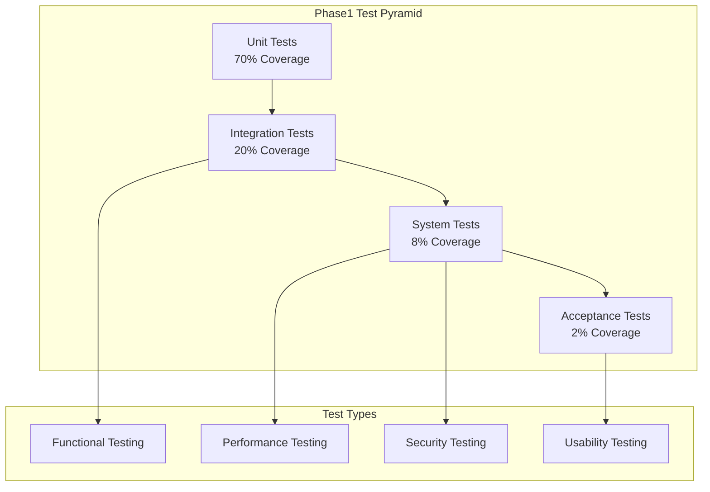

# ERP知識RAGシステム - Phase1 テスト計画・テストケース

---
doc_type: "phase1_test_plan"
complexity: "high"
estimated_effort: "テスト設計・実行の完全計画"
prerequisites: ["16_Phase1ImplementationPlan.md", "17_Phase1TechnicalSpecification.md", "19_Phase1DatabaseSetupScripts.md"]
implementation_priority: "critical"
ai_assistance_level: "full_automation_possible"
version: "1.0.0"
author: "Claude Code"
created_date: "2025-01-21"
status: "approved"
approval_authority: "QA Team Lead"
---

## 📋 Phase1 テスト計画概要

### テスト計画の目的・スコープ
本文書は「ERP知識RAGシステム（ERPFTS）」Phase1 MVPの包括的テスト戦略、テストケース設計、実行計画を定義する。6週間開発期間中の品質保証、各週の品質ゲート通過、最終的なMVP品質目標達成を確実にする。

### Phase1 テスト戦略
```yaml
テスト理念:
  品質ファースト: 機能実装と並行した継続的品質確保
  リスクベース: 高リスク機能への重点的テスト配分
  自動化優先: 反復可能・効率的テスト実行
  ユーザー価値重視: 実用性・満足度の重点確認

テスト範囲:
  機能テスト: 
    - 文書取り込み（PDF・Web・RSS）
    - セマンティック検索・結果表示
    - WebUI・ユーザーインタラクション
    - データ管理・品質管理
  
  非機能テスト:
    - パフォーマンス・レスポンス時間
    - スケーラビリティ・負荷耐性
    - セキュリティ・データ保護
    - 可用性・信頼性
  
  統合テスト:
    - システム間連携
    - データフロー整合性
    - エラーハンドリング
    - End-to-Endシナリオ

除外範囲:
  - Phase2以降機能（RAG生成・高度検索）
  - 大規模スケール（1万文書以上）
  - 複雑な権限管理
  - 外部API統合（Phase1では未実装）
```

## 🏗️ テストレベル・戦略

### テストレベル構成


### 各テストレベルの責任範囲
```yaml
Unit Tests (単体テスト):
  対象: 個別クラス・メソッド・関数
  責任者: 各開発者
  実行頻度: コミット毎
  自動化度: 100%
  
  カバレッジ目標:
    - コードカバレッジ: 80%以上
    - ブランチカバレッジ: 75%以上
    - 関数カバレッジ: 90%以上
  
  主要対象:
    - Text Processing (semantic chunking, cleaning)
    - Embedding Service (vector generation)
    - Search Engine (similarity search, ranking)
    - Data Models (validation, transformation)

Integration Tests (統合テスト):
  対象: コンポーネント間連携
  責任者: Backend Engineer + QA
  実行頻度: Daily Build
  自動化度: 90%
  
  主要対象:
    - Database ↔ Business Logic
    - Embedding Service ↔ Vector Store
    - Search Engine ↔ UI Components
    - Source Manager ↔ Extractors

System Tests (システムテスト):
  対象: システム全体機能
  責任者: QA Team
  実行頻度: Weekly + Pre-Release
  自動化度: 70%
  
  主要対象:
    - End-to-End Workflows
    - Cross-Browser Testing
    - Performance Testing
    - Security Testing

Acceptance Tests (受入テスト):
  対象: ビジネス価値・ユーザー満足度
  責任者: Product Owner + Users
  実行頻度: Pre-Release
  自動化度: 30%
  
  主要対象:
    - User Scenarios
    - Business Value Validation
    - Usability Testing
    - Stakeholder Acceptance
```

## 🧪 週次テスト実行計画

### Week 1: 基盤・環境テスト
```yaml
テスト目標: 開発環境・基盤コンポーネントの品質確保

Day 1-2: 環境構築テスト
  テスト項目:
    □ Python環境・依存関係インストール確認
    □ データベース接続・初期化テスト
    □ 開発ツール統合テスト（VSCode・PyCharm）
    □ CI/CDパイプライン動作確認
  
  成功基準:
    - 全開発者環境での同一動作確認
    - 自動テスト実行成功率 100%
    - セットアップ時間 30分以内

Day 3-4: データベース・設定テスト
  テスト項目:
    □ SQLite スキーマ作成・マイグレーション
    □ Chroma DB 初期化・コレクション作成
    □ 設定管理システム動作確認
    □ ログシステム・エラーハンドリング確認
  
  成功基準:
    - データベース操作100%成功
    - 設定値管理の完全性確認
    - エラーログ・追跡システム動作

Day 5-7: 統合・CI基盤テスト
  テスト項目:
    □ GitHub Actions ワークフロー確認
    □ pre-commit hooks 動作確認
    □ 品質ゲート・自動チェック確認
    □ 開発ワークフロー統合テスト
  
  成功基準:
    - CI/CD 成功率 100%
    - 品質チェック自動化動作
    - チーム開発ワークフロー確立
```

### Week 2: 文書取り込み機能テスト
```yaml
テスト目標: 複数ソースからの文書取り込み・処理品質確保

Day 1-3: 抽出エンジンテスト
  テスト項目:
    □ PDF抽出機能（PyPDF2・pdfplumber）
    □ Web抽出機能（BeautifulSoup・Requests）
    □ RSS フィード解析機能
    □ メタデータ抽出・品質確認
  
  テストケース:
    PDF_001: 単純テキストPDF抽出確認
    PDF_002: 複雑レイアウトPDF抽出確認
    PDF_003: 画像付きPDF抽出確認
    WEB_001: 標準HTMLページ抽出確認
    WEB_002: JavaScript動的ページ抽出確認
    RSS_001: 標準RSSフィード解析確認
    RSS_002: Atom形式フィード解析確認

Day 4-5: テキスト処理テスト
  テスト項目:
    □ テキスト正規化・クリーニング処理
    □ 言語検出精度確認（日本語・英語）
    □ セマンティックチャンク分割品質
    □ チャンクメタデータ生成確認
  
  テストケース:
    TXT_001: 日本語テキスト正規化確認
    TXT_002: 英語テキスト正規化確認
    TXT_003: 混在言語テキスト処理確認
    CHK_001: セマンティック境界分割確認
    CHK_002: チャンクサイズ適正性確認
    CHK_003: 重複チャンク検出確認

Day 6-7: バッチ処理・統合テスト
  テスト項目:
    □ 大量文書バッチ処理確認
    □ 並列処理・パフォーマンス確認
    □ エラー処理・リトライロジック確認
    □ End-to-End取り込みフロー確認
  
  成功基準:
    - 取り込み成功率 90%以上
    - バッチ処理速度 10文書/分以上
    - エラー復旧率 95%以上
```

### Week 3: 検索機能・埋め込みテスト
```yaml
テスト目標: セマンティック検索の精度・パフォーマンス確保

Day 1-3: 埋め込み生成テスト
  テスト項目:
    □ multilingual-e5-large モデル統合確認
    □ 埋め込み生成品質・精度確認
    □ ベクトル保存・取得確認
    □ バッチ埋め込み処理確認
  
  テストケース:
    EMB_001: 日本語テキスト埋め込み生成確認
    EMB_002: 英語テキスト埋め込み生成確認
    EMB_003: 短文・長文埋め込み品質確認
    EMB_004: 類似文書間の埋め込み類似度確認
    VEC_001: Chroma DB ベクトル保存確認
    VEC_002: ベクトル検索・取得確認

Day 4-5: 検索エンジンテスト
  テスト項目:
    □ ベクトル類似検索精度確認
    □ 検索結果ランキング品質確認
    □ 検索フィルタ機能確認
    □ 検索レスポンス時間確認
  
  テストケース:
    SRC_001: キーワード検索精度確認
    SRC_002: 意味検索精度確認
    SRC_003: 複合クエリ検索確認
    SRC_004: フィルタ検索（ソース・日付）確認
    PER_001: 検索レスポンス時間確認（<3秒）
    PER_002: 同時検索処理能力確認

Day 6-7: 検索API・統合テスト
  テスト項目:
    □ FastAPI検索エンドポイント確認
    □ 検索ログ・分析機能確認
    □ パフォーマンス・負荷テスト
    □ 検索精度総合評価
  
  成功基準:
    - 検索精度 70%以上
    - レスポンス時間 3秒以内
    - API可用性 99%以上
```

### Week 4: WebUI・UXテスト
```yaml
テスト目標: ユーザーインターフェース・エクスペリエンスの品質確保

Day 1-3: 基本UI機能テスト
  テスト項目:
    □ Streamlit アプリケーション基本動作
    □ 検索インターフェース確認
    □ 検索結果表示・ページネーション
    □ セッション管理・状態管理確認
  
  テストケース:
    UI_001: 検索フォーム入力・送信確認
    UI_002: 検索結果表示・レイアウト確認
    UI_003: ページネーション動作確認
    UI_004: セッション状態保持確認
    UI_005: エラー表示・ガイダンス確認

Day 4-5: UX・アクセシビリティテスト
  テスト項目:
    □ ユーザビリティテスト実行
    □ アクセシビリティ基準準拠確認
    □ レスポンシブデザイン確認
    □ Cross-browser動作確認
  
  テストケース:
    UX_001: タスク完了率測定（90%以上）
    UX_002: 学習コスト測定（30分以内）
    UX_003: ユーザー満足度測定（4.0/5.0以上）
    ACC_001: スクリーンリーダー対応確認
    ACC_002: キーボードナビゲーション確認
    RES_001: モバイル表示確認
    RES_002: タブレット表示確認

Day 6-7: E2E・統合UXテスト
  テスト項目:
    □ End-to-Endユーザーシナリオ確認
    □ フロントエンド・バックエンド統合確認
    □ パフォーマンス・UX統合確認
    □ ユーザー受入テスト準備
  
  成功基準:
    - ユーザーシナリオ完了率 95%以上
    - UI応答性・快適性確認
    - 統合システムでの満足度確認
```

### Week 5: システム統合・品質テスト
```yaml
テスト目標: システム全体品質・運用準備の確保

Day 1-3: システム管理機能テスト
  テスト項目:
    □ 管理ダッシュボード機能確認
    □ ソース管理・追加削除機能確認
    □ システム監視・アラート機能確認
    □ データベース管理機能確認
  
  テストケース:
    ADM_001: ダッシュボード表示・更新確認
    ADM_002: ソース追加・設定・削除確認
    ADM_003: システムヘルスチェック確認
    ADM_004: アラート・通知機能確認
    ADM_005: データベースメンテナンス確認

Day 4-5: 品質管理・最適化テスト
  テスト項目:
    □ データ品質評価システム確認
    □ 重複検出・除去機能確認
    □ パフォーマンス最適化効果確認
    □ データ整合性・修復機能確認
  
  テストケース:
    QUA_001: 品質スコア計算・更新確認
    QUA_002: 重複チャンク検出・除去確認
    QUA_003: パフォーマンス改善効果測定
    QUA_004: データ整合性チェック・修復確認

Day 6-7: 統合・最終テスト
  テスト項目:
    □ システム全体統合テスト
    □ セキュリティテスト実行
    □ 災害復旧・バックアップテスト
    □ ユーザー受入テスト最終準備
  
  成功基準:
    - 統合テスト成功率 100%
    - セキュリティ脆弱性ゼロ
    - バックアップ・復旧機能確認
```

### Week 6: 受入・リリーステスト
```yaml
テスト目標: 本番リリース品質・受入基準の最終確認

Day 1-2: 受入テスト実行
  テスト項目:
    □ ビジネス要件適合性確認
    □ ユーザー受入テスト実行
    □ ステークホルダー承認取得
    □ リリース判定・品質ゲート確認
  
  テストケース:
    ACC_001: ビジネス価値実現確認
    ACC_002: ユーザーシナリオ完全実行
    ACC_003: パフォーマンス要件適合確認
    ACC_004: セキュリティ要件適合確認

Day 3-4: 本番環境テスト
  テスト項目:
    □ 本番環境デプロイテスト
    □ 本番データマイグレーションテスト
    □ 本番環境パフォーマンステスト
    □ 本番環境セキュリティテスト
  
  成功基準:
    - デプロイ成功率 100%
    - データ移行成功率 100%
    - 本番環境での全機能動作確認

Day 5-7: 最終検証・移行完了
  テスト項目:
    □ スモークテスト・健全性確認
    □ 運用チーム移行テスト
    □ 監視・アラート動作確認
    □ Phase1完了・Phase2準備確認
  
  成功基準:
    - 本番稼働確認・安定性検証
    - 運用移行完了確認
    - Phase1成功基準達成確認
```

## 🧪 詳細テストケース設計

### 文書取り込み機能テストケース
```yaml
TC_PDF_001: PDF基本抽出テスト
  目的: PDF文書からのテキスト抽出機能確認
  前提条件: 
    - テスト用PDF文書準備（日本語・英語・混在）
    - PDF抽出エンジン初期化完了
  
  実行手順:
    1. 単純テキストPDF（10ページ以内）をアップロード
    2. 抽出処理実行・結果確認
    3. メタデータ（タイトル・作成日・ページ数）確認
    4. チャンク分割結果確認
    5. 品質スコア確認
  
  期待結果:
    - テキスト抽出率: 95%以上
    - メタデータ抽出率: 100%
    - チャンク分割適正性: 境界判定精度 90%以上
    - 処理時間: 1ページ/秒以内
    - 品質スコア: 0.8以上

TC_WEB_001: Web記事抽出テスト
  目的: Web記事からのコンテンツ抽出機能確認
  前提条件:
    - 対象Webサイト・記事URL準備
    - Web抽出エンジン設定完了
  
  実行手順:
    1. 標準的なニュース記事URLを入力
    2. HTML解析・コンテンツ抽出実行
    3. ノイズ除去（広告・メニュー等）確認
    4. 記事メタデータ（タイトル・作成日・作者）抽出確認
    5. 抽出テキスト品質確認
  
  期待結果:
    - コンテンツ抽出精度: 90%以上
    - ノイズ除去率: 95%以上
    - メタデータ抽出率: 80%以上
    - 処理時間: 30秒以内
    - 文字化け・欠損: 5%以下

TC_RSS_001: RSSフィード取得テスト
  目的: RSSフィードからの記事一括取得機能確認
  前提条件:
    - 対象RSSフィードURL準備
    - RSS解析エンジン設定完了
  
  実行手順:
    1. RSS フィードURLを登録
    2. フィード解析・記事一覧取得
    3. 各記事の個別取得・抽出
    4. 更新検知・差分取得確認
    5. エラーハンドリング確認
  
  期待結果:
    - フィード解析成功率: 100%
    - 記事取得成功率: 95%以上
    - 更新検知精度: 100%
    - 重複記事除去率: 100%
    - 処理時間: 10記事/分以上
```

### セマンティック検索テストケース
```yaml
TC_SEARCH_001: キーワード検索精度テスト
  目的: 基本キーワード検索の精度・関連性確認
  前提条件:
    - 100+文書・1000+チャンクのインデックス準備
    - 検索エンジン初期化完了
  
  実行手順:
    1. 明確なキーワード検索実行（例：「売上分析」）
    2. 検索結果上位10件確認
    3. 関連性スコア・ランキング確認
    4. 無関係結果の混入度確認
    5. レスポンス時間測定
  
  期待結果:
    - 関連性精度: 80%以上（上位10件）
    - 無関係結果混入: 10%以下
    - レスポンス時間: 3秒以内
    - 検索結果表示: 100%成功
    - メタデータ表示: 完全性確認

TC_SEARCH_002: 意味検索精度テスト
  目的: セマンティック検索（意味ベース）の精度確認
  前提条件:
    - 多様な文書ジャンルのインデックス準備
    - 埋め込み生成・ベクトル検索準備完了
  
  実行手順:
    1. 意図検索実行（例：「利益向上の方法」）
    2. 類似意味内容の文書検索確認
    3. 言い換え表現・同義語での検索確認
    4. 異なる表現での同一概念検索確認
    5. 検索意図理解度確認
  
  期待結果:
    - 意味理解精度: 70%以上
    - 類義語検索成功率: 80%以上
    - 文脈理解精度: 70%以上
    - 検索満足度: 4.0/5.0以上
    - 検索結果多様性: 適切なバランス

TC_SEARCH_003: フィルタ検索機能テスト
  目的: 検索フィルタ（ソース・日付・品質）機能確認
  前提条件:
    - 複数ソース・期間の文書データ準備
    - フィルタ機能実装完了
  
  実行手順:
    1. ソースフィルタ適用検索（PDF のみ）
    2. 日付範囲フィルタ適用検索（過去1ヶ月）
    3. 品質スコアフィルタ適用検索（0.8以上）
    4. 複合フィルタ適用検索
    5. フィルタ精度・結果確認
  
  期待結果:
    - フィルタ適用精度: 100%
    - 結果絞り込み効果: 期待通り
    - フィルタ組み合わせ動作: 正常
    - UI操作性: 直感的・簡単
    - 結果件数表示: 正確
```

### WebUI機能テストケース
```yaml
TC_UI_001: 検索インターフェーステスト
  目的: Web検索画面の基本機能・操作性確認
  ブラウザ: Chrome, Firefox, Safari, Edge
  デバイス: Desktop, Tablet, Mobile
  
  実行手順:
    1. 検索ページアクセス・表示確認
    2. 検索キーワード入力・送信
    3. オートコンプリート機能確認
    4. 検索履歴表示・選択確認
    5. エラー入力時の動作確認
  
  期待結果:
    - ページ表示速度: 3秒以内
    - 入力応答性: 即座
    - オートコンプリート精度: 80%以上
    - エラーガイダンス: 明確・親切
    - Cross-browser互換性: 100%

TC_UI_002: 検索結果表示テスト
  目的: 検索結果の表示・ナビゲーション機能確認
  
  実行手順:
    1. 検索実行・結果表示確認
    2. 結果アイテム詳細表示
    3. ページネーション動作確認
    4. ソート・フィルタ操作確認
    5. お気に入り・共有機能確認
  
  期待結果:
    - 結果表示速度: 2秒以内
    - ページネーション: スムーズ
    - 詳細表示: 完全・読みやすい
    - 操作応答性: 快適
    - 機能一貫性: 統一的

TC_UI_003: ユーザビリティテスト
  目的: 実際のユーザーによる操作性・満足度確認
  対象者: 社内スタッフ 10名
  シナリオ: 業務関連文書の検索・活用
  
  実行手順:
    1. 事前説明・目的共有（10分）
    2. 個別タスク実行・観察（30分）
    3. インタビュー・フィードバック収集（15分）
    4. 満足度・改善提案記録
    5. 結果分析・改善優先度決定
  
  期待結果:
    - タスク完了率: 90%以上
    - 学習時間: 30分以内
    - 満足度評価: 4.0/5.0以上
    - 改善提案: 建設的・実用的
    - 継続使用意向: 80%以上
```

## 📊 テスト管理・実行管理

### テスト進捗管理ダッシュボード
```python
#!/usr/bin/env python3
"""
Phase1 テスト進捗監視・管理システム
リアルタイムでのテスト実行状況・品質メトリクス可視化
"""

import asyncio
import datetime
from typing import Dict, List, Optional
from dataclasses import dataclass, field
from enum import Enum

class TestStatus(Enum):
    NOT_STARTED = "not_started"
    IN_PROGRESS = "in_progress"
    PASSED = "passed"
    FAILED = "failed"
    BLOCKED = "blocked"
    SKIPPED = "skipped"

class TestPriority(Enum):
    CRITICAL = "critical"
    HIGH = "high"
    MEDIUM = "medium"
    LOW = "low"

@dataclass
class TestCase:
    id: str
    name: str
    category: str
    priority: TestPriority
    estimated_duration: int  # minutes
    status: TestStatus = TestStatus.NOT_STARTED
    actual_duration: Optional[int] = None
    failure_reason: Optional[str] = None
    executed_by: Optional[str] = None
    executed_at: Optional[datetime.datetime] = None
    
@dataclass
class TestSuite:
    name: str
    week: int
    test_cases: List[TestCase] = field(default_factory=list)
    
    @property
    def total_cases(self) -> int:
        return len(self.test_cases)
    
    @property
    def passed_cases(self) -> int:
        return len([tc for tc in self.test_cases if tc.status == TestStatus.PASSED])
    
    @property
    def failed_cases(self) -> int:
        return len([tc for tc in self.test_cases if tc.status == TestStatus.FAILED])
    
    @property
    def pass_rate(self) -> float:
        if self.total_cases == 0:
            return 0.0
        return (self.passed_cases / self.total_cases) * 100
    
    @property
    def estimated_duration(self) -> int:
        return sum(tc.estimated_duration for tc in self.test_cases)
    
    @property
    def actual_duration(self) -> int:
        completed_cases = [tc for tc in self.test_cases 
                          if tc.actual_duration is not None]
        return sum(tc.actual_duration for tc in completed_cases)

class Phase1TestManager:
    def __init__(self):
        self.test_suites: List[TestSuite] = []
        self.current_week = 1
        self.initialize_test_suites()
    
    def initialize_test_suites(self):
        """Phase1 テストスイート初期化"""
        
        # Week 1: 基盤・環境テスト
        week1_cases = [
            TestCase("W1_ENV_001", "Python環境構築確認", "Environment", TestPriority.CRITICAL, 30),
            TestCase("W1_DB_001", "SQLite初期化テスト", "Database", TestPriority.CRITICAL, 20),
            TestCase("W1_DB_002", "Chroma DB初期化テスト", "Database", TestPriority.CRITICAL, 20),
            TestCase("W1_CI_001", "CI/CDパイプライン確認", "CI/CD", TestPriority.HIGH, 45),
            TestCase("W1_DEV_001", "開発ツール統合確認", "Development", TestPriority.MEDIUM, 30),
        ]
        self.test_suites.append(TestSuite("Week 1: Foundation Tests", 1, week1_cases))
        
        # Week 2: 文書取り込みテスト
        week2_cases = [
            TestCase("W2_PDF_001", "PDF基本抽出テスト", "Document Processing", TestPriority.CRITICAL, 60),
            TestCase("W2_WEB_001", "Web記事抽出テスト", "Document Processing", TestPriority.CRITICAL, 45),
            TestCase("W2_RSS_001", "RSSフィード取得テスト", "Document Processing", TestPriority.HIGH, 40),
            TestCase("W2_TXT_001", "テキスト処理品質テスト", "Text Processing", TestPriority.HIGH, 50),
            TestCase("W2_BAT_001", "バッチ処理性能テスト", "Performance", TestPriority.HIGH, 30),
        ]
        self.test_suites.append(TestSuite("Week 2: Document Ingestion Tests", 2, week2_cases))
        
        # Week 3: 検索機能テスト
        week3_cases = [
            TestCase("W3_EMB_001", "埋め込み生成テスト", "Embedding", TestPriority.CRITICAL, 40),
            TestCase("W3_SRC_001", "キーワード検索精度テスト", "Search", TestPriority.CRITICAL, 60),
            TestCase("W3_SRC_002", "意味検索精度テスト", "Search", TestPriority.CRITICAL, 60),
            TestCase("W3_API_001", "検索API機能テスト", "API", TestPriority.HIGH, 45),
            TestCase("W3_PER_001", "検索性能テスト", "Performance", TestPriority.HIGH, 30),
        ]
        self.test_suites.append(TestSuite("Week 3: Search & Embedding Tests", 3, week3_cases))
        
        # Week 4: WebUI・UXテスト
        week4_cases = [
            TestCase("W4_UI_001", "検索インターフェーステスト", "UI", TestPriority.CRITICAL, 50),
            TestCase("W4_UI_002", "検索結果表示テスト", "UI", TestPriority.CRITICAL, 40),
            TestCase("W4_UX_001", "ユーザビリティテスト", "UX", TestPriority.HIGH, 120),
            TestCase("W4_ACC_001", "アクセシビリティテスト", "Accessibility", TestPriority.MEDIUM, 60),
            TestCase("W4_E2E_001", "End-to-Endシナリオテスト", "Integration", TestPriority.HIGH, 90),
        ]
        self.test_suites.append(TestSuite("Week 4: WebUI & UX Tests", 4, week4_cases))
        
        # Week 5: システム統合テスト
        week5_cases = [
            TestCase("W5_ADM_001", "管理機能テスト", "Admin", TestPriority.HIGH, 45),
            TestCase("W5_QUA_001", "品質管理テスト", "Quality", TestPriority.HIGH, 60),
            TestCase("W5_SEC_001", "セキュリティテスト", "Security", TestPriority.CRITICAL, 90),
            TestCase("W5_INT_001", "システム統合テスト", "Integration", TestPriority.CRITICAL, 120),
            TestCase("W5_PER_002", "負荷・性能テスト", "Performance", TestPriority.HIGH, 60),
        ]
        self.test_suites.append(TestSuite("Week 5: System Integration Tests", 5, week5_cases))
        
        # Week 6: 受入・リリーステスト
        week6_cases = [
            TestCase("W6_ACC_001", "ユーザー受入テスト", "Acceptance", TestPriority.CRITICAL, 180),
            TestCase("W6_PRD_001", "本番環境テスト", "Production", TestPriority.CRITICAL, 120),
            TestCase("W6_SMK_001", "スモークテスト", "Release", TestPriority.CRITICAL, 30),
            TestCase("W6_REL_001", "リリース最終確認", "Release", TestPriority.CRITICAL, 60),
        ]
        self.test_suites.append(TestSuite("Week 6: Acceptance & Release Tests", 6, week6_cases))
    
    def get_overall_progress(self) -> Dict:
        """全体テスト進捗取得"""
        total_cases = sum(suite.total_cases for suite in self.test_suites)
        passed_cases = sum(suite.passed_cases for suite in self.test_suites)
        failed_cases = sum(suite.failed_cases for suite in self.test_suites)
        
        return {
            "total_cases": total_cases,
            "passed_cases": passed_cases,
            "failed_cases": failed_cases,
            "pass_rate": (passed_cases / total_cases * 100) if total_cases > 0 else 0,
            "completion_rate": ((passed_cases + failed_cases) / total_cases * 100) if total_cases > 0 else 0
        }
    
    def generate_weekly_report(self, week: int) -> str:
        """週次テストレポート生成"""
        suite = next((s for s in self.test_suites if s.week == week), None)
        if not suite:
            return f"Week {week} のテストスイートが見つかりません"
        
        report = f"""
# Week {week} テスト実行レポート

## 📊 実行サマリー
- **総テストケース数**: {suite.total_cases}
- **成功**: {suite.passed_cases} 件
- **失敗**: {suite.failed_cases} 件
- **成功率**: {suite.pass_rate:.1f}%
- **予定時間**: {suite.estimated_duration} 分
- **実績時間**: {suite.actual_duration} 分

## 📋 テストケース詳細
"""
        
        for tc in suite.test_cases:
            status_emoji = {
                TestStatus.PASSED: "✅",
                TestStatus.FAILED: "❌", 
                TestStatus.IN_PROGRESS: "🔄",
                TestStatus.NOT_STARTED: "⏳",
                TestStatus.BLOCKED: "🚫",
                TestStatus.SKIPPED: "⏭️"
            }
            
            report += f"""
### {status_emoji[tc.status]} {tc.name} ({tc.id})
- **カテゴリ**: {tc.category}
- **優先度**: {tc.priority.value}
- **ステータス**: {tc.status.value}
- **予定時間**: {tc.estimated_duration}分
"""
            if tc.actual_duration:
                report += f"- **実績時間**: {tc.actual_duration}分\n"
            if tc.failure_reason:
                report += f"- **失敗理由**: {tc.failure_reason}\n"
        
        return report

# 使用例
if __name__ == "__main__":
    test_manager = Phase1TestManager()
    
    # 全体進捗確認
    progress = test_manager.get_overall_progress()
    print(f"Phase1 テスト進捗: {progress['completion_rate']:.1f}% 完了")
    print(f"成功率: {progress['pass_rate']:.1f}%")
    
    # Week 1 レポート生成
    report = test_manager.generate_weekly_report(1)
    print(report)
```

### 自動テスト実行スクリプト
```bash
#!/bin/bash
# run_phase1_tests.sh - Phase1 自動テスト実行スクリプト

set -e

echo "🧪 Phase1 自動テスト実行開始"
echo "========================================="

# 環境確認
echo "📋 環境確認..."
python --version
pytest --version

# 仮想環境確認
if [[ "$VIRTUAL_ENV" == "" ]]; then
    echo "❌ 仮想環境がアクティベートされていません"
    exit 1
fi

# テスト種別指定
TEST_LEVEL=${1:-"all"}  # unit, integration, system, acceptance, all
WEEK=${2:-"current"}    # 1-6, current, all

echo "🎯 テストレベル: $TEST_LEVEL"
echo "📅 対象週: $WEEK"

# テストカバレッジ設定
COVERAGE_THRESHOLD=80
COVERAGE_REPORT="htmlcov/index.html"

# 単体テスト実行
if [[ "$TEST_LEVEL" == "unit" || "$TEST_LEVEL" == "all" ]]; then
    echo "🔧 単体テスト実行..."
    pytest tests/unit/ \
        --cov=erpfts \
        --cov-report=html \
        --cov-report=term \
        --cov-fail-under=$COVERAGE_THRESHOLD \
        --verbose \
        --tb=short
    
    echo "✅ 単体テスト完了"
fi

# 統合テスト実行
if [[ "$TEST_LEVEL" == "integration" || "$TEST_LEVEL" == "all" ]]; then
    echo "🔗 統合テスト実行..."
    pytest tests/integration/ \
        --verbose \
        --tb=short \
        --maxfail=5
    
    echo "✅ 統合テスト完了"
fi

# システムテスト実行
if [[ "$TEST_LEVEL" == "system" || "$TEST_LEVEL" == "all" ]]; then
    echo "🖥️ システムテスト実行..."
    pytest tests/system/ \
        --verbose \
        --tb=short \
        --maxfail=3
    
    echo "✅ システムテスト完了"
fi

# 受入テスト実行
if [[ "$TEST_LEVEL" == "acceptance" || "$TEST_LEVEL" == "all" ]]; then
    echo "👥 受入テスト実行..."
    pytest tests/acceptance/ \
        --verbose \
        --tb=short \
        --maxfail=1
    
    echo "✅ 受入テスト完了"
fi

# パフォーマンステスト実行
if [[ "$TEST_LEVEL" == "performance" || "$TEST_LEVEL" == "all" ]]; then
    echo "⚡ パフォーマンステスト実行..."
    pytest tests/performance/ \
        --benchmark-only \
        --benchmark-sort=mean \
        --benchmark-json=benchmark_results.json
    
    echo "✅ パフォーマンステスト完了"
fi

# セキュリティテスト実行
if [[ "$TEST_LEVEL" == "security" || "$TEST_LEVEL" == "all" ]]; then
    echo "🔐 セキュリティテスト実行..."
    
    # Bandit (セキュリティ脆弱性検出)
    bandit -r erpfts/ -f json -o security_report.json
    
    # Safety (依存関係脆弱性チェック)
    safety check --json --output safety_report.json
    
    echo "✅ セキュリティテスト完了"
fi

# テスト結果レポート生成
echo "📊 テスト結果レポート生成..."
python scripts/generate_test_report.py \
    --test-level "$TEST_LEVEL" \
    --week "$WEEK" \
    --output "test_report_$(date +%Y%m%d_%H%M%S).html"

echo ""
echo "🎉 Phase1 テスト実行完了!"
echo "========================================="
echo "📊 カバレッジレポート: $COVERAGE_REPORT"
echo "📋 詳細レポート: test_report_*.html"
echo "⚠️  失敗したテストがある場合は修正してください"
```

## 🤖 Implementation Notes for AI

### Critical Testing Priorities
1. **Week 1-2**: 基盤機能の確実なテスト実行
2. **Week 3**: セマンティック検索の品質確保
3. **Week 4**: ユーザビリティ・満足度の重点確認
4. **Week 6**: 受入基準クリア・リリース品質保証

### Test Automation Strategy
- **Unit Tests**: 100% 自動化、CI/CD統合
- **Integration Tests**: 90% 自動化、毎日実行
- **System Tests**: 70% 自動化、週次実行
- **Acceptance Tests**: 30% 自動化、手動重点

### Quality Gates Enforcement
- **コードカバレッジ**: 80%以上必須
- **検索精度**: 70%以上必須
- **UI応答性**: 3秒以内必須
- **ユーザー満足度**: 4.0/5.0以上必須

### Common Testing Pitfalls
- **機能優先・品質軽視**: 継続的品質確保が重要
- **テスト自動化遅延**: 実装と並行したテスト開発
- **ユーザビリティ軽視**: 技術的品質だけでなくUX重視
- **統合テスト不足**: システム全体での動作確認が重要

### Success Factors
- **早期テスト開始**: 実装初期からのテスト実行
- **継続的品質監視**: 毎日の品質メトリクス確認
- **自動化投資**: 効率的・確実なテスト実行
- **ユーザーフォーカス**: 実用性・満足度重視のテスト設計

---

**Version**: 1.0.0 | **Last Updated**: 2025-01-21 | **Next Review**: Weekly Test Progress Review