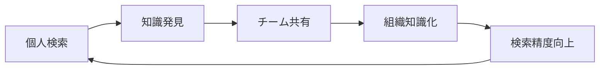

# ERPFTS Phase1 MVP - ユーザーマニュアル

## 📖 概要

**ERPFTS (ERP Fit To Standard)** は、国際標準フレームワーク（PMBOK、BABOK、DMBOK、SPEM、TOGAF）の知識を効率的に検索・活用できるRAG（Retrieval Augmented Generation）システムです。

### 🎯 本システムの目的

- **知識検索時間を90%削減** - 従来の手動検索から自動検索への移行
- **標準準拠の向上** - AI支援による適切なベストプラクティス提案
- **組織成熟度向上** - 体系的な知識管理と活用
- **新人オンボーディング加速** - 必要な知識への即座のアクセス

---

## 🚀 はじめに - システムアクセス

### アクセス方法

1. **Web UI アクセス**
   ```
   URL: http://localhost:8501
   ブラウザ: Chrome, Firefox, Safari, Edge (最新版推奨)
   ```

2. **API アクセス** (開発者・統合用)
   ```
   API URL: http://localhost:8000
   API Docs: http://localhost:8000/docs
   Health Check: http://localhost:8000/health
   ```

### 初回セットアップ確認

システムの準備状況を確認：
- ✅ データベース初期化完了
- ✅ 知識ベースデータ読み込み完了  
- ✅ 検索インデックス構築完了
- ✅ 埋め込みモデル準備完了

---

## 🔍 基本操作ガイド

### 1. 知識検索の基本操作

#### 1.1 シンプル検索
最も基本的な検索方法です。

**操作手順:**
1. ホーム画面の検索ボックスにキーワードを入力
2. 「検索」ボタンをクリック、またはEnterキーを押下
3. 検索結果一覧から関連する情報を確認

**検索のコツ:**
```
✅ 良い検索例:
- "プロジェクト リスク管理 手法"
- "要求分析 ベストプラクティス"
- "データ品質 評価指標"

❌ 避けるべき検索例:
- "あれ" "それ" (曖昧な代名詞)
- "いい方法" (抽象的すぎる表現)
- 単語の羅列のみ
```

#### 1.2 詳細検索（フィルタ機能）
特定の条件で絞り込み検索を行います。

**利用可能フィルタ:**
- **知識ソース**: PMBOK、BABOK、DMBOK、SPEM、TOGAF、ブログ記事
- **言語**: 日本語、英語
- **更新日時**: 最近1週間、1ヶ月、3ヶ月、全期間
- **関連度**: 高関連度のみ、中関連度以上、全て表示

**操作手順:**
1. 検索ボックス横の「詳細検索」をクリック
2. 必要なフィルタ条件を設定
3. 「詳細検索実行」ボタンをクリック

### 2. 検索結果の活用

#### 2.1 検索結果の読み方
```
┌─────────────────────────────────────┐
│ 📄 プロジェクトリスク管理プロセス      │
│ ソース: PMBOK 第7版                  │
│ 関連度: ★★★★☆ (85%)              │
│ ─────────────────────────────────── │
│ プロジェクトリスク管理は、プロジェクト │
│ 目標達成に対する不確実性の影響を...    │
│                                     │
│ [詳細を見る] [保存] [共有]           │
└─────────────────────────────────────┘
```

**各要素の説明:**
- **タイトル**: 検索にヒットした知識項目の名称
- **ソース**: 情報の出典（標準書籍・記事など）
- **関連度**: 検索クエリとの関連度（0-100%）
- **プレビュー**: 関連部分の抜粋テキスト
- **操作ボタン**: 詳細確認・保存・共有機能

#### 2.2 詳細情報の確認
「詳細を見る」をクリックすると以下が表示されます：

- **完全なコンテキスト**: 前後の文脈を含む詳細情報
- **関連する知識項目**: 類似・関連するその他の情報
- **引用情報**: 正確な出典とページ番号
- **キーワードハイライト**: 検索語句の強調表示

### 3. 知識の保存・管理

#### 3.1 お気に入り保存
重要な検索結果を後で参照するために保存できます。

**操作手順:**
1. 検索結果で「保存」ボタンをクリック
2. 保存先フォルダを選択（新規作成も可能）
3. コメント・タグを追加（オプション）
4. 「保存完了」をクリック

#### 3.2 保存済み知識の管理
**アクセス方法:**
- メニューバー「マイライブラリ」をクリック

**管理機能:**
- **フォルダ別整理**: テーマ・プロジェクト別の分類
- **タグ管理**: 横断的なカテゴリ設定
- **検索履歴**: 過去の検索クエリ確認
- **使用統計**: よく参照する知識の把握

---

## 📊 高度な機能

### 1. 知識の投稿・共有

#### 1.1 新しい知識の追加
組織独自の知識やベストプラクティスを追加できます。

**対応ファイル形式:**
- PDF ファイル（推奨）
- Word文書（.docx）
- テキストファイル（.txt）
- HTML文書

**投稿手順:**
1. メニューバー「知識投稿」をクリック
2. ファイルをドラッグ&ドロップまたは選択
3. メタデータ入力:
   - タイトル
   - カテゴリ
   - 説明・要約
   - タグ
4. 「投稿」ボタンをクリック
5. システム処理完了後、検索対象に追加

#### 1.2 品質ガイドライン
**推奨する投稿内容:**
✅ 組織のベストプラクティス
✅ プロジェクト振り返り・教訓
✅ 標準フレームワークの実践事例
✅ ツール・技法の使用マニュアル

**避けるべき内容:**
❌ 個人情報・機密情報
❌ 著作権侵害の可能性があるもの
❌ 一時的・限定的すぎる情報
❌ 品質が低く参考にならない情報

### 2. チーム・組織での活用

#### 2.1 知識共有ワークフロー


**推奨プラクティス:**
1. **定期的な知識棚卸し** (月1回)
2. **チーム検索結果共有** (週次ミーティング)
3. **新人向け必須知識リスト** 作成
4. **プロジェクト完了時の知識登録** 義務化

#### 2.2 使用統計・分析機能
管理者向け機能として、以下の統計情報を確認可能：

- **検索トレンド**: よく検索されるキーワード
- **知識利用度**: アクセス頻度の高い知識項目
- **ユーザー活動**: 個人・チーム別の利用状況
- **システム性能**: 応答時間・成功率などのKPI

---

## ⚙️ システム設定・カスタマイズ

### 1. 個人設定

#### 1.1 プロファイル設定
**アクセス**: メニューバー → 「設定」 → 「プロファイル」

**設定項目:**
- **表示言語**: 日本語/英語
- **検索結果表示件数**: 10/20/50件
- **デフォルト検索範囲**: 全て/特定ソースのみ
- **通知設定**: 新着情報・システム更新通知

#### 1.2 検索設定のカスタマイズ
**詳細設定項目:**
- **関連度閾値**: 表示する最低関連度（50%-95%）
- **検索結果ソート順**: 関連度順/更新日時順/ソース順
- **ハイライト設定**: キーワード強調の色・スタイル
- **プレビュー長さ**: 検索結果の表示文字数

### 2. 管理者設定

#### 2.1 システム全体設定
管理者権限が必要な設定項目：

**知識ベース管理:**
- 新規知識ソースの追加
- 既存知識の更新・削除
- インデックス再構築

**ユーザー管理:**
- アカウント作成・削除
- 権限レベル設定
- アクセスログ確認

**システム監視:**
- パフォーマンス監視
- エラーログ確認
- バックアップ設定

---

## 🔧 トラブルシューティング

### 1. よくある問題と解決法

#### 1.1 検索結果が表示されない
**症状**: 検索しても「結果が見つかりません」と表示される

**解決手順:**
1. **検索語句の確認**
   - タイポがないか確認
   - より一般的な用語で再検索
   - 英語・日本語を切り替えて検索

2. **フィルタ設定の確認**
   - 詳細検索フィルタが厳しすぎないか
   - 「全て」の条件でリセットして再検索

3. **システム状態の確認**
   - ヘルスチェックページで稼働状況確認
   - 管理者に状況を問い合わせ

#### 1.2 検索が遅い
**症状**: 検索実行から結果表示まで3秒以上かかる

**対処法:**
1. **ネットワーク確認**: インターネット接続状況
2. **ブラウザキャッシュクリア**: Ctrl+F5で強制更新
3. **検索条件の調整**: より具体的なキーワードに変更
4. **時間帯の考慮**: ピーク時間を避けて使用

#### 1.3 ファイルアップロードに失敗する
**症状**: 知識投稿時にファイルアップロードができない

**確認項目:**
- **ファイルサイズ**: 50MB以下であることを確認
- **ファイル形式**: 対応形式（PDF, DOCX, TXT）であることを確認
- **ファイル破損**: 別のPCで正常に開けることを確認

### 2. エラーメッセージと対応

#### 2.1 システムエラー

| エラーメッセージ | 原因 | 対処法 |
|---|---|---|
| "検索サービスが利用できません" | バックエンドサービス停止 | 管理者に連絡・時間を空けて再試行 |
| "認証に失敗しました" | セッション期限切れ | ログアウト後、再ログイン |
| "権限が不足しています" | 操作権限なし | 管理者に権限付与を依頼 |
| "ファイル処理に失敗しました" | ファイル破損・形式不正 | ファイルを確認して再アップロード |

#### 2.2 パフォーマンス警告

| 警告メッセージ | 意味 | 対処法 |
|---|---|---|
| "システムの負荷が高くなっています" | 同時アクセス過多 | しばらく待ってから再実行 |
| "検索インデックス更新中" | メンテナンス実行中 | 更新完了まで待機 |
| "一時的に制限されています" | 短時間での大量アクセス | 少し時間を空けて再実行 |

---

## 📈 効果測定・活用促進

### 1. 利用効果の測定

#### 1.1 個人レベルの効果測定
以下の指標で効果を測定してください：

**効率性指標:**
- 知識検索時間の短縮率
- 必要な情報への到達成功率
- 検索から業務適用までの時間

**品質指標:**
- 見つけた情報の有用性評価
- 業務成果への貢献度
- 標準準拠度の向上

#### 1.2 組織レベルの効果測定
**組織全体のKPI:**
- 新人オンボーディング期間の短縮
- プロジェクト品質向上（不具合減少率）
- ナレッジワーカーの生産性向上
- 標準フレームワーク習得率向上

### 2. 活用促進のヒント

#### 2.1 日常業務への組み込み
**推奨する活用パターン:**

**朝の準備時間 (5分):**
- 今日の業務に関連するキーワードで検索
- 関連ベストプラクティスの確認

**課題発生時 (10分):**
- 類似問題の解決事例検索
- 適用可能な標準手法の調査

**振り返り時間 (15分):**
- 実施した作業の標準適合度確認
- 改善点に関する知識検索

#### 2.2 チーム活用の促進
**定期活動への組み込み:**

**週次チームミーティング:**
- 「今週の発見知識」共有タイム
- 検索で見つけた有用情報の報告

**月次振り返り:**
- よく検索されるキーワードの分析
- チームで不足している知識領域の特定

**四半期レビュー:**
- システム利用統計の確認
- 組織知識レベルの向上度測定

---

## 📞 サポート・お問い合わせ

### 1. サポート体制

**レベル1: 基本サポート**
- 対象: 操作方法・基本機能の質問
- 対応時間: 平日 9:00-17:00
- 連絡方法: システム内ヘルプデスク

**レベル2: 技術サポート**
- 対象: システムエラー・性能問題
- 対応時間: 平日 9:00-18:00
- 連絡方法: 技術サポートメール

**レベル3: 緊急対応**
- 対象: システム停止・重大障害
- 対応時間: 24時間365日
- 連絡方法: 緊急連絡先（電話）

### 2. よくある質問（FAQ）

**Q: 検索結果の精度を上げるにはどうすればよいですか？**
A: 以下の点にご注意ください：
- 具体的なキーワードを使用
- 複数のキーワードを組み合わせる
- フィルタ機能を活用して範囲を絞り込む
- 検索履歴から関連する語句を参考にする

**Q: 自分の組織独自の知識を追加できますか？**
A: はい、可能です。「知識投稿」機能をご利用ください。ただし、以下の点にご注意ください：
- 著作権を侵害しない内容であること
- 組織内で共有して問題ない情報であること
- 他のユーザーの参考になる内容であること

**Q: モバイル端末からも利用できますか？**
A: Webブラウザからアクセスすることでモバイル端末でも利用可能ですが、PC環境での利用を推奨します。

**Q: 利用統計を確認することはできますか？**
A: 管理者権限をお持ちの場合、システム全体の利用統計を確認できます。個人の検索履歴は「マイライブラリ」で確認可能です。

### 3. 改善提案・フィードバック

システムの改善にご協力ください：

**フィードバック方法:**
- システム内「フィードバック」ボタン
- 定期的なユーザーアンケート回答
- 直接的な改善提案の投稿

**改善提案の例:**
- 新しい知識ソースの追加要求
- UI/UXの改善提案
- 新機能の要望
- パフォーマンス改善の要求

---

## 🎓 トレーニング・教育

### 1. 新規ユーザー向けトレーニング

**基礎コース (30分):**
- システム概要・目的理解
- 基本検索操作
- 結果の読み方・活用方法

**応用コース (60分):**
- 詳細検索・フィルタ活用
- 知識保存・管理機能
- チームでの活用方法

### 2. 継続的な能力向上

**月次Tips配信:**
- 効果的な検索方法
- 新機能の紹介
- 活用事例の共有

**四半期ワークショップ:**
- 組織での活用成果発表
- 応用的な活用方法の学習
- 次期機能のプレビュー

---

**Version**: 1.0.0 | **Last Updated**: 2025-01-22 | **Next Review**: Monthly User Feedback Review