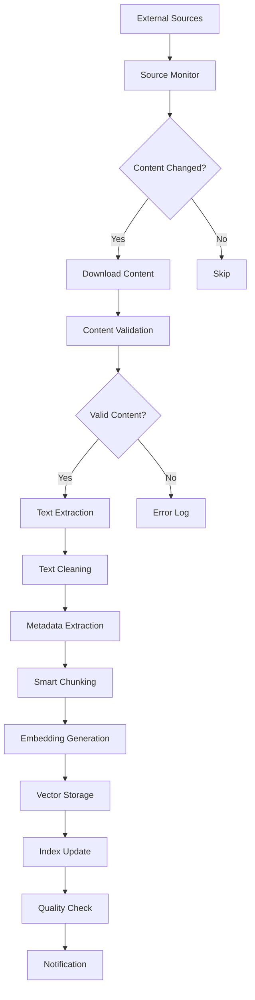
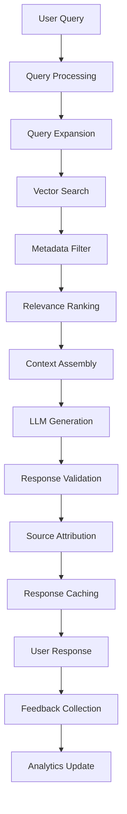
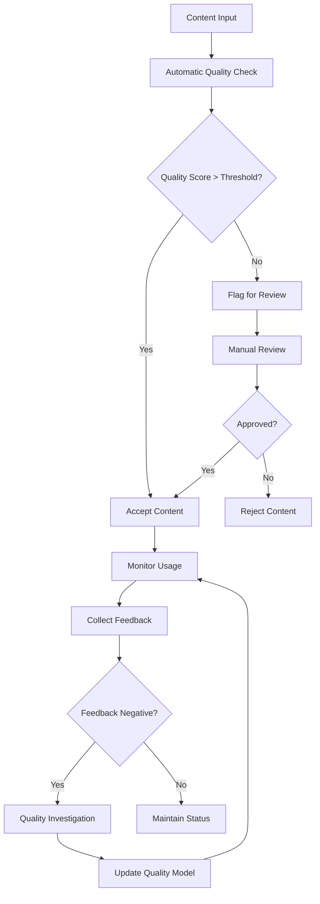

# ERP知識RAGシステム - システムアーキテクチャ設計書

---
doc_type: "system_architecture"
complexity: "high"
estimated_effort: "40-60 hours"
prerequisites: ["01_PRD.md"]
implementation_priority: "high"
ai_assistance_level: "full_automation_possible"
version: "1.0.0"
author: "Claude Code"
created_date: "2025-01-21"
status: "draft"
---

## 📋 システム概要

### アーキテクチャ原則
- **マイクロサービス指向**: 機能別に疎結合なコンポーネント設計
- **段階的スケーラビリティ**: 無料→低コスト→高性能への移行可能
- **データ中心設計**: 知識・メタデータの品質と一貫性を最優先
- **自動化ファースト**: 手動作業を最小限に抑制

## 🏗️ 全体アーキテクチャ

### システム構成図
```
┌─────────────────────────────────────────────────────────────────┐
│                        External Sources                         │
├─────────────────┬─────────────────┬─────────────────┬───────────┤
│   PMBOK/BABOK   │   Blog/RSS      │   Community     │   GitHub  │
│   PDF Files     │   Feeds         │   Forums        │   Repos   │
└─────────────────┴─────────────────┴─────────────────┴───────────┘
         │                 │                 │             │
         └─────────────────┼─────────────────┼─────────────┘
                           │                 │
┌─────────────────────────────────────────────────────────────────┐
│                     Data Ingestion Layer                        │
├─────────────────┬─────────────────┬─────────────────┬───────────┤
│  PDF Parser     │  RSS Monitor    │  Web Scraper    │  Git Hook │
│  (PyPDF2)       │  (feedparser)   │  (Beautiful-    │  (Webhook)│
│                 │                 │   Soup)         │           │
└─────────────────┴─────────────────┴─────────────────┴───────────┘
         │                 │                 │             │
         └─────────────────┼─────────────────┼─────────────┘
                           │
┌─────────────────────────────────────────────────────────────────┐
│                    Processing Layer                             │
├─────────────────┬─────────────────┬─────────────────┬───────────┤
│  Text Cleaning  │  Smart Chunking │  Metadata       │  Quality  │
│  (spaCy/NLTK)   │  (LangChain)    │  Extraction     │  Filter   │
│                 │                 │                 │           │
└─────────────────┴─────────────────┴─────────────────┴───────────┘
         │                 │                 │             │
         └─────────────────┼─────────────────┼─────────────┘
                           │
┌─────────────────────────────────────────────────────────────────┐
│                    Embedding Layer                              │
├─────────────────┬─────────────────┬─────────────────────────────┤
│  Text Embedding │  Metadata       │  Vector Storage             │
│  (sentence-     │  Processing     │  (Chroma/Supabase)          │
│   transformers) │                 │                             │
└─────────────────┴─────────────────┴─────────────────────────────┘
         │                 │                           │
         └─────────────────┼───────────────────────────┘
                           │
┌─────────────────────────────────────────────────────────────────┐
│                      Search Layer                               │
├─────────────────┬─────────────────┬─────────────────────────────┤
│  Vector Search  │  Hybrid Search  │  Query Processing           │
│  (Cosine Sim)   │  (BM25 + Vec)   │  (Query Expansion)          │
│                 │                 │                             │
└─────────────────┴─────────────────┴─────────────────────────────┘
         │                 │                           │
         └─────────────────┼───────────────────────────┘
                           │
┌─────────────────────────────────────────────────────────────────┐
│                    Application Layer                            │
├─────────────────┬─────────────────┬─────────────────┬───────────┤
│   Web UI        │   REST API      │   Admin Panel   │  Monitor  │
│  (Streamlit/    │  (FastAPI)      │  (Streamlit)    │  (Grafana)│
│   Gradio)       │                 │                 │           │
└─────────────────┴─────────────────┴─────────────────┴───────────┘
         │                 │                 │             │
         └─────────────────┼─────────────────┼─────────────┘
                           │
┌─────────────────────────────────────────────────────────────────┐
│                      Data Layer                                 │
├─────────────────┬─────────────────┬─────────────────┬───────────┤
│  Vector Store   │  Metadata DB    │  File Storage   │  Cache    │
│  (Chroma/       │  (SQLite/       │  (Local/S3)     │  (Redis)  │
│   Supabase)     │   PostgreSQL)   │                 │           │
└─────────────────┴─────────────────┴─────────────────┴───────────┘
         │                 │                 │             │
         └─────────────────┼─────────────────┼─────────────┘
                           │
┌─────────────────────────────────────────────────────────────────┐
│                   Infrastructure Layer                          │
├─────────────────┬─────────────────┬─────────────────┬───────────┤
│  Orchestration  │  Monitoring     │  Backup         │  Security │
│  (GitHub        │  (Prometheus/   │  (scheduled     │  (Auth/   │
│   Actions)      │   Grafana)      │   scripts)      │   HTTPS)  │
└─────────────────┴─────────────────┴─────────────────┴───────────┘
```

## 🔧 技術スタック

### Phase 1: 完全無料スタック
```yaml
Frontend:
  - UI Framework: Streamlit / Gradio
  - Admin Panel: Streamlit
  - Monitoring: Simple HTML dashboard

Backend:
  - API Framework: FastAPI
  - Processing: LangChain / LlamaIndex  
  - Embedding: sentence-transformers
  - Language: Python 3.9+

Database:
  - Vector Store: Chroma DB (local)
  - Metadata: SQLite
  - File Storage: Local filesystem
  - Cache: In-memory Python dict

Infrastructure:
  - Hosting: Local / Google Colab
  - Automation: GitHub Actions
  - Monitoring: Python logging
  - Backup: Git + periodic exports
```

### Phase 2: 高性能スタック
```yaml
Frontend:
  - UI Framework: Next.js / React
  - Admin Panel: React Admin
  - Monitoring: Grafana

Backend:
  - API Framework: FastAPI + Uvicorn
  - Processing: LlamaIndex + custom pipeline
  - Embedding: OpenAI text-embedding-3-small
  - Language: Python 3.11+

Database:
  - Vector Store: Supabase Vector / Pinecone
  - Metadata: PostgreSQL (Supabase)
  - File Storage: AWS S3 / Supabase Storage
  - Cache: Redis

Infrastructure:
  - Hosting: Railway / Render / Vercel
  - CDN: Cloudflare
  - Monitoring: Prometheus + Grafana
  - Backup: Automated cloud backup
```

## 📊 データフロー設計

### 1. データ取り込みフロー


### 2. 検索・回答生成フロー


### 3. 品質管理フロー


## 🗄️ データベース設計

### ER図
```
┌─────────────────┐     ┌─────────────────┐     ┌─────────────────┐
│    Sources      │     │    Documents    │     │     Chunks      │
├─────────────────┤     ├─────────────────┤     ├─────────────────┤
│ id (PK)         │────▷│ id (PK)         │────▷│ id (PK)         │
│ name            │     │ source_id (FK)  │     │ document_id(FK) │
│ source_type     │     │ title           │     │ chunk_index     │
│ base_url        │     │ author          │     │ content         │
│ rss_feed        │     │ published_date  │     │ token_count     │
│ check_interval  │     │ last_modified   │     │ embedding_id    │
│ last_checked    │     │ file_path       │     │ page_number     │
│ is_active       │     │ content_hash    │     │ section_title   │
│ quality_score   │     │ language        │     │ quality_score   │
│ created_at      │     │ metadata_json   │     │ created_at      │
│ updated_at      │     │ quality_score   │     │ updated_at      │
└─────────────────┘     │ created_at      │     └─────────────────┘
                        │ updated_at      │              │
                        └─────────────────┘              │
                                 │                       │
                                 │    ┌─────────────────┐│
                                 │    │   Embeddings    ││
                                 │    ├─────────────────┤│
                                 │    │ id (PK)         ││
                                 └───▷│ chunk_id (FK)   │◁
                                      │ vector          │
                                      │ model_name      │
                                      │ dimension       │
                                      │ created_at      │
                                      └─────────────────┘

┌─────────────────┐     ┌─────────────────┐     ┌─────────────────┐
│    Searches     │     │    Feedback     │     │    Analytics    │
├─────────────────┤     ├─────────────────┤     ├─────────────────┤
│ id (PK)         │     │ id (PK)         │     │ id (PK)         │
│ query_text      │     │ search_id (FK)  │     │ date            │
│ user_id         │     │ rating          │     │ total_searches  │
│ response_time   │     │ comment         │     │ avg_response_time │
│ result_count    │     │ useful_sources  │     │ success_rate    │
│ clicked_sources │     │ created_at      │     │ top_queries     │
│ satisfaction    │     └─────────────────┘     │ popular_sources │
│ created_at      │                             │ quality_trends  │
└─────────────────┘                             └─────────────────┘
```

### 主要テーブル仕様

#### Sources (データソース管理)
```sql
CREATE TABLE sources (
    id UUID PRIMARY KEY,
    name VARCHAR(255) NOT NULL,
    source_type VARCHAR(50) NOT NULL, -- 'pdf', 'rss', 'web', 'github'
    base_url TEXT,
    rss_feed TEXT,
    check_interval INTEGER DEFAULT 3600, -- seconds
    last_checked TIMESTAMP,
    is_active BOOLEAN DEFAULT true,
    quality_score DECIMAL(3,2) DEFAULT 0.0,
    metadata_json JSONB,
    created_at TIMESTAMP DEFAULT NOW(),
    updated_at TIMESTAMP DEFAULT NOW()
);
```

#### Documents (文書管理)
```sql
CREATE TABLE documents (
    id UUID PRIMARY KEY,
    source_id UUID REFERENCES sources(id),
    title VARCHAR(500) NOT NULL,
    author VARCHAR(255),
    published_date DATE,
    last_modified TIMESTAMP,
    file_path TEXT,
    content_hash VARCHAR(64), -- SHA-256
    language VARCHAR(10) DEFAULT 'ja',
    document_type VARCHAR(50), -- 'standard', 'blog', 'article'
    metadata_json JSONB,
    quality_score DECIMAL(3,2) DEFAULT 0.0,
    created_at TIMESTAMP DEFAULT NOW(),
    updated_at TIMESTAMP DEFAULT NOW()
);
```

#### Chunks (チャンク管理)
```sql
CREATE TABLE chunks (
    id UUID PRIMARY KEY,
    document_id UUID REFERENCES documents(id),
    chunk_index INTEGER NOT NULL,
    content TEXT NOT NULL,
    token_count INTEGER,
    page_number INTEGER,
    section_title VARCHAR(255),
    quality_score DECIMAL(3,2) DEFAULT 0.0,
    metadata_json JSONB,
    created_at TIMESTAMP DEFAULT NOW(),
    updated_at TIMESTAMP DEFAULT NOW(),
    
    INDEX idx_document_chunk (document_id, chunk_index),
    INDEX idx_quality (quality_score),
    FULLTEXT INDEX idx_content (content)
);
```

## 🔌 API設計

### REST API エンドポイント
```yaml
# Search API
GET /api/v1/search
  parameters:
    - query: string (required)
    - limit: integer (default: 10)
    - min_score: float (default: 0.7)
    - source_types: array[string]
    - date_range: object
  response:
    - results: array[SearchResult]
    - total: integer
    - response_time: float

# Document Management API
GET /api/v1/documents
POST /api/v1/documents
GET /api/v1/documents/{id}
PUT /api/v1/documents/{id}
DELETE /api/v1/documents/{id}

# Source Management API  
GET /api/v1/sources
POST /api/v1/sources
GET /api/v1/sources/{id}
PUT /api/v1/sources/{id}
DELETE /api/v1/sources/{id}

# Analytics API
GET /api/v1/analytics/dashboard
GET /api/v1/analytics/quality-report
GET /api/v1/analytics/usage-stats

# Admin API
POST /api/v1/admin/reindex
POST /api/v1/admin/quality-check
GET /api/v1/admin/system-health
```

### WebSocket API (リアルタイム機能)
```yaml
# Real-time Search
WS /ws/search
  - query: 検索クエリの送信
  - results: リアルタイム結果配信

# System Monitoring  
WS /ws/admin/monitor
  - status: システム状態更新
  - alerts: アラート通知
```

## 🔒 セキュリティ設計

### 認証・認可
```yaml
Authentication:
  - Method: OAuth 2.0 + JWT
  - Providers: Google, Microsoft, GitHub
  - Session: JWT with refresh tokens
  - Timeout: 24 hours

Authorization:
  - RBAC (Role-Based Access Control)
  - Roles: admin, editor, viewer, guest
  - Resource-level permissions
  - API rate limiting
```

### データ保護
```yaml
Data Protection:
  - Encryption at rest: AES-256
  - Encryption in transit: TLS 1.3
  - Database: Connection encryption
  - Secrets: Environment variables + vault

Privacy:
  - No personal data storage
  - Anonymous analytics
  - GDPR compliance
  - Data retention policies
```

## ⚡ パフォーマンス設計

### レスポンス時間目標
- 検索クエリ: < 2秒 (95パーセンタイル)
- 文書取り込み: < 30秒/文書
- インデックス更新: < 10分 (増分)
- システム起動: < 60秒

### スケーラビリティ戦略
```yaml
Vertical Scaling:
  - CPU: 2-8 cores
  - Memory: 4-32 GB
  - Storage: SSD preferred
  
Horizontal Scaling:
  - Load balancer: nginx/Cloudflare
  - Database: Read replicas
  - Cache: Distributed Redis
  - Search: Elasticsearch cluster

Optimization:
  - Vector index: HNSW algorithm
  - Query cache: LRU with TTL
  - Connection pooling: SQLAlchemy
  - Batch processing: Async/await
```

## 📊 監視・運用設計

### 監視項目
```yaml
System Metrics:
  - CPU/Memory usage
  - Disk I/O and space
  - Network throughput
  - Response times

Application Metrics:
  - Search query rate
  - Success/Error rates  
  - Vector similarity scores
  - Document processing time

Business Metrics:
  - Daily active users
  - Search satisfaction
  - Content freshness
  - Knowledge coverage
```

### アラート設定
```yaml
Critical Alerts:
  - System down: > 5 minutes
  - High error rate: > 5%
  - Disk space: < 10%
  - Memory usage: > 90%

Warning Alerts:
  - Response time: > 5 seconds
  - Failed documents: > 10%
  - Quality score drop: > 20%
  - User complaints: > 3/day
```

## 🚀 デプロイメント設計

### 環境構成
```yaml
Development:
  - Local machine / Docker Compose
  - SQLite + Chroma local
  - Hot reload enabled
  - Debug logging

Staging:
  - Cloud hosting (Railway/Render)
  - PostgreSQL + Supabase Vector
  - Production-like data
  - Integration tests

Production:
  - Multi-zone deployment
  - Managed databases
  - CDN distribution
  - Backup & monitoring
```

### CI/CD パイプライン
```yaml
GitHub Actions Workflow:
  1. Code Quality:
     - Lint (flake8, mypy)
     - Security scan (bandit)
     - Dependency check

  2. Testing:
     - Unit tests (pytest)
     - Integration tests
     - Performance tests

  3. Build & Deploy:
     - Docker image build
     - Environment promotion
     - Health check validation

  4. Post-Deploy:
     - Smoke tests
     - Monitoring setup
     - Rollback capability
```

## 🤖 Implementation Notes for AI

### Critical Implementation Paths
1. **Vector Database Setup**: Chroma configuration with persistent storage
2. **Text Processing Pipeline**: LangChain TextSplitter with Japanese support
3. **Embedding Generation**: sentence-transformers multilingual models
4. **Search Optimization**: Hybrid search combining vector + keyword

### Key Dependencies
- **LangChain**: Document processing and RAG framework
- **Chroma**: Vector database with similarity search
- **FastAPI**: High-performance async web framework  
- **sentence-transformers**: Multilingual embedding models

### Testing Strategy
- **Unit Tests**: Each component isolated testing
- **Integration Tests**: End-to-end search pipeline
- **Performance Tests**: Load testing with realistic queries
- **Quality Tests**: Search relevance and accuracy metrics

### Common Pitfalls
- **Memory Management**: Large document embeddings causing OOM
- **Japanese Text Processing**: Proper tokenization and chunking
- **Vector Dimensionality**: Model compatibility and performance
- **Async Operations**: Proper async/await usage in FastAPI

---

**Version**: 1.0.0 | **Last Updated**: 2025-01-21 | **Next Review**: 2025-02-21