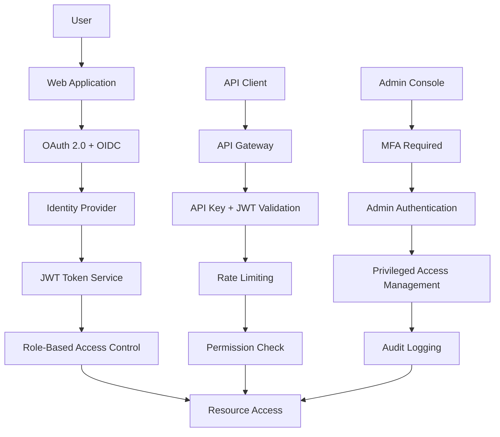

# ERP知識RAGシステム - セキュリティ設計書

---
doc_type: "security_design"
complexity: "high"
estimated_effort: "40-50 hours"
prerequisites: ["02_SystemArchitecture.md", "04_NonFunctionalRequirements.md", "05_DataModelDesign.md", "06_APISpecification.md"]
implementation_priority: "medium"
ai_assistance_level: "full_automation_possible"
version: "1.0.0"
author: "Claude Code"
created_date: "2025-01-21"
status: "approved"
approval_authority: "Project Stakeholders"
---

## 📋 セキュリティ設計概要

### セキュリティ設計の目的
本文書は「ERP知識RAGシステム（ERPFTS）」における包括的なセキュリティ設計を定義し、情報資産の保護、プライバシーの確保、コンプライアンス要件の満足を実現する。多層防御アプローチにより、外部・内部脅威に対する強固なセキュリティ体制を構築する。

### セキュリティ基本方針
```yaml
情報セキュリティ三要素:
  機密性 (Confidentiality):
    - アクセス制御による情報保護
    - 暗号化による不正アクセス防止
    - 権限管理による最小権限原則
  
  完全性 (Integrity):
    - データ改ざん検知・防止
    - デジタル署名・ハッシュ検証
    - バックアップ・復旧機能
  
  可用性 (Availability):
    - サービス継続性保証
    - DDoS攻撃対策
    - 冗長化・負荷分散

設計原則:
  多層防御: 複数のセキュリティレイヤーによる防護
  最小権限: 必要最小限の権限のみ付与
  ゼロトラスト: 全てのアクセスを検証・認証
  深層防御: 境界・内部双方での防御機能
```

## 🛡️ 認証・認可システム設計

### 認証アーキテクチャ


### OAuth 2.0 + OpenID Connect 実装
```python
# OAuth 2.0設定
OAUTH_CONFIG = {
    "providers": {
        "google": {
            "client_id": "${GOOGLE_CLIENT_ID}",
            "client_secret": "${GOOGLE_CLIENT_SECRET}",
            "discovery_url": "https://accounts.google.com/.well-known/openid_configuration",
            "scope": ["openid", "email", "profile"],
            "redirect_uri": "${BASE_URL}/auth/google/callback"
        },
        "microsoft": {
            "client_id": "${MICROSOFT_CLIENT_ID}",
            "client_secret": "${MICROSOFT_CLIENT_SECRET}", 
            "discovery_url": "https://login.microsoftonline.com/common/v2.0/.well-known/openid_configuration",
            "scope": ["openid", "email", "profile"],
            "redirect_uri": "${BASE_URL}/auth/microsoft/callback"
        },
        "github": {
            "client_id": "${GITHUB_CLIENT_ID}",
            "client_secret": "${GITHUB_CLIENT_SECRET}",
            "authorize_url": "https://github.com/login/oauth/authorize",
            "token_url": "https://github.com/login/oauth/access_token",
            "user_url": "https://api.github.com/user",
            "scope": ["user:email"],
            "redirect_uri": "${BASE_URL}/auth/github/callback"
        }
    }
}

# JWT設定
JWT_CONFIG = {
    "algorithm": "RS256",
    "access_token_expire": 86400,  # 24時間
    "refresh_token_expire": 2592000,  # 30日
    "issuer": "erpfts-system",
    "audience": ["web-app", "api-service"],
    "private_key_path": "/secure/keys/jwt-private.pem",
    "public_key_path": "/secure/keys/jwt-public.pem"
}

class AuthenticationService:
    def __init__(self):
        self.oauth_providers = self._init_oauth_providers()
        self.jwt_handler = JWTHandler(JWT_CONFIG)
        self.user_service = UserService()
    
    async def initiate_oauth_flow(self, provider: str, state: str) -> str:
        """OAuth認証フロー開始"""
        if provider not in self.oauth_providers:
            raise ValueError(f"Unsupported provider: {provider}")
        
        oauth_client = self.oauth_providers[provider]
        authorization_url = oauth_client.get_authorization_url(
            state=state,
            nonce=self._generate_nonce()
        )
        
        return authorization_url
    
    async def handle_oauth_callback(self, provider: str, 
                                   authorization_code: str, 
                                   state: str) -> AuthResult:
        """OAuth認証コールバック処理"""
        oauth_client = self.oauth_providers[provider]
        
        # アクセストークン取得
        token_response = await oauth_client.exchange_code_for_token(
            authorization_code
        )
        
        # ユーザー情報取得
        user_info = await oauth_client.get_user_info(
            token_response.access_token
        )
        
        # ユーザー登録・更新
        user = await self._get_or_create_user(user_info, provider)
        
        # JWT生成
        access_token = self.jwt_handler.create_access_token(
            subject=user.id,
            claims={
                "email": user.email,
                "role": user.role,
                "provider": provider
            }
        )
        
        refresh_token = self.jwt_handler.create_refresh_token(
            subject=user.id
        )
        
        # ログイン記録
        await self._log_successful_login(user, provider)
        
        return AuthResult(
            access_token=access_token,
            refresh_token=refresh_token,
            user=user,
            expires_in=JWT_CONFIG["access_token_expire"]
        )
```

### 多要素認証 (MFA) 実装
```python
# MFA設定
MFA_CONFIG = {
    "enabled_methods": ["totp", "sms", "email"],
    "backup_codes_count": 10,
    "totp_issuer": "ERPFTS Knowledge System",
    "totp_window": 1,
    "sms_provider": "twilio",
    "email_provider": "sendgrid"
}

class MFAService:
    def __init__(self):
        self.totp_handler = TOTPHandler()
        self.sms_service = SMSService()
        self.email_service = EmailService()
    
    async def setup_totp(self, user_id: str) -> TOTPSetup:
        """TOTP設定"""
        secret = self.totp_handler.generate_secret()
        qr_code = self.totp_handler.generate_qr_code(
            user_email=await self._get_user_email(user_id),
            secret=secret,
            issuer=MFA_CONFIG["totp_issuer"]
        )
        
        # 一時的に秘密鍵を保存（確認後に正式保存）
        await self._store_pending_totp_secret(user_id, secret)
        
        return TOTPSetup(
            secret=secret,
            qr_code=qr_code,
            backup_codes=self._generate_backup_codes()
        )
    
    async def verify_totp(self, user_id: str, token: str) -> bool:
        """TOTP検証"""
        secret = await self._get_user_totp_secret(user_id)
        if not secret:
            return False
        
        is_valid = self.totp_handler.verify_token(
            secret=secret,
            token=token,
            window=MFA_CONFIG["totp_window"]
        )
        
        if is_valid:
            await self._log_mfa_success(user_id, "totp")
        else:
            await self._log_mfa_failure(user_id, "totp", token)
        
        return is_valid
    
    async def send_sms_code(self, user_id: str) -> bool:
        """SMS認証コード送信"""
        user = await self._get_user(user_id)
        if not user.phone_number:
            return False
        
        code = self._generate_sms_code()
        await self._store_sms_code(user_id, code, ttl=300)  # 5分間有効
        
        message = f"ERPFTS認証コード: {code} (5分間有効)"
        return await self.sms_service.send_message(
            to=user.phone_number,
            message=message
        )
```

## 🔐 RBAC (Role-Based Access Control) 設計

### ロール・権限管理
```python
# ロール定義
ROLES = {
    "guest": {
        "description": "ゲストユーザー",
        "permissions": [
            "search:basic",
            "results:view_summary"
        ],
        "restrictions": {
            "max_queries_per_hour": 10,
            "result_detail_level": "summary_only"
        }
    },
    "viewer": {
        "description": "閲覧者",
        "permissions": [
            "search:basic",
            "search:advanced", 
            "results:view_detailed",
            "feedback:submit",
            "profile:view"
        ],
        "restrictions": {
            "max_queries_per_hour": 100,
            "downloadable_results": False
        }
    },
    "editor": {
        "description": "編集者",
        "inherits": ["viewer"],
        "permissions": [
            "sources:evaluate_quality",
            "feedback:moderate",
            "content:flag_issues",
            "reports:quality_metrics"
        ],
        "restrictions": {
            "max_queries_per_hour": 500
        }
    },
    "admin": {
        "description": "管理者", 
        "inherits": ["editor"],
        "permissions": [
            "users:manage",
            "sources:manage",
            "system:configure",
            "logs:access",
            "backup:manage",
            "security:audit"
        ],
        "restrictions": {
            "requires_mfa": True,
            "session_timeout": 3600  # 1時間
        }
    }
}

# 権限チェック実装
class RBACService:
    def __init__(self):
        self.roles = ROLES
        self.permission_cache = TTLCache(maxsize=1000, ttl=300)  # 5分キャッシュ
    
    async def check_permission(self, user_id: str, 
                              permission: str, 
                              resource_id: str = None) -> bool:
        """権限チェック"""
        cache_key = f"{user_id}:{permission}:{resource_id}"
        
        # キャッシュ確認
        if cache_key in self.permission_cache:
            return self.permission_cache[cache_key]
        
        user = await self._get_user(user_id)
        if not user or not user.is_active:
            return False
        
        # ロール権限チェック
        has_permission = self._check_role_permission(user.role, permission)
        
        # リソースレベル権限チェック
        if has_permission and resource_id:
            has_permission = await self._check_resource_permission(
                user, permission, resource_id
            )
        
        # 制限事項チェック
        if has_permission:
            has_permission = await self._check_restrictions(user, permission)
        
        # 結果キャッシュ
        self.permission_cache[cache_key] = has_permission
        
        # 監査ログ
        await self._log_permission_check(
            user_id, permission, resource_id, has_permission
        )
        
        return has_permission
    
    def _check_role_permission(self, role: str, permission: str) -> bool:
        """ロールベース権限チェック"""
        if role not in self.roles:
            return False
        
        role_def = self.roles[role]
        
        # 直接権限チェック
        if permission in role_def.get("permissions", []):
            return True
        
        # 継承権限チェック
        for inherited_role in role_def.get("inherits", []):
            if self._check_role_permission(inherited_role, permission):
                return True
        
        return False
    
    async def _check_resource_permission(self, user, permission: str, 
                                       resource_id: str) -> bool:
        """リソースレベル権限チェック"""
        # ドキュメントアクセス制御
        if permission.startswith("document:"):
            return await self._check_document_access(user, resource_id)
        
        # ソースアクセス制御
        if permission.startswith("source:"):
            return await self._check_source_access(user, resource_id)
        
        # ユーザー管理権限
        if permission.startswith("user:"):
            return await self._check_user_management_access(user, resource_id)
        
        return True
```

### API認証・認可
```python
# API認証デコレータ
def require_auth(permissions: List[str] = None, 
                roles: List[str] = None,
                require_mfa: bool = False):
    def decorator(func):
        @wraps(func)
        async def wrapper(request: Request, *args, **kwargs):
            # JWT検証
            token = extract_token_from_request(request)
            if not token:
                raise HTTPException(401, "Missing authentication token")
            
            try:
                payload = jwt_handler.decode_token(token)
                user_id = payload.get("sub")
                
                # ユーザー存在確認
                user = await user_service.get_user(user_id)
                if not user or not user.is_active:
                    raise HTTPException(401, "Invalid user")
                
                # MFA要件確認
                if require_mfa and not user.mfa_enabled:
                    raise HTTPException(403, "MFA required")
                
                # ロール確認
                if roles and user.role not in roles:
                    raise HTTPException(403, "Insufficient role")
                
                # 権限確認
                if permissions:
                    for permission in permissions:
                        has_permission = await rbac_service.check_permission(
                            user_id, permission
                        )
                        if not has_permission:
                            raise HTTPException(403, f"Missing permission: {permission}")
                
                # リクエストにユーザー情報追加
                request.state.user = user
                request.state.token_payload = payload
                
                return await func(request, *args, **kwargs)
                
            except JWTError as e:
                raise HTTPException(401, f"Invalid token: {str(e)}")
            except Exception as e:
                logger.error(f"Authentication error: {str(e)}")
                raise HTTPException(500, "Authentication failed")
        
        return wrapper
    return decorator

# 使用例
@app.post("/api/v1/search")
@require_auth(permissions=["search:advanced"])
async def advanced_search(request: Request, query: SearchQuery):
    user = request.state.user
    # 検索実行
    pass

@app.delete("/api/v1/admin/users/{user_id}")
@require_auth(roles=["admin"], require_mfa=True)
async def delete_user(request: Request, user_id: str):
    # ユーザー削除
    pass
```

## 🔒 データ暗号化・保護

### 暗号化実装
```python
# 暗号化設定
ENCRYPTION_CONFIG = {
    "algorithms": {
        "symmetric": "AES-256-GCM",
        "asymmetric": "RSA-4096", 
        "hashing": "SHA-256",
        "key_derivation": "PBKDF2-SHA256"
    },
    "key_rotation": {
        "interval_days": 90,
        "overlap_days": 7
    },
    "key_storage": {
        "type": "environment_variables",  # 本番: key_vault
        "backup_location": "/secure/keys/"
    }
}

class EncryptionService:
    def __init__(self):
        self.fernet = self._init_fernet_cipher()
        self.rsa_keys = self._load_rsa_keys()
        
    def _init_fernet_cipher(self):
        """対称暗号化（Fernet）初期化"""
        key = os.getenv("ENCRYPTION_KEY")
        if not key:
            key = Fernet.generate_key()
            logger.warning("Generated new encryption key - store securely!")
        
        return Fernet(key.encode() if isinstance(key, str) else key)
    
    def encrypt_sensitive_data(self, data: str) -> str:
        """機密データの暗号化"""
        if not data:
            return data
            
        encrypted = self.fernet.encrypt(data.encode('utf-8'))
        return base64.b64encode(encrypted).decode('utf-8')
    
    def decrypt_sensitive_data(self, encrypted_data: str) -> str:
        """機密データの復号化"""
        if not encrypted_data:
            return encrypted_data
            
        try:
            encrypted_bytes = base64.b64decode(encrypted_data.encode('utf-8'))
            decrypted = self.fernet.decrypt(encrypted_bytes)
            return decrypted.decode('utf-8')
        except Exception as e:
            logger.error(f"Decryption failed: {str(e)}")
            raise EncryptionError("Failed to decrypt data")
    
    def hash_password(self, password: str, salt: bytes = None) -> tuple:
        """パスワードハッシュ化"""
        if salt is None:
            salt = os.urandom(32)
        
        # PBKDF2でハッシュ化
        password_hash = hashlib.pbkdf2_hmac(
            'sha256',
            password.encode('utf-8'),
            salt,
            100000  # 10万回反復
        )
        
        return password_hash, salt
    
    def verify_password(self, password: str, hash_salt: tuple) -> bool:
        """パスワード検証"""
        stored_hash, salt = hash_salt
        password_hash, _ = self.hash_password(password, salt)
        return hmac.compare_digest(password_hash, stored_hash)

# データベース暗号化
class DatabaseEncryption:
    def __init__(self, encryption_service: EncryptionService):
        self.encryption = encryption_service
        
    def encrypt_field(self, value: Any, field_type: str) -> str:
        """フィールド暗号化"""
        if value is None:
            return None
            
        if field_type == "pii":  # 個人識別情報
            return self.encryption.encrypt_sensitive_data(str(value))
        elif field_type == "api_key":  # APIキー
            return self.encryption.encrypt_sensitive_data(value)
        elif field_type == "password":  # パスワード
            hash_value, salt = self.encryption.hash_password(value)
            return base64.b64encode(salt + hash_value).decode('utf-8')
        
        return value
    
    def decrypt_field(self, encrypted_value: str, field_type: str) -> Any:
        """フィールド復号化"""
        if encrypted_value is None:
            return None
            
        if field_type in ["pii", "api_key"]:
            return self.encryption.decrypt_sensitive_data(encrypted_value)
        elif field_type == "password":
            # パスワードは検証のみ、復号化不可
            raise ValueError("Password fields cannot be decrypted")
        
        return encrypted_value
```

### TLS/SSL設定
```yaml
# TLS設定
TLS_CONFIG:
  protocols:
    - TLSv1.3  # 最優先
    - TLSv1.2  # フォールバック
  
  cipher_suites:
    # TLS 1.3 暗号スイート
    - TLS_AES_256_GCM_SHA384
    - TLS_CHACHA20_POLY1305_SHA256
    - TLS_AES_128_GCM_SHA256
    
    # TLS 1.2 暗号スイート（後方互換性）
    - ECDHE-RSA-AES256-GCM-SHA384
    - ECDHE-RSA-AES128-GCM-SHA256
    - ECDHE-RSA-CHACHA20-POLY1305
  
  certificate_config:
    type: "lets_encrypt"  # 自動更新
    domains:
      - "erpfts.example.com"
      - "api.erpfts.example.com"
    auto_renewal: true
    renewal_days_before: 30
  
  security_headers:
    strict_transport_security: "max-age=31536000; includeSubDomains; preload"
    content_security_policy: "default-src 'self'; script-src 'self' 'unsafe-inline'; style-src 'self' 'unsafe-inline'"
    x_frame_options: "DENY"
    x_content_type_options: "nosniff"
    referrer_policy: "strict-origin-when-cross-origin"
```

## 🔍 セキュリティ監視・ログ

### セキュリティイベント監視
```python
# セキュリティイベント定義
SECURITY_EVENTS = {
    "authentication": {
        "failed_login": {"severity": "medium", "threshold": 5},
        "account_lockout": {"severity": "high", "threshold": 1},
        "mfa_failure": {"severity": "medium", "threshold": 3},
        "token_validation_failure": {"severity": "medium", "threshold": 10}
    },
    "authorization": {
        "privilege_escalation": {"severity": "critical", "threshold": 1},
        "unauthorized_access": {"severity": "high", "threshold": 1}, 
        "permission_abuse": {"severity": "medium", "threshold": 5}
    },
    "data_access": {
        "bulk_data_download": {"severity": "medium", "threshold": 1},
        "sensitive_data_access": {"severity": "medium", "threshold": 10},
        "unusual_query_pattern": {"severity": "low", "threshold": 20}
    },
    "system": {
        "suspicious_api_usage": {"severity": "medium", "threshold": 100},
        "rate_limit_exceeded": {"severity": "low", "threshold": 50},
        "configuration_change": {"severity": "high", "threshold": 1}
    }
}

class SecurityMonitor:
    def __init__(self):
        self.event_store = SecurityEventStore()
        self.alert_service = AlertService()
        self.anomaly_detector = AnomalyDetector()
        
    async def log_security_event(self, event_type: str, 
                                details: dict, 
                                user_id: str = None,
                                ip_address: str = None):
        """セキュリティイベントログ記録"""
        event = SecurityEvent(
            event_type=event_type,
            timestamp=datetime.utcnow(),
            user_id=user_id,
            ip_address=ip_address,
            details=details,
            severity=self._get_event_severity(event_type)
        )
        
        # イベント保存
        await self.event_store.store_event(event)
        
        # 異常検知
        is_anomaly = await self.anomaly_detector.detect_anomaly(event)
        if is_anomaly:
            await self._handle_security_anomaly(event)
        
        # 閾値チェック・アラート
        await self._check_thresholds_and_alert(event)
    
    async def _check_thresholds_and_alert(self, event: SecurityEvent):
        """閾値チェック・アラート送信"""
        event_config = self._get_event_config(event.event_type)
        if not event_config:
            return
        
        # 時間窓内の同種イベント数カウント
        time_window = timedelta(minutes=15)
        recent_events = await self.event_store.count_events(
            event_type=event.event_type,
            user_id=event.user_id,
            ip_address=event.ip_address,
            since=datetime.utcnow() - time_window
        )
        
        # 閾値超過チェック
        if recent_events >= event_config["threshold"]:
            alert = SecurityAlert(
                alert_type=f"threshold_exceeded_{event.event_type}",
                severity=event_config["severity"],
                event=event,
                event_count=recent_events,
                time_window=time_window
            )
            
            await self.alert_service.send_alert(alert)
            
            # 自動対応
            await self._auto_respond_to_threat(alert)
    
    async def _auto_respond_to_threat(self, alert: SecurityAlert):
        """脅威への自動対応"""
        if alert.alert_type == "threshold_exceeded_failed_login":
            # アカウント一時ロック
            await self._temporary_account_lock(alert.event.user_id)
        
        elif alert.alert_type == "threshold_exceeded_suspicious_api_usage":
            # IP制限
            await self._add_ip_to_blocklist(alert.event.ip_address)
        
        elif alert.severity == "critical":
            # 緊急通知
            await self.alert_service.send_emergency_notification(alert)

# 異常検知システム
class AnomalyDetector:
    def __init__(self):
        self.ml_model = self._load_anomaly_detection_model()
        
    async def detect_anomaly(self, event: SecurityEvent) -> bool:
        """機械学習による異常検知"""
        features = self._extract_features(event)
        
        # 異常スコア計算
        anomaly_score = self.ml_model.predict_anomaly_score(features)
        
        # 動的閾値（過去データに基づく）
        threshold = await self._get_dynamic_threshold(event.event_type)
        
        return anomaly_score > threshold
    
    def _extract_features(self, event: SecurityEvent) -> dict:
        """特徴量抽出"""
        return {
            "hour_of_day": event.timestamp.hour,
            "day_of_week": event.timestamp.weekday(),
            "user_role": event.details.get("user_role"),
            "ip_geolocation": self._get_ip_geolocation(event.ip_address),
            "request_rate": self._calculate_request_rate(event.user_id),
            "session_duration": self._get_session_duration(event.user_id),
            "device_fingerprint": event.details.get("device_fingerprint")
        }
```

### 監査ログ管理
```python
# 監査ログ設定
AUDIT_CONFIG = {
    "log_levels": {
        "authentication": "INFO",
        "authorization": "INFO", 
        "data_access": "INFO",
        "admin_actions": "INFO",
        "system_changes": "WARNING"
    },
    "retention_policy": {
        "security_logs": 366,  # 1年+1日
        "audit_logs": 2557,    # 7年（法的要件）
        "access_logs": 90,     # 3ヶ月
        "error_logs": 30       # 1ヶ月
    },
    "export_formats": ["json", "csv", "syslog"],
    "compliance_standards": ["SOX", "GDPR", "ISO27001"]
}

class AuditLogger:
    def __init__(self):
        self.logger = self._setup_audit_logger()
        self.encryption = EncryptionService()
        
    def _setup_audit_logger(self):
        """監査ログ設定"""
        logger = logging.getLogger("audit")
        logger.setLevel(logging.INFO)
        
        # ファイルハンドラー（日次ローテーション）
        file_handler = TimedRotatingFileHandler(
            filename="/var/log/erpfts/audit.log",
            when="midnight",
            interval=1,
            backupCount=AUDIT_CONFIG["retention_policy"]["audit_logs"],
            encoding="utf-8"
        )
        
        # JSON形式フォーマッター
        formatter = logging.Formatter(
            '%(asctime)s - %(name)s - %(levelname)s - %(message)s'
        )
        file_handler.setFormatter(formatter)
        logger.addHandler(file_handler)
        
        # Syslogハンドラー（リモート送信）
        syslog_handler = SysLogHandler(address=('log-server', 514))
        syslog_handler.setFormatter(formatter)
        logger.addHandler(syslog_handler)
        
        return logger
    
    async def log_user_action(self, action: str, user_id: str, 
                             details: dict, outcome: str = "success"):
        """ユーザーアクション監査ログ"""
        audit_record = {
            "timestamp": datetime.utcnow().isoformat(),
            "event_type": "user_action",
            "action": action,
            "user_id": user_id,
            "outcome": outcome,
            "details": details,
            "session_id": details.get("session_id"),
            "ip_address": details.get("ip_address"),
            "user_agent": details.get("user_agent")
        }
        
        # 機密情報のマスキング
        masked_record = self._mask_sensitive_data(audit_record)
        
        self.logger.info(json.dumps(masked_record, ensure_ascii=False))
    
    async def log_data_access(self, resource_type: str, resource_id: str,
                             access_type: str, user_id: str, details: dict):
        """データアクセス監査ログ"""
        audit_record = {
            "timestamp": datetime.utcnow().isoformat(),
            "event_type": "data_access",
            "resource_type": resource_type,
            "resource_id": resource_id,
            "access_type": access_type,
            "user_id": user_id,
            "details": details
        }
        
        self.logger.info(json.dumps(audit_record, ensure_ascii=False))
    
    async def log_admin_action(self, action: str, admin_id: str,
                              target: str, changes: dict, justification: str):
        """管理者アクション監査ログ"""
        audit_record = {
            "timestamp": datetime.utcnow().isoformat(),
            "event_type": "admin_action",
            "action": action,
            "admin_id": admin_id,
            "target": target,
            "changes": changes,
            "justification": justification,
            "requires_review": self._requires_review(action)
        }
        
        self.logger.warning(json.dumps(audit_record, ensure_ascii=False))
        
        # 重要な管理者アクションは即座に通知
        if self._requires_immediate_notification(action):
            await self._send_admin_action_alert(audit_record)
```

## 🛡️ 攻撃防御システム

### レート制限・DDoS防御
```python
# レート制限設定
RATE_LIMIT_CONFIG = {
    "global": {
        "requests_per_minute": 1000,
        "requests_per_hour": 10000,
        "concurrent_connections": 500
    },
    "per_user": {
        "authenticated": {
            "requests_per_minute": 100,
            "search_queries_per_hour": 500,
            "api_calls_per_day": 5000
        },
        "guest": {
            "requests_per_minute": 10,
            "search_queries_per_hour": 50,
            "api_calls_per_day": 100
        }
    },
    "per_ip": {
        "requests_per_minute": 60,
        "failed_attempts_per_hour": 20,
        "new_registrations_per_day": 5
    }
}

class RateLimitService:
    def __init__(self):
        self.redis_client = redis.Redis(
            host=os.getenv("REDIS_HOST"),
            port=6379,
            decode_responses=True
        )
        
    async def check_rate_limit(self, key: str, limit: int, 
                              window_seconds: int) -> tuple[bool, dict]:
        """レート制限チェック"""
        current_time = int(time.time())
        window_start = current_time - window_seconds
        
        # Sliding window algorithm
        pipe = self.redis_client.pipeline()
        
        # 古い記録を削除
        pipe.zremrangebyscore(key, 0, window_start)
        
        # 現在の要求数を取得
        pipe.zcard(key)
        
        # 新しい要求を記録
        pipe.zadd(key, {str(current_time): current_time})
        
        # TTL設定
        pipe.expire(key, window_seconds)
        
        results = pipe.execute()
        current_requests = results[1]
        
        # 制限チェック
        is_allowed = current_requests < limit
        
        rate_limit_info = {
            "allowed": is_allowed,
            "current_requests": current_requests,
            "limit": limit,
            "window_seconds": window_seconds,
            "reset_time": current_time + window_seconds
        }
        
        if not is_allowed:
            await self._log_rate_limit_exceeded(key, rate_limit_info)
        
        return is_allowed, rate_limit_info

class DDoSProtection:
    def __init__(self):
        self.rate_limiter = RateLimitService()
        self.blocklist = IPBlocklist()
        
    async def check_request(self, request: Request) -> bool:
        """DDoS攻撃チェック"""
        client_ip = self._get_client_ip(request)
        user_id = self._get_user_id(request)
        
        # IPブロックリストチェック
        if await self.blocklist.is_blocked(client_ip):
            raise HTTPException(403, "IP address is blocked")
        
        # グローバルレート制限
        global_allowed, _ = await self.rate_limiter.check_rate_limit(
            f"global:requests", 
            RATE_LIMIT_CONFIG["global"]["requests_per_minute"],
            60
        )
        if not global_allowed:
            raise HTTPException(429, "Global rate limit exceeded")
        
        # IP別レート制限
        ip_allowed, _ = await self.rate_limiter.check_rate_limit(
            f"ip:{client_ip}",
            RATE_LIMIT_CONFIG["per_ip"]["requests_per_minute"],
            60
        )
        if not ip_allowed:
            # 一時的なIP制限
            await self.blocklist.add_temporary_block(client_ip, duration=300)
            raise HTTPException(429, "IP rate limit exceeded")
        
        # ユーザー別レート制限
        if user_id:
            user_limit = self._get_user_rate_limit(user_id)
            user_allowed, _ = await self.rate_limiter.check_rate_limit(
                f"user:{user_id}",
                user_limit["requests_per_minute"],
                60
            )
            if not user_allowed:
                raise HTTPException(429, "User rate limit exceeded")
        
        return True
```

### 入力検証・SQLインジェクション対策
```python
# 入力検証設定
INPUT_VALIDATION = {
    "query_text": {
        "max_length": 1000,
        "min_length": 1,
        "allowed_patterns": [r"^[\w\s\-\.\,\?\!\(\)]+$"],
        "forbidden_patterns": [
            r"<script",  # XSS防止
            r"javascript:",
            r"vbscript:",
            r"onload=",
            r"onerror=",
            r"SELECT.*FROM",  # SQL injection防止
            r"INSERT.*INTO",
            r"UPDATE.*SET",
            r"DELETE.*FROM",
            r"DROP.*TABLE",
            r"ALTER.*TABLE"
        ]
    },
    "file_upload": {
        "max_size": 10485760,  # 10MB
        "allowed_extensions": [".pdf", ".docx", ".txt", ".md"],
        "allowed_mime_types": [
            "application/pdf",
            "application/vnd.openxmlformats-officedocument.wordprocessingml.document",
            "text/plain",
            "text/markdown"
        ]
    }
}

class InputValidator:
    def __init__(self):
        self.validation_rules = INPUT_VALIDATION
        
    def validate_search_query(self, query: str) -> str:
        """検索クエリ検証"""
        if not query:
            raise ValidationError("Query cannot be empty")
        
        # 長さチェック
        rules = self.validation_rules["query_text"]
        if len(query) > rules["max_length"]:
            raise ValidationError(f"Query too long (max {rules['max_length']} characters)")
        
        if len(query) < rules["min_length"]:
            raise ValidationError(f"Query too short (min {rules['min_length']} characters)")
        
        # 禁止パターンチェック
        for pattern in rules["forbidden_patterns"]:
            if re.search(pattern, query, re.IGNORECASE):
                raise ValidationError("Query contains forbidden content")
        
        # 許可パターンチェック
        allowed = False
        for pattern in rules["allowed_patterns"]:
            if re.match(pattern, query, re.IGNORECASE):
                allowed = True
                break
        
        if not allowed:
            raise ValidationError("Query contains invalid characters")
        
        # HTMLエスケープ
        escaped_query = html.escape(query)
        
        return escaped_query
    
    def validate_file_upload(self, file: UploadFile) -> bool:
        """ファイルアップロード検証"""
        rules = self.validation_rules["file_upload"]
        
        # ファイルサイズチェック
        if file.size > rules["max_size"]:
            raise ValidationError(f"File too large (max {rules['max_size']} bytes)")
        
        # 拡張子チェック
        file_ext = os.path.splitext(file.filename)[1].lower()
        if file_ext not in rules["allowed_extensions"]:
            raise ValidationError(f"File type not allowed: {file_ext}")
        
        # MIMEタイプチェック
        if file.content_type not in rules["allowed_mime_types"]:
            raise ValidationError(f"MIME type not allowed: {file.content_type}")
        
        # マルウェアスキャン（実装例）
        if not self._scan_for_malware(file):
            raise ValidationError("File failed security scan")
        
        return True

# SQLインジェクション対策（ORM使用）
class SecureDatabase:
    def __init__(self):
        self.engine = create_async_engine(
            DATABASE_URL,
            echo=False,
            pool_pre_ping=True,
            pool_recycle=3600
        )
        
    async def execute_safe_query(self, query: str, parameters: dict = None):
        """パラメータ化クエリ実行"""
        async with self.engine.begin() as conn:
            # SQLAlchemyのtext()でパラメータ化
            stmt = text(query)
            result = await conn.execute(stmt, parameters or {})
            return result.fetchall()
    
    async def search_documents(self, search_params: dict):
        """安全な文書検索"""
        # SQLAlchemy ORMを使用（自動的にパラメータ化される）
        query = select(Document).where(
            and_(
                Document.title.contains(search_params.get("title", "")),
                Document.quality_score >= search_params.get("min_quality", 0),
                Document.processing_status == "completed"
            )
        )
        
        async with AsyncSession(self.engine) as session:
            result = await session.execute(query)
            return result.scalars().all()
```

## 🔐 脆弱性管理・ペネトレーションテスト

### 脆弱性スキャンシステム
```python
# 脆弱性スキャン設定
VULNERABILITY_SCAN_CONFIG = {
    "scan_types": {
        "static_analysis": {
            "tools": ["bandit", "semgrep", "sonarqube"],
            "frequency": "on_commit",
            "severity_threshold": "medium"
        },
        "dependency_scan": {
            "tools": ["safety", "pip-audit", "snyk"],
            "frequency": "daily",
            "auto_update": True
        },
        "web_scan": {
            "tools": ["zap", "nikto", "nmap"],
            "frequency": "weekly",
            "scope": ["web_app", "api_endpoints"]
        },
        "infrastructure_scan": {
            "tools": ["nessus", "openvas"],
            "frequency": "monthly",
            "scope": ["servers", "network", "containers"]
        }
    },
    "remediation": {
        "critical": {"sla_hours": 4, "auto_disable": True},
        "high": {"sla_hours": 24, "auto_disable": False},
        "medium": {"sla_hours": 168, "auto_disable": False},  # 1週間
        "low": {"sla_hours": 720, "auto_disable": False}       # 1ヶ月
    }
}

class VulnerabilityScanner:
    def __init__(self):
        self.scan_tools = self._init_scan_tools()
        self.vulnerability_db = VulnerabilityDatabase()
        
    async def run_security_scan(self, scan_type: str) -> VulnerabilityScanResult:
        """セキュリティスキャン実行"""
        scan_config = VULNERABILITY_SCAN_CONFIG["scan_types"][scan_type]
        scan_results = []
        
        for tool in scan_config["tools"]:
            try:
                tool_result = await self._run_tool_scan(tool, scan_type)
                scan_results.append(tool_result)
            except Exception as e:
                logger.error(f"Scan tool {tool} failed: {str(e)}")
        
        # 結果統合・重複排除
        consolidated_result = self._consolidate_scan_results(scan_results)
        
        # 脆弱性データベース更新
        await self.vulnerability_db.update_vulnerabilities(consolidated_result)
        
        # 重要度に応じた自動対応
        await self._auto_remediate_vulnerabilities(consolidated_result)
        
        return consolidated_result
    
    async def _run_tool_scan(self, tool: str, scan_type: str) -> dict:
        """個別ツールスキャン実行"""
        if tool == "bandit" and scan_type == "static_analysis":
            return await self._run_bandit_scan()
        elif tool == "safety" and scan_type == "dependency_scan":
            return await self._run_safety_scan()
        elif tool == "zap" and scan_type == "web_scan":
            return await self._run_zap_scan()
        # 他のツール...
        
    async def _run_bandit_scan(self) -> dict:
        """Bandit静的解析実行"""
        cmd = [
            "bandit", "-r", "./src",
            "-f", "json",
            "-o", "/tmp/bandit_report.json"
        ]
        
        process = await asyncio.create_subprocess_exec(
            *cmd,
            stdout=asyncio.subprocess.PIPE,
            stderr=asyncio.subprocess.PIPE
        )
        
        stdout, stderr = await process.communicate()
        
        # 結果解析
        with open("/tmp/bandit_report.json", "r") as f:
            report = json.load(f)
        
        return self._parse_bandit_results(report)

# ペネトレーションテスト
class PenetrationTestSuite:
    def __init__(self):
        self.test_scenarios = self._load_test_scenarios()
        
    async def run_penetration_tests(self) -> PenTestResults:
        """ペネトレーションテスト実行"""
        results = PenTestResults()
        
        for scenario in self.test_scenarios:
            try:
                scenario_result = await self._execute_scenario(scenario)
                results.add_scenario_result(scenario_result)
            except Exception as e:
                logger.error(f"Pen test scenario {scenario.name} failed: {str(e)}")
        
        return results
    
    async def _execute_scenario(self, scenario: TestScenario) -> ScenarioResult:
        """テストシナリオ実行"""
        if scenario.type == "authentication_bypass":
            return await self._test_auth_bypass()
        elif scenario.type == "sql_injection":
            return await self._test_sql_injection()
        elif scenario.type == "xss_attack":
            return await self._test_xss_vulnerabilities()
        elif scenario.type == "privilege_escalation":
            return await self._test_privilege_escalation()
        # 他のシナリオ...
    
    async def _test_auth_bypass(self) -> ScenarioResult:
        """認証バイパステスト"""
        test_cases = [
            self._test_jwt_manipulation(),
            self._test_session_hijacking(),
            self._test_password_brute_force(),
            self._test_oauth_vulnerabilities()
        ]
        
        results = await asyncio.gather(*test_cases, return_exceptions=True)
        
        return ScenarioResult(
            scenario_name="authentication_bypass",
            test_cases=len(test_cases),
            vulnerabilities_found=sum(1 for r in results if r.vulnerable),
            risk_level=max(r.risk_level for r in results if not isinstance(r, Exception))
        )
```

## 🤖 Implementation Notes for AI

### Critical Implementation Paths
1. **認証システム**: OAuth 2.0 + JWT + MFA → セキュアなユーザー認証
2. **RBAC実装**: ロール・権限管理 → 細かい権限制御
3. **暗号化システム**: AES-256 + RSA-4096 → データ保護
4. **監視・ログ**: セキュリティイベント監視 → 脅威検知

### Key Dependencies
- **認証**: PyJWT, authlib, cryptography
- **暗号化**: cryptography, bcrypt, fernet
- **監視**: structlog, prometheus-client
- **スキャン**: bandit, safety, pip-audit

### Testing Strategy
- **認証テスト**: JWT検証、OAuth フロー、MFA機能
- **セキュリティテスト**: 入力検証、レート制限、権限チェック
- **脆弱性テスト**: 静的解析、依存関係スキャン、ペネトレーションテスト
- **暗号化テスト**: 暗号化・復号化、鍵管理、ハッシュ検証

### Common Pitfalls
- **鍵管理**: 本番環境での適切な鍵保管・ローテーション
- **ログ漏洩**: 機密情報のログ出力回避
- **認証状態**: セッション管理・タイムアウト処理
- **権限エスカレーション**: ロール継承の適切な実装

### 実装優先順位
1. **Phase 1**: 基本認証・認可、HTTPS、入力検証
2. **Phase 2**: MFA、暗号化、監視システム、レート制限
3. **Phase 3**: 脆弱性スキャン、ペネトレーションテスト、高度監視

---

**Version**: 1.0.0 | **Last Updated**: 2025-01-21 | **Next Review**: 2025-02-21