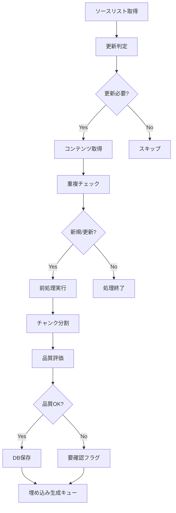

# ERP知識RAGシステム - 機能要件仕様書 (FRS)

---
doc_type: "functional_requirements"
complexity: "high"
estimated_effort: "80-120 hours"
prerequisites: ["01_PRD.md", "02_SystemArchitecture.md"]
implementation_priority: "high"
ai_assistance_level: "full_automation_possible"
version: "1.0.0"
author: "Claude Code"
created_date: "2025-01-21"
status: "draft"
---

## 📋 機能概要

### システム機能マップ
```
ERP知識RAGシステム
├── データ管理機能
│   ├── UC-001: ソース管理機能
│   ├── UC-002: 文書取り込み機能  
│   ├── UC-003: 自動更新監視機能
│   └── UC-004: 品質管理機能
├── 検索・回答機能
│   ├── UC-005: セマンティック検索機能
│   ├── UC-006: ハイブリッド検索機能
│   ├── UC-007: RAG回答生成機能
│   └── UC-008: 検索結果フィルタリング機能
├── ユーザーインターフェース機能
│   ├── UC-009: Web検索インターフェース
│   ├── UC-010: 管理者ダッシュボード
│   ├── UC-011: API インターフェース
│   └── UC-012: フィードバック収集機能
└── 運用支援機能
    ├── UC-013: システム監視機能
    ├── UC-014: 分析レポート機能
    ├── UC-015: バックアップ機能
    └── UC-016: ユーザー管理機能
```

## 🗂️ UC-001: ソース管理機能

### 機能概要
データソース（PMBOK、ブログ、GitHub等）の登録・管理・監視を行う

### アクター
- 管理者
- システム（自動処理）

### 前提条件
- 管理者がシステムにログイン済み
- 管理者権限を保有

### 基本フロー
1. 管理者が新規ソース追加画面を開く
2. ソース情報を入力
   - ソース名
   - ソースタイプ (PDF, RSS, Web, GitHub)
   - URL/パス
   - 更新チェック間隔
   - 品質重み
3. システムがソース接続をテスト
4. 接続成功時、ソース情報をデータベースに保存
5. 初回データ取得をキューに追加

### 代替フロー
- 3a. 接続失敗時、エラーメッセージ表示
- 5a. 手動での初回取得スキップ可能

### 事後条件
- ソース情報がデータベースに登録される
- 自動監視対象に追加される

### 非機能要件
- レスポンス時間: < 3秒
- 同時ソース管理: 100件まで
- 可用性: 99.0%

### UI仕様
```
┌─────────────────────────────────────────┐
│ データソース管理                          │
├─────────────────────────────────────────┤
│ ソース名: [________________]             │
│ タイプ: [▼ RSS Feed    ]                │  
│ URL: [_________________________________] │
│ チェック間隔: [▼ 1時間  ] [テスト]       │
│ 品質重み: [●●●○○] (3/5)                │
│                                         │
│ [保存] [キャンセル]                       │
└─────────────────────────────────────────┘
```

### 検証項目
- [ ] ソース情報の正常保存
- [ ] URL接続テストの動作確認
- [ ] 重複ソース登録の防止
- [ ] 不正URL入力時のエラー処理

## 🗂️ UC-002: 文書取り込み機能

### 機能概要
外部ソースから文書を取得し、テキスト抽出・前処理・チャンク分割を実行

### アクター
- システム（自動処理）
- 管理者（手動実行）

### 前提条件
- ソースが登録済み
- インターネット接続が利用可能

### 基本フロー
1. システムがソースリストを取得
2. 各ソースの更新チェック間隔に基づき処理判定
3. 対象ソースからコンテンツ取得
   - PDF: PyPDF2でテキスト抽出
   - RSS: feedparserで記事取得
   - Web: Beautiful Soupでスクレイピング
   - GitHub: GitHub APIでファイル取得
4. コンテンツハッシュで重複チェック
5. 新規/更新コンテンツの場合、前処理実行
   - 不要テキスト除去（広告、ナビ等）
   - メタデータ抽出（タイトル、著者、日付）
   - 言語判定（日本語/英語）
6. テキストをチャンクに分割
   - 意味的境界を考慮した分割
   - チャンクサイズ: 200-800トークン
   - オーバーラップ: 50トークン
7. 品質スコア計算・フィルタリング
8. データベースに保存

### 代替フロー
- 3a. 取得失敗時、リトライ（最大3回）
- 4a. 重複検出時、更新日時比較
- 7a. 品質スコア閾値未満時、要確認フラグ設定

### 事後条件
- 文書・チャンクがデータベースに保存
- 埋め込み生成キューに追加
- 処理ログが記録

### 非機能要件
- 処理時間: PDF 30秒/MB、RSS記事 5秒/記事
- 同時処理: 5ソース並列
- エラー許容: 10%まで

### 処理フロー図


### 検証項目
- [ ] 各ソースタイプの正常取得
- [ ] テキスト抽出の精度確認
- [ ] チャンク分割の適切性
- [ ] 重複検出・除去の動作
- [ ] エラー時のリトライ処理

## 🗂️ UC-003: 自動更新監視機能

### 機能概要
登録ソースを定期監視し、更新された内容を自動取り込み

### アクター
- システム（自動処理）

### 前提条件
- 監視対象ソースが登録済み
- GitHub Actionsまたはcronジョブが設定済み

### 基本フロー
1. スケジューラーが定期実行をトリガー
2. アクティブなソースリストを取得
3. 各ソースの最終チェック時刻と間隔を確認
4. 更新チェック対象ソースを特定
5. 並列で更新確認処理実行
   - RSS: Last-Modified、ETタグ確認
   - Web: コンテンツハッシュ比較
   - PDF: ファイル最終更新日確認
   - GitHub: コミットハッシュ確認
6. 更新検出時、文書取り込み処理を実行
7. 処理結果をログに記録
8. エラー・警告があれば通知送信

### 代替フロー
- 5a. ソース接続失敗時、次回リトライ設定
- 6a. 取り込み処理失敗時、エラーログ記録
- 8a. 連続失敗時、ソースを一時停止

### 事後条件
- 最終チェック時刻が更新
- 新規コンテンツが取り込まれる
- 処理統計が更新される

### GitHub Actions設定例
```yaml
name: Knowledge Base Auto Update
on:
  schedule:
    - cron: '0 */6 * * *'  # 6時間ごと
  workflow_dispatch:

jobs:
  update_sources:
    runs-on: ubuntu-latest
    steps:
      - uses: actions/checkout@v3
      - name: Setup Python
        uses: actions/setup-python@v4
        with:
          python-version: '3.11'
      - name: Install dependencies
        run: pip install -r requirements.txt
      - name: Run source update
        run: python scripts/update_sources.py
      - name: Health check
        run: python scripts/health_check.py
```

### 検証項目
- [ ] スケジュール実行の確実性
- [ ] 並列処理の安定性
- [ ] 更新検出の精度
- [ ] エラー通知の送信
- [ ] リソース消費の最適化

## 🗂️ UC-004: 品質管理機能

### 機能概要
取り込んだ知識の品質評価・監視・改善を継続的に実施

### アクター
- システム（自動評価）
- 管理者（品質確認）
- 専門家（レビュー）

### 前提条件
- 文書・チャンクがシステムに存在
- 品質評価基準が設定済み

### 基本フロー
1. システムが品質評価を定期実行
2. 各文書・チャンクに対して評価項目を算出
   - **権威性スコア**: ソース信頼度
   - **正確性スコア**: ファクトチェック結果
   - **時宜性スコア**: 発行・更新日からの経過
   - **網羅性スコア**: 重要トピックのカバー率
   - **利用性スコア**: 検索・評価実績
3. 総合品質スコアを算出（加重平均）
4. 閾値以下の低品質コンテンツを特定
5. 要確認リストに追加
6. 管理者・専門家に通知
7. レビュー結果に基づき対応実行
   - 品質向上: メタデータ補完、再処理
   - 除外: 非表示、削除
   - 維持: 現状維持

### 品質評価基準
```yaml
品質スコア計算:
  権威性 (25%):
    - PMI/IIBA公式: 100点
    - 認定専門家: 90点
    - 業界メディア: 80点
    - 個人ブログ: 60点
  
  正確性 (30%):
    - 第三者検証済み: 100点
    - 引用・根拠明示: 90点
    - 実績・事例あり: 80点
    - 主観的記述: 60点
  
  時宜性 (20%):
    - 1年以内: 100点
    - 2年以内: 90点
    - 3年以内: 70点
    - 3年超: 50点
  
  網羅性 (15%):
    - 体系的説明: 100点
    - 部分的説明: 80点
    - 断片的情報: 60点
  
  利用性 (10%):
    - 高評価多数: 100点
    - 中評価中心: 80点
    - 低評価・未使用: 50点
```

### 自動品質チェック例
```python
class QualityEvaluator:
    def evaluate_document(self, document):
        scores = {}
        
        # 権威性評価
        scores['authority'] = self._evaluate_authority(document.source)
        
        # 時宜性評価
        age_days = (datetime.now() - document.published_date).days
        scores['timeliness'] = max(100 - age_days * 0.1, 50)
        
        # 利用性評価
        scores['utility'] = self._evaluate_utility(document.usage_stats)
        
        # 総合スコア
        weights = {'authority': 0.25, 'timeliness': 0.20, 'utility': 0.10}
        total_score = sum(scores[k] * weights.get(k, 0.15) 
                         for k in scores)
        
        return total_score, scores
```

### 検証項目
- [ ] 品質スコア算出の妥当性
- [ ] 低品質コンテンツの検出精度
- [ ] レビューワークフローの効率性
- [ ] 品質改善効果の測定

## 🔍 UC-005: セマンティック検索機能

### 機能概要
自然言語クエリに基づく意味的類似検索を提供

### アクター
- エンドユーザー（コンサルタント、PM等）

### 前提条件
- ユーザーがシステムにアクセス済み
- ベクトルデータベースに埋め込み済みデータが存在

### 基本フロー
1. ユーザーが検索クエリを入力
2. システムがクエリを前処理
   - 正規化（小文字変換、記号除去）
   - 同義語・関連語展開
   - ストップワード除去
3. クエリの埋め込みベクトル生成
4. ベクトルデータベースで類似検索実行
   - コサイン類似度計算
   - 上位K件取得（デフォルト: 20件）
5. メタデータフィルタリング適用
   - ソースタイプフィルタ
   - 日付範囲フィルタ
   - 品質スコア閾値
6. 関連度ランキング調整
7. 検索結果を整形・返却
   - タイトル、要約、ソース情報
   - 類似度スコア、品質スコア
   - ハイライト表示

### UI仕様
```
┌─────────────────────────────────────────────────┐
│ 🔍 [ERPプロジェクトでのリスク管理方法は？____] [検索] │
├─────────────────────────────────────────────────┤
│ フィルタ: [▼すべて] [▼1年以内] [品質▼高] [詳細▲]   │
├─────────────────────────────────────────────────┤
│ 📄 PMBOK Guide - Risk Management (95%) ★★★★★    │
│    プロジェクトリスクの識別、分析、対応戦略...      │
│    出典: PMI | 2021年 | 3,245回参照              │
│                                               │
│ 📝 ERP導入プロジェクトのリスク要因分析 (89%) ★★★★☆ │
│    ERP導入で発生する典型的なリスクと軽減策...      │
│    出典: ITコンサル協会 | 2023年 | 892回参照        │
│                                               │
│ 💡 関連検索: "リスク登録簿" "リスク対応計画"        │
└─────────────────────────────────────────────────┘
```

### レスポンス仕様
```json
{
  "query": "ERPプロジェクトでのリスク管理方法",
  "results": [
    {
      "id": "chunk_12345",
      "title": "PMBOK Guide - Risk Management",
      "content": "プロジェクトリスクの識別、分析、対応戦略...",
      "source": {
        "name": "PMBOK Guide 7th Edition",
        "type": "standard_document",
        "author": "PMI",
        "url": "https://pmi.org/pmbok"
      },
      "scores": {
        "similarity": 0.95,
        "quality": 4.8,
        "relevance": 0.92
      },
      "metadata": {
        "page_number": 123,
        "section": "Risk Management",
        "published_date": "2021-08-01"
      }
    }
  ],
  "total_results": 15,
  "response_time_ms": 1250,
  "suggestions": ["リスク登録簿", "リスク対応計画"]
}
```

### 検証項目
- [ ] 検索精度の妥当性
- [ ] レスポンス時間の要件達成
- [ ] フィルタリングの正確性
- [ ] ユーザビリティの確認

## 🔍 UC-006: ハイブリッド検索機能

### 機能概要
ベクトル検索とキーワード検索を組み合わせた高精度検索

### アクター
- エンドユーザー（上級者）

### 前提条件
- セマンティック検索機能が利用可能
- 全文検索インデックスが構築済み

### 基本フロー
1. ユーザーがクエリを入力（詳細検索モード）
2. システムがクエリを解析
   - 専門用語・固有名詞の抽出
   - 意味的検索部分の特定
3. 並列で複数検索を実行
   - ベクトル検索（セマンティック）
   - BM25全文検索（キーワード）
   - メタデータ検索（構造化）
4. 検索結果をマージ・重複除去
5. 相互ランク融合（RRF）でスコア統合
6. 再ランキング実行（Cross-Encoder）
7. 最終結果を返却

### ハイブリッド検索アルゴリズム
```python
def hybrid_search(query, k=20):
    # ベクトル検索
    vector_results = vector_search(query, k=k*2)
    
    # BM25検索  
    bm25_results = keyword_search(query, k=k*2)
    
    # メタデータ検索
    metadata_results = structured_search(query, k=k//2)
    
    # 結果マージ
    combined = merge_results([
        vector_results,
        bm25_results, 
        metadata_results
    ])
    
    # RRF（相互ランク融合）
    rrf_scores = reciprocal_rank_fusion(combined)
    
    # 再ランキング
    reranked = cross_encoder_rerank(query, rrf_scores)
    
    return reranked[:k]

def reciprocal_rank_fusion(results, k=60):
    """相互ランク融合によるスコア統合"""
    fusion_scores = {}
    
    for result_list in results:
        for rank, doc in enumerate(result_list):
            doc_id = doc['id']
            rrf_score = 1 / (k + rank + 1)
            
            if doc_id in fusion_scores:
                fusion_scores[doc_id] += rrf_score
            else:
                fusion_scores[doc_id] = rrf_score
    
    return sorted(fusion_scores.items(), 
                 key=lambda x: x[1], reverse=True)
```

### 詳細検索UI
```
┌─────────────────────────────────────────────────┐
│ 🔍 高度な検索                                    │
├─────────────────────────────────────────────────┤
│ クエリ: [ERPプロジェクトでのリスク管理方法________]  │
│ 必須キーワード: [リスク 管理_____________]        │
│ 除外キーワード: [理論 学術______________]        │
│                                               │
│ ソース: ☑PMBOK ☑BABOK ☐ブログ ☑論文           │
│ 期間: [2020-01-01] ～ [2025-01-21]            │
│ 品質: ●●●●○ (4.0以上)                         │
│                                               │
│ 検索方式: ☑意味検索 ☑キーワード ☑構造化        │
│                                               │
│ [詳細検索実行] [条件クリア]                      │
└─────────────────────────────────────────────────┘
```

### 検証項目
- [ ] 各検索方式の結果品質
- [ ] マージ・融合アルゴリズムの効果
- [ ] 再ランキングの精度向上
- [ ] 計算コスト・レスポンス時間

## 🤖 UC-007: RAG回答生成機能

### 機能概要
検索結果を基にした自然言語での回答生成

### アクター
- エンドユーザー
- システム（LLM連携）

### 前提条件
- 検索機能が利用可能
- LLMサービス（GPT-4等）が利用可能

### 基本フロー
1. ユーザーが質問を入力（会話モード）
2. システムが関連情報を検索
3. 検索結果からコンテキストを構築
   - 上位5-10件の内容統合
   - 重複情報の統合・要約
   - ソース情報の保持
4. プロンプトテンプレートに組み込み
5. LLMに回答生成を依頼
6. 回答の品質チェック・フィルタリング
7. ソース情報付きで回答を返却
8. ユーザーフィードバックを収集

### プロンプトテンプレート例
```python
PROMPT_TEMPLATE = """
あなたはERP導入の専門家です。以下の情報を参考に、ユーザーの質問に正確で実用的な回答をしてください。

【質問】
{question}

【参考情報】
{context}

【回答の条件】
- 正確性を最優先し、不明な点は明記する
- 実践的なアドバイスを含める
- 参考情報のソースを明示する
- 日本語で200-400文字程度で回答する

【回答】
"""

def generate_answer(question, search_results):
    context = build_context(search_results)
    
    prompt = PROMPT_TEMPLATE.format(
        question=question,
        context=context
    )
    
    response = llm.generate(
        prompt=prompt,
        temperature=0.3,
        max_tokens=500
    )
    
    return {
        'answer': response.text,
        'sources': [r['source'] for r in search_results[:5]],
        'confidence': calculate_confidence(response, search_results)
    }
```

### 回答UI例
```
┌─────────────────────────────────────────────────┐
│ 💬 ERPプロジェクトでのリスク管理方法は？          │
├─────────────────────────────────────────────────┤
│ 🤖 ERPプロジェクトのリスク管理では、以下の手順が   │
│    重要です：                                   │
│                                               │
│    1. **リスク識別**: プロジェクト初期段階で...    │
│    2. **リスク分析**: 発生確率と影響度を...       │
│    3. **リスク対応**: 軽減、回避、受容の...       │
│                                               │
│    特にERP導入では「業務要件の変更」「データ      │
│    移行の複雑さ」「ユーザー受入」が主要リスク...   │
│                                               │
│ 📚 参考資料:                                    │
│    • PMBOK Guide 7版 (PMI, 2021)              │
│    • ERP導入ベストプラクティス (2023)            │
│                                               │
│ 👍 この回答は役に立ちましたか？ [👍] [👎] [💬]    │
└─────────────────────────────────────────────────┘
```

### 検証項目
- [ ] 回答の正確性・妥当性
- [ ] ソース情報の適切な引用
- [ ] 回答生成時間の許容範囲
- [ ] ユーザー満足度の測定

## 👥 UC-008-016: その他の機能要件

### UC-008: 検索結果フィルタリング機能
- **概要**: 検索結果をソース、期間、品質等で絞り込み
- **優先度**: 高
- **実装工数**: 10-15時間

### UC-009: Web検索インターフェース
- **概要**: 直感的なWeb UIでの検索・閲覧機能
- **優先度**: 高  
- **実装工数**: 20-30時間

### UC-010: 管理者ダッシュボード
- **概要**: システム状態、利用統計、品質監視の統合画面
- **優先度**: 中
- **実装工数**: 25-35時間

### UC-011: API インターフェース
- **概要**: 外部システム連携用のREST API
- **優先度**: 中
- **実装工数**: 15-25時間

### UC-012: フィードバック収集機能
- **概要**: ユーザー評価・改善要望の収集・分析
- **優先度**: 中
- **実装工数**: 10-15時間

### UC-013: システム監視機能
- **概要**: パフォーマンス、エラー、リソース使用量の監視
- **優先度**: 中
- **実装工数**: 15-20時間

### UC-014: 分析レポート機能
- **概要**: 利用状況、検索トレンド、品質改善の分析報告
- **優先度**: 低
- **実装工数**: 20-25時間

### UC-015: バックアップ機能
- **概要**: データベース、設定、ログの定期バックアップ
- **優先度**: 中
- **実装工数**: 8-12時間

### UC-016: ユーザー管理機能
- **概要**: 認証、認可、ロール管理
- **優先度**: 中
- **実装工数**: 15-20時間

## 🎯 優先度・実装順序

### Phase 1 (MVP) - 6週間
1. UC-002: 文書取り込み機能
2. UC-005: セマンティック検索機能  
3. UC-009: Web検索インターフェース
4. UC-001: ソース管理機能

### Phase 2 (機能拡張) - 4週間
5. UC-003: 自動更新監視機能
6. UC-004: 品質管理機能
7. UC-007: RAG回答生成機能
8. UC-010: 管理者ダッシュボード

### Phase 3 (高度機能) - 継続
9. UC-006: ハイブリッド検索機能
10. UC-011: API インターフェース
11. UC-013: システム監視機能
12. その他運用支援機能

## 🤖 Implementation Notes for AI

### Critical Implementation Paths
1. **文書処理パイプライン**: PyPDF2/Beautiful Soup → LangChain TextSplitter → 品質フィルタ
2. **検索エンジン**: sentence-transformers → Chroma DB → 類似度計算
3. **UI フレームワーク**: Streamlit/FastAPI → リアクティブ検索UI
4. **品質管理**: 自動スコアリング → 閾値判定 → レビューワークフロー

### Key Dependencies
- **LangChain**: 文書処理・RAGフレームワーク
- **Chroma**: ベクトルデータベース・類似検索
- **sentence-transformers**: 多言語埋め込みモデル  
- **FastAPI**: 高性能Web API
- **Streamlit**: 管理画面・プロトタイプUI

### Testing Strategy
- **単体テスト**: 各機能コンポーネントの独立テスト
- **統合テスト**: データフロー全体の動作確認
- **ユーザーテスト**: 実際の検索クエリでの精度評価
- **性能テスト**: レスポンス時間・スループット測定

### Common Pitfalls
- **日本語処理**: MeCab/SudachiPy設定、トークン境界
- **メモリ管理**: 大量文書処理時のOOM対策
- **非同期処理**: async/await適切な実装
- **品質評価**: 主観的評価の定量化・自動化

---

**Version**: 1.0.0 | **Last Updated**: 2025-01-21 | **Next Review**: 2025-02-21