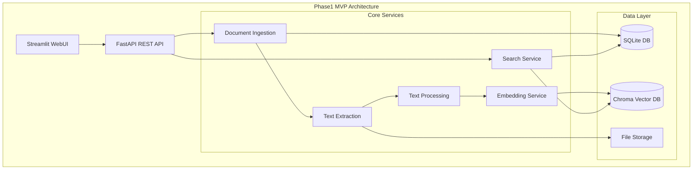

# ERP知識RAGシステム - Phase1 技術仕様書

---
doc_type: "phase1_technical_specification"
complexity: "high"
estimated_effort: "技術実装の詳細仕様"
prerequisites: ["02_SystemArchitecture.md", "05_DataModelDesign.md", "16_Phase1ImplementationPlan.md"]
implementation_priority: "critical"
ai_assistance_level: "full_automation_possible"
version: "1.0.0"
author: "Claude Code"
created_date: "2025-01-21"
status: "approved"
approval_authority: "Technical Lead"
---

## 📋 Phase1 技術仕様概要

### MVP技術仕様の範囲・目的
本文書は「ERP知識RAGシステム（ERPFTS）」Phase1 MVPの詳細技術実装仕様を定義する。文書取り込み、セマンティック検索、WebUI の核心機能について、実装レベルでの具体的技術仕様・API・データ構造・アルゴリズムを規定する。

### Phase1 技術アーキテクチャ概要


### Phase1 技術スタック
```yaml
Language & Runtime:
  - Python 3.11+
  - AsyncIO (非同期処理)
  - Type Hints (mypy準拠)

Core Libraries:
  Document Processing:
    - PyPDF2 3.0+ (PDF抽出)
    - pdfplumber 0.9+ (PDF構造解析)
    - BeautifulSoup4 4.12+ (HTML解析)
    - feedparser 6.0+ (RSS解析)
    - python-docx (Word文書対応)
  
  Text Processing:
    - spaCy 3.7+ (多言語NLP)
    - langdetect 1.0+ (言語検出)
    - sentence-transformers 2.2+ (埋め込み)
    - tiktoken 0.5+ (トークン計算)
  
  Vector Search:
    - chromadb 0.4+ (ベクトルDB)
    - sentence-transformers (埋め込みモデル)
  
  Web Framework:
    - FastAPI 0.104+ (REST API)
    - Streamlit 1.28+ (WebUI)
    - Pydantic 2.5+ (データ検証)
  
  Data & Storage:
    - SQLAlchemy 2.0+ (ORM)
    - SQLite 3.35+ (メタデータDB)
    - Alembic 1.12+ (マイグレーション)

Development & Testing:
  - pytest 7.4+ (テストフレームワーク)
  - pytest-asyncio (非同期テスト)
  - Black (コードフォーマッタ)
  - mypy (型チェック)
  - pre-commit (Git hooks)
```

## 🗂️ Phase1 プロジェクト構造

### ディレクトリ構成
```
erpfts/
├── pyproject.toml              # プロジェクト設定・依存関係
├── requirements.txt            # Python依存ライブラリ
├── .env.template              # 環境変数テンプレート
├── README.md                  # プロジェクト概要・セットアップ
├── Makefile                   # 開発用コマンド集約
│
├── erpfts/                    # メインアプリケーション
│   ├── __init__.py
│   ├── main.py                # FastAPI アプリケーション
│   ├── cli.py                 # CLI コマンドエントリーポイント
│   │
│   ├── core/                  # 共通基盤・設定
│   │   ├── __init__.py
│   │   ├── config.py          # 設定管理 (Pydantic Settings)
│   │   ├── database.py        # データベース接続・セッション
│   │   ├── logging.py         # ログ設定・ハンドラー
│   │   ├── exceptions.py      # カスタム例外クラス
│   │   └── utils.py           # 共通ユーティリティ
│   │
│   ├── models/                # データモデル・スキーマ
│   │   ├── __init__.py
│   │   ├── database.py        # SQLAlchemy モデル
│   │   ├── schemas.py         # Pydantic スキーマ
│   │   └── enums.py           # 列挙型定義
│   │
│   ├── sources/               # データソース管理
│   │   ├── __init__.py
│   │   ├── source_manager.py  # ソース統合管理
│   │   ├── pdf_source.py      # PDF ソース処理
│   │   ├── web_source.py      # Web ソース処理
│   │   └── rss_source.py      # RSS ソース処理
│   │
│   ├── extractors/            # 文書抽出エンジン
│   │   ├── __init__.py
│   │   ├── base_extractor.py  # 抽出器基底クラス
│   │   ├── pdf_extractor.py   # PDF 抽出器
│   │   ├── web_extractor.py   # Web 抽出器
│   │   └── content_detector.py # コンテンツタイプ検出
│   │
│   ├── processing/            # テキスト処理・チャンク化
│   │   ├── __init__.py
│   │   ├── text_processor.py  # テキスト前処理・正規化
│   │   ├── chunker.py         # セマンティックチャンク分割
│   │   ├── language_detector.py # 言語検出・多言語対応
│   │   └── batch_processor.py # バッチ処理・進捗管理
│   │
│   ├── embeddings/            # 埋め込み生成・管理
│   │   ├── __init__.py
│   │   ├── embedding_service.py # 埋め込みサービス
│   │   ├── model_manager.py   # モデル管理・最適化
│   │   └── batch_embedder.py  # バッチ埋め込み生成
│   │
│   ├── storage/               # データストレージ管理
│   │   ├── __init__.py
│   │   ├── vector_store.py    # Chroma DB 管理
│   │   ├── metadata_store.py  # SQLite メタデータ管理
│   │   └── file_store.py      # ファイルストレージ管理
│   │
│   ├── search/                # 検索エンジン・ランキング
│   │   ├── __init__.py
│   │   ├── search_engine.py   # セマンティック検索エンジン
│   │   ├── ranking.py         # 検索結果ランキング
│   │   ├── filters.py         # 検索フィルタリング
│   │   └── analytics.py       # 検索分析・ログ
│   │
│   ├── quality/               # 品質管理・評価
│   │   ├── __init__.py
│   │   ├── quality_evaluator.py # 品質評価システム
│   │   ├── deduplication.py   # 重複検出・除去
│   │   └── quality_metrics.py # 品質メトリクス計算
│   │
│   ├── api/                   # REST API エンドポイント
│   │   ├── __init__.py
│   │   ├── search.py          # 検索API
│   │   ├── documents.py       # 文書管理API
│   │   ├── sources.py         # ソース管理API
│   │   └── health.py          # ヘルスチェックAPI
│   │
│   ├── ui/                    # Streamlit WebUI
│   │   ├── __init__.py
│   │   ├── streamlit_app.py   # メインUIアプリケーション
│   │   ├── components/        # UI コンポーネント
│   │   │   ├── search_form.py # 検索フォーム
│   │   │   ├── result_display.py # 結果表示
│   │   │   ├── source_viewer.py # ソース詳細表示
│   │   │   └── user_feedback.py # ユーザーフィードバック
│   │   └── styles/            # カスタムCSS・スタイル
│   │       └── custom.css
│   │
│   └── admin/                 # 管理機能・監視
│       ├── __init__.py
│       ├── admin_dashboard.py # 管理ダッシュボード
│       ├── source_management.py # ソース管理
│       └── system_monitor.py  # システム監視
│
├── tests/                     # テストコード
│   ├── __init__.py
│   ├── conftest.py           # pytest設定・フィクスチャ
│   ├── unit/                 # 単体テスト
│   │   ├── test_extractors.py
│   │   ├── test_processing.py
│   │   ├── test_embeddings.py
│   │   └── test_search.py
│   ├── integration/          # 統合テスト
│   │   ├── test_api.py
│   │   ├── test_database.py
│   │   └── test_pipeline.py
│   └── e2e/                  # End-to-End テスト
│       └── test_user_scenarios.py
│
├── data/                     # データディレクトリ
│   ├── sources/              # ソースファイル
│   ├── processed/            # 処理済みファイル
│   ├── embeddings/           # 埋め込みデータ
│   └── chroma_db/            # Chroma データベース
│
├── scripts/                  # 運用・メンテナンススクリプト
│   ├── setup_environment.py # 環境初期化
│   ├── migrate_database.py  # データ移行
│   └── backup_data.py        # データバックアップ
│
├── docs/                     # ドキュメント
│   └── (既存の全ドキュメント)
│
└── .github/                  # GitHub Actions・CI/CD
    └── workflows/
        ├── ci.yml            # 継続的統合
        └── release.yml       # リリース自動化
```

## 🔧 Core Services詳細仕様

### 1. Document Ingestion Service
```python
# erpfts/sources/source_manager.py
from typing import List, Dict, Any, Optional
from dataclasses import dataclass
from enum import Enum
import asyncio
from pathlib import Path

class SourceType(Enum):
    PDF = "pdf"
    WEB = "web"
    RSS = "rss"
    LOCAL_FILE = "local_file"

@dataclass
class SourceConfig:
    """ソース設定クラス"""
    id: str
    name: str
    source_type: SourceType
    base_url: Optional[str] = None
    file_path: Optional[Path] = None
    rss_feed: Optional[str] = None
    check_interval: int = 3600  # seconds
    is_active: bool = True
    quality_weight: float = 1.0
    metadata: Dict[str, Any] = None

class SourceManager:
    """統合ソース管理システム"""
    
    def __init__(self, db_session, file_store, quality_evaluator):
        self.db = db_session
        self.file_store = file_store
        self.quality_evaluator = quality_evaluator
        self.extractors = self._init_extractors()
    
    def _init_extractors(self):
        """抽出器の初期化"""
        from erpfts.extractors import (
            PDFExtractor, WebExtractor, RSSExtractor
        )
        return {
            SourceType.PDF: PDFExtractor(),
            SourceType.WEB: WebExtractor(),
            SourceType.RSS: RSSExtractor(),
        }
    
    async def register_source(
        self, 
        source_config: SourceConfig
    ) -> Dict[str, Any]:
        """新しいソースの登録"""
        try:
            # 1. ソース設定の検証
            await self._validate_source_config(source_config)
            
            # 2. データベースへの登録
            source_record = await self._create_source_record(source_config)
            
            # 3. 初回取り込みテスト
            test_result = await self._test_source_ingestion(source_config)
            
            return {
                "status": "success",
                "source_id": source_record.id,
                "test_result": test_result
            }
        except Exception as e:
            return {
                "status": "error",
                "error": str(e)
            }
    
    async def ingest_source(
        self, 
        source_id: str,
        force_update: bool = False
    ) -> Dict[str, Any]:
        """ソースからの文書取り込み実行"""
        # 1. ソース設定取得
        source_config = await self._get_source_config(source_id)
        
        # 2. 抽出器選択・実行
        extractor = self.extractors[source_config.source_type]
        documents = await extractor.extract(source_config)
        
        # 3. 各文書の処理
        processed_docs = []
        for doc_data in documents:
            try:
                # 重複チェック
                if not force_update and await self._is_duplicate(doc_data):
                    continue
                
                # 文書処理・品質評価
                processed_doc = await self._process_document(
                    doc_data, source_config
                )
                processed_docs.append(processed_doc)
                
            except Exception as e:
                # エラーログ記録・継続処理
                await self._log_processing_error(doc_data, e)
        
        # 4. バッチ保存・統計更新
        result = await self._save_documents(processed_docs, source_id)
        
        return result

# Phase1 MVP用簡易実装例
class SimplePDFExtractor:
    """Phase1用簡易PDF抽出器"""
    
    async def extract(self, source_config: SourceConfig) -> List[Dict]:
        """PDF文書からのテキスト抽出"""
        import PyPDF2
        from pathlib import Path
        
        if source_config.source_type != SourceType.PDF:
            raise ValueError("PDFソース以外は対応していません")
        
        pdf_path = Path(source_config.file_path)
        if not pdf_path.exists():
            raise FileNotFoundError(f"PDF file not found: {pdf_path}")
        
        with open(pdf_path, 'rb') as file:
            pdf_reader = PyPDF2.PdfReader(file)
            text_content = ""
            
            for page_num, page in enumerate(pdf_reader.pages):
                page_text = page.extract_text()
                text_content += f"\n--- Page {page_num + 1} ---\n{page_text}"
        
        # 基本メタデータ生成
        doc_metadata = {
            "title": pdf_path.stem,
            "source_type": "pdf",
            "file_path": str(pdf_path),
            "page_count": len(pdf_reader.pages),
            "content_hash": self._calculate_hash(text_content),
            "extraction_timestamp": datetime.utcnow().isoformat()
        }
        
        return [{
            "content": text_content,
            "metadata": doc_metadata
        }]
```

### 2. Text Processing Service
```python
# erpfts/processing/text_processor.py
import re
import unicodedata
from typing import List, Dict, Any
import spacy
from langdetect import detect
import tiktoken

class TextProcessor:
    """テキスト前処理・正規化サービス"""
    
    def __init__(self):
        # spaCy 多言語モデル読み込み
        self.nlp_ja = spacy.load("ja_core_news_sm")
        self.nlp_en = spacy.load("en_core_web_sm")
        self.tokenizer = tiktoken.get_encoding("cl100k_base")
    
    async def process_text(
        self, 
        raw_text: str, 
        source_metadata: Dict[str, Any]
    ) -> Dict[str, Any]:
        """テキストの包括的前処理"""
        
        # 1. 基本クリーニング
        cleaned_text = self._clean_text(raw_text)
        
        # 2. 言語検出
        language = self._detect_language(cleaned_text)
        
        # 3. 言語別処理
        processed_text = await self._process_by_language(cleaned_text, language)
        
        # 4. 品質評価
        quality_score = self._evaluate_text_quality(processed_text)
        
        return {
            "processed_text": processed_text,
            "language": language,
            "quality_score": quality_score,
            "token_count": len(self.tokenizer.encode(processed_text)),
            "char_count": len(processed_text),
            "metadata": {
                **source_metadata,
                "processing_timestamp": datetime.utcnow().isoformat(),
                "language_detected": language
            }
        }
    
    def _clean_text(self, text: str) -> str:
        """基本テキストクリーニング"""
        # Unicode正規化
        text = unicodedata.normalize('NFKC', text)
        
        # 制御文字除去
        text = re.sub(r'[\x00-\x08\x0B\x0C\x0E-\x1F\x7F]', '', text)
        
        # 連続空白・改行の正規化
        text = re.sub(r'\n\s*\n\s*\n', '\n\n', text)  # 3連続改行→2改行
        text = re.sub(r'[ \t]+', ' ', text)  # 連続スペース→単一スペース
        
        # 文書構造マーカー除去（PDFの不要なヘッダー・フッター等）
        text = re.sub(r'-{3,}', '', text)  # 罫線
        text = re.sub(r'={3,}', '', text)  # 等号線
        
        return text.strip()
    
    def _detect_language(self, text: str) -> str:
        """言語検出"""
        try:
            # テキストサンプル使用（最初の1000文字）
            sample_text = text[:1000] if len(text) > 1000 else text
            detected = detect(sample_text)
            
            # サポート言語にマッピング
            if detected in ['ja', 'japanese']:
                return 'ja'
            elif detected in ['en', 'english']:
                return 'en'
            else:
                return 'auto'  # その他言語は自動判定
        except:
            return 'auto'

# erpfts/processing/chunker.py
class SemanticChunker:
    """セマンティックチャンク分割器"""
    
    def __init__(self, max_tokens: int = 512, overlap_tokens: int = 50):
        self.max_tokens = max_tokens
        self.overlap_tokens = overlap_tokens
        self.tokenizer = tiktoken.get_encoding("cl100k_base")
    
    async def chunk_text(
        self, 
        text: str, 
        metadata: Dict[str, Any]
    ) -> List[Dict[str, Any]]:
        """テキストのセマンティックチャンク分割"""
        
        # 1. 段落分割
        paragraphs = self._split_into_paragraphs(text)
        
        # 2. トークン数ベースでチャンク作成
        chunks = []
        current_chunk = ""
        current_tokens = 0
        
        for paragraph in paragraphs:
            paragraph_tokens = len(self.tokenizer.encode(paragraph))
            
            # 段落がmax_tokensを超える場合は分割
            if paragraph_tokens > self.max_tokens:
                # 現在のチャンクを保存
                if current_chunk:
                    chunks.append(self._create_chunk_dict(
                        current_chunk, len(chunks), metadata
                    ))
                    current_chunk = ""
                    current_tokens = 0
                
                # 大きな段落を分割
                split_chunks = self._split_large_paragraph(
                    paragraph, len(chunks), metadata
                )
                chunks.extend(split_chunks)
            
            # 通常の段落追加処理
            elif current_tokens + paragraph_tokens <= self.max_tokens:
                current_chunk += f"\n\n{paragraph}" if current_chunk else paragraph
                current_tokens += paragraph_tokens
            else:
                # 現在のチャンクを保存・新チャンク開始
                chunks.append(self._create_chunk_dict(
                    current_chunk, len(chunks), metadata
                ))
                current_chunk = paragraph
                current_tokens = paragraph_tokens
        
        # 最後のチャンク処理
        if current_chunk:
            chunks.append(self._create_chunk_dict(
                current_chunk, len(chunks), metadata
            ))
        
        return chunks
    
    def _create_chunk_dict(
        self, 
        content: str, 
        chunk_index: int, 
        metadata: Dict[str, Any]
    ) -> Dict[str, Any]:
        """チャンク辞書作成"""
        token_count = len(self.tokenizer.encode(content))
        
        return {
            "content": content.strip(),
            "chunk_index": chunk_index,
            "token_count": token_count,
            "char_count": len(content),
            "content_hash": hashlib.md5(content.encode()).hexdigest(),
            "metadata": {
                **metadata,
                "chunk_timestamp": datetime.utcnow().isoformat()
            }
        }
```

### 3. Embedding Service
```python
# erpfts/embeddings/embedding_service.py
from sentence_transformers import SentenceTransformer
import numpy as np
from typing import List, Dict, Any, Optional
import asyncio
import torch

class EmbeddingService:
    """埋め込み生成・管理サービス"""
    
    def __init__(self, model_name: str = "intfloat/multilingual-e5-large"):
        self.model_name = model_name
        self.model = None
        self.device = "cuda" if torch.cuda.is_available() else "cpu"
        self._load_model()
    
    def _load_model(self):
        """埋め込みモデル読み込み"""
        try:
            self.model = SentenceTransformer(self.model_name)
            self.model.to(self.device)
            print(f"✅ Embedding model loaded: {self.model_name} on {self.device}")
        except Exception as e:
            raise RuntimeError(f"Failed to load embedding model: {e}")
    
    async def generate_embeddings(
        self, 
        texts: List[str],
        batch_size: int = 32
    ) -> List[np.ndarray]:
        """テキストリストの埋め込み生成"""
        if not texts:
            return []
        
        try:
            # バッチ処理で埋め込み生成
            embeddings = []
            for i in range(0, len(texts), batch_size):
                batch = texts[i:i + batch_size]
                
                # 多言語E5モデル用のプレフィックス追加
                prefixed_batch = [f"query: {text}" for text in batch]
                
                # 埋め込み生成
                batch_embeddings = self.model.encode(
                    prefixed_batch,
                    convert_to_numpy=True,
                    normalize_embeddings=True,
                    show_progress_bar=True
                )
                embeddings.extend(batch_embeddings)
                
                # 非同期yield（UIの応答性向上）
                await asyncio.sleep(0)
            
            return embeddings
            
        except Exception as e:
            raise RuntimeError(f"Embedding generation failed: {e}")
    
    async def generate_single_embedding(self, text: str) -> np.ndarray:
        """単一テキストの埋め込み生成"""
        embeddings = await self.generate_embeddings([text])
        return embeddings[0] if embeddings else None
    
    def get_embedding_dimension(self) -> int:
        """埋め込み次元数取得"""
        return self.model.get_sentence_embedding_dimension()
    
    async def similarity_search(
        self, 
        query_text: str,
        candidate_embeddings: List[np.ndarray],
        top_k: int = 10
    ) -> List[Dict[str, Any]]:
        """類似度検索実行"""
        # クエリ埋め込み生成
        query_embedding = await self.generate_single_embedding(query_text)
        
        # コサイン類似度計算
        similarities = []
        for idx, candidate in enumerate(candidate_embeddings):
            similarity = np.dot(query_embedding, candidate) / (
                np.linalg.norm(query_embedding) * np.linalg.norm(candidate)
            )
            similarities.append({
                "index": idx,
                "similarity": float(similarity)
            })
        
        # 類似度でソート・上位K件取得
        similarities.sort(key=lambda x: x["similarity"], reverse=True)
        return similarities[:top_k]

# Phase1用Chroma統合例
class ChromaVectorStore:
    """Chroma ベクトルストア管理"""
    
    def __init__(self, collection_name: str = "erpfts_embeddings"):
        import chromadb
        self.client = chromadb.PersistentClient(path="./data/chroma_db")
        self.collection_name = collection_name
        self.collection = self._get_or_create_collection()
    
    def _get_or_create_collection(self):
        """コレクション取得または作成"""
        try:
            return self.client.get_collection(self.collection_name)
        except:
            return self.client.create_collection(
                name=self.collection_name,
                metadata={"description": "ERP Knowledge Base Embeddings"}
            )
    
    async def add_embeddings(
        self, 
        embeddings: List[np.ndarray],
        texts: List[str],
        metadatas: List[Dict[str, Any]],
        ids: List[str]
    ):
        """埋め込みをChromaに追加"""
        try:
            self.collection.add(
                embeddings=[emb.tolist() for emb in embeddings],
                documents=texts,
                metadatas=metadatas,
                ids=ids
            )
        except Exception as e:
            raise RuntimeError(f"Failed to add embeddings to Chroma: {e}")
    
    async def search(
        self, 
        query_embedding: np.ndarray,
        n_results: int = 10,
        where: Optional[Dict[str, Any]] = None
    ) -> Dict[str, Any]:
        """ベクトル検索実行"""
        try:
            results = self.collection.query(
                query_embeddings=[query_embedding.tolist()],
                n_results=n_results,
                where=where,
                include=["documents", "metadatas", "distances"]
            )
            return results
        except Exception as e:
            raise RuntimeError(f"Vector search failed: {e}")
```

### 4. Search Engine
```python
# erpfts/search/search_engine.py
from typing import List, Dict, Any, Optional
from dataclasses import dataclass
import asyncio

@dataclass
class SearchQuery:
    """検索クエリクラス"""
    query_text: str
    filters: Optional[Dict[str, Any]] = None
    limit: int = 10
    offset: int = 0
    min_similarity: float = 0.0

@dataclass 
class SearchResult:
    """検索結果クラス"""
    chunk_id: str
    document_id: str
    content: str
    similarity_score: float
    metadata: Dict[str, Any]
    source_info: Dict[str, Any]

class SearchEngine:
    """セマンティック検索エンジン"""
    
    def __init__(
        self, 
        embedding_service: EmbeddingService,
        vector_store: ChromaVectorStore,
        metadata_store: MetadataStore
    ):
        self.embedding_service = embedding_service
        self.vector_store = vector_store
        self.metadata_store = metadata_store
    
    async def search(self, search_query: SearchQuery) -> List[SearchResult]:
        """セマンティック検索実行"""
        try:
            # 1. クエリ埋め込み生成
            query_embedding = await self.embedding_service.generate_single_embedding(
                search_query.query_text
            )
            
            # 2. ベクトル検索実行
            vector_results = await self.vector_store.search(
                query_embedding=query_embedding,
                n_results=search_query.limit * 2,  # 余裕を持って取得
                where=self._build_chroma_filters(search_query.filters)
            )
            
            # 3. メタデータ拡充・結果構造化
            search_results = []
            for i, chunk_id in enumerate(vector_results["ids"][0]):
                similarity = 1.0 - vector_results["distances"][0][i]  # distance -> similarity
                
                if similarity < search_query.min_similarity:
                    continue
                
                # メタデータ取得・拡充
                chunk_metadata = vector_results["metadatas"][0][i]
                document_info = await self.metadata_store.get_document_info(
                    chunk_metadata["document_id"]
                )
                source_info = await self.metadata_store.get_source_info(
                    document_info["source_id"]
                )
                
                search_result = SearchResult(
                    chunk_id=chunk_id,
                    document_id=chunk_metadata["document_id"],
                    content=vector_results["documents"][0][i],
                    similarity_score=similarity,
                    metadata=chunk_metadata,
                    source_info=source_info
                )
                search_results.append(search_result)
            
            # 4. 結果ランキング・フィルタリング
            ranked_results = await self._rank_results(
                search_results, search_query
            )
            
            # 5. ページネーション適用
            start_idx = search_query.offset
            end_idx = start_idx + search_query.limit
            
            return ranked_results[start_idx:end_idx]
            
        except Exception as e:
            raise RuntimeError(f"Search execution failed: {e}")
    
    async def _rank_results(
        self, 
        results: List[SearchResult], 
        query: SearchQuery
    ) -> List[SearchResult]:
        """検索結果ランキング"""
        # Phase1では単純な類似度ソート
        # Phase2以降で高度ランキング（品質スコア、人気度、時間等）を追加
        
        def ranking_score(result: SearchResult) -> float:
            base_score = result.similarity_score
            
            # 品質スコア重み付け（30%）
            quality_score = result.metadata.get("quality_score", 3.0) / 5.0
            quality_weight = base_score * 0.3 * quality_score
            
            # ソース品質重み付け（20%）
            source_weight = result.source_info.get("quality_weight", 1.0)
            source_score = base_score * 0.2 * source_weight
            
            return base_score + quality_weight + source_score
        
        results.sort(key=ranking_score, reverse=True)
        return results
    
    def _build_chroma_filters(self, filters: Optional[Dict[str, Any]]) -> Optional[Dict]:
        """Chroma用フィルター構築"""
        if not filters:
            return None
        
        chroma_filter = {}
        
        # ソースタイプフィルター
        if "source_types" in filters:
            chroma_filter["source_type"] = {"$in": filters["source_types"]}
        
        # 品質スコアフィルター
        if "min_quality_score" in filters:
            chroma_filter["quality_score"] = {"$gte": filters["min_quality_score"]}
        
        # 言語フィルター
        if "languages" in filters:
            chroma_filter["language"] = {"$in": filters["languages"]}
        
        return chroma_filter if chroma_filter else None

# 検索API実装例
# erpfts/api/search.py
from fastapi import APIRouter, HTTPException, Depends
from pydantic import BaseModel
from typing import List, Optional, Dict, Any

router = APIRouter(prefix="/api/v1/search", tags=["search"])

class SearchRequest(BaseModel):
    query: str
    filters: Optional[Dict[str, Any]] = None
    limit: int = 10
    offset: int = 0
    min_similarity: float = 0.0

class SearchResponse(BaseModel):
    results: List[Dict[str, Any]]
    total_count: int
    query_time: float
    
@router.post("/", response_model=SearchResponse)
async def search_documents(
    request: SearchRequest,
    search_engine: SearchEngine = Depends(get_search_engine)
):
    """文書検索API"""
    try:
        import time
        start_time = time.time()
        
        # 検索実行
        search_query = SearchQuery(
            query_text=request.query,
            filters=request.filters,
            limit=request.limit,
            offset=request.offset,
            min_similarity=request.min_similarity
        )
        
        results = await search_engine.search(search_query)
        query_time = time.time() - start_time
        
        # 結果構造化
        formatted_results = [
            {
                "chunk_id": result.chunk_id,
                "document_id": result.document_id,
                "content": result.content,
                "similarity_score": result.similarity_score,
                "metadata": result.metadata,
                "source_info": result.source_info
            }
            for result in results
        ]
        
        return SearchResponse(
            results=formatted_results,
            total_count=len(formatted_results),
            query_time=query_time
        )
        
    except Exception as e:
        raise HTTPException(status_code=500, detail=str(e))
```

### 5. Streamlit WebUI
```python
# erpfts/ui/streamlit_app.py
import streamlit as st
import asyncio
import requests
from typing import List, Dict, Any
import time

# ページ設定
st.set_page_config(
    page_title="ERP知識RAGシステム",
    page_icon="🔍",
    layout="wide",
    initial_sidebar_state="expanded"
)

# カスタムCSS読み込み
def load_css():
    """カスタムCSS読み込み"""
    with open("erpfts/ui/styles/custom.css") as f:
        st.markdown(f"<style>{f.read()}</style>", unsafe_allow_html=True)

def main():
    """メインアプリケーション"""
    load_css()
    
    # サイドバー設定
    with st.sidebar:
        st.title("🔍 ERP知識検索")
        st.markdown("---")
        
        # 検索フィルター
        st.subheader("検索フィルター")
        source_types = st.multiselect(
            "ソースタイプ",
            ["pdf", "web", "rss"],
            default=["pdf", "web", "rss"]
        )
        
        min_quality = st.slider(
            "最小品質スコア",
            min_value=0.0,
            max_value=5.0,
            value=3.0,
            step=0.5
        )
        
        languages = st.multiselect(
            "言語",
            ["ja", "en"],
            default=["ja", "en"]
        )
    
    # メインコンテンツエリア
    st.title("🏢 ERP知識RAGシステム")
    st.markdown("組織の知識を効率的に検索・発見するためのシステムです")
    
    # 検索フォーム
    search_query = st.text_input(
        "検索クエリを入力してください",
        placeholder="例: プロジェクト管理のベストプラクティス",
        help="自然言語での検索が可能です"
    )
    
    col1, col2, col3 = st.columns([1, 1, 2])
    with col1:
        search_button = st.button("🔍 検索実行", type="primary")
    with col2:
        limit = st.selectbox("表示件数", [5, 10, 20, 50], index=1)
    
    # 検索実行
    if search_button and search_query:
        with st.spinner("検索中..."):
            results = search_documents(
                query=search_query,
                filters={
                    "source_types": source_types,
                    "min_quality_score": min_quality,
                    "languages": languages
                },
                limit=limit
            )
        
        # 結果表示
        if results and results.get("results"):
            display_search_results(results)
        else:
            st.warning("検索結果が見つかりませんでした。別のキーワードで試してください。")
    
    # 最近の検索履歴（セッション状態使用）
    if "search_history" not in st.session_state:
        st.session_state.search_history = []
    
    if st.session_state.search_history:
        st.markdown("---")
        st.subheader("📋 最近の検索")
        for i, hist_query in enumerate(st.session_state.search_history[-5:]):
            if st.button(f"🔄 {hist_query}", key=f"hist_{i}"):
                st.rerun()

def search_documents(
    query: str, 
    filters: Dict[str, Any],
    limit: int = 10
) -> Dict[str, Any]:
    """検索API呼び出し"""
    try:
        # FastAPI エンドポイント呼び出し
        response = requests.post(
            "http://localhost:8000/api/v1/search/",
            json={
                "query": query,
                "filters": filters,
                "limit": limit
            },
            timeout=30
        )
        response.raise_for_status()
        
        # 検索履歴更新
        if query not in st.session_state.search_history:
            st.session_state.search_history.append(query)
        
        return response.json()
        
    except requests.RequestException as e:
        st.error(f"検索APIエラー: {str(e)}")
        return {}

def display_search_results(results: Dict[str, Any]):
    """検索結果表示"""
    search_results = results.get("results", [])
    query_time = results.get("query_time", 0)
    
    # 検索サマリー
    st.success(f"🎯 {len(search_results)}件の結果が見つかりました（{query_time:.2f}秒）")
    
    # 結果リスト
    for i, result in enumerate(search_results):
        with st.expander(
            f"📄 {result['metadata'].get('title', '無題')} "
            f"(類似度: {result['similarity_score']:.1%})",
            expanded=(i < 3)  # 最初の3件は展開
        ):
            # 基本情報
            col1, col2, col3 = st.columns(3)
            with col1:
                st.metric("類似度", f"{result['similarity_score']:.1%}")
            with col2:
                st.metric("品質スコア", f"{result['metadata'].get('quality_score', 0):.1f}/5.0")
            with col3:
                st.metric("ソース", result['source_info'].get('name', '不明'))
            
            # コンテンツ表示
            st.markdown("**📝 内容:**")
            content_preview = result['content'][:500] + "..." if len(result['content']) > 500 else result['content']
            st.markdown(f"```\n{content_preview}\n```")
            
            # メタデータ
            with st.expander("🔍 詳細情報"):
                st.json({
                    "document_id": result['document_id'],
                    "chunk_id": result['chunk_id'],
                    "metadata": result['metadata'],
                    "source_info": result['source_info']
                })
            
            # ユーザーフィードバック
            col1, col2 = st.columns(2)
            with col1:
                if st.button(f"👍 役に立った", key=f"helpful_{i}"):
                    record_feedback(result['chunk_id'], "helpful")
                    st.success("フィードバックありがとうございます！")
            with col2:
                if st.button(f"👎 役に立たなかった", key=f"not_helpful_{i}"):
                    record_feedback(result['chunk_id'], "not_helpful")
                    st.success("フィードバックありがとうございます！")

def record_feedback(chunk_id: str, feedback_type: str):
    """ユーザーフィードバック記録"""
    try:
        requests.post(
            "http://localhost:8000/api/v1/feedback/",
            json={
                "chunk_id": chunk_id,
                "feedback_type": feedback_type,
                "timestamp": time.time()
            }
        )
    except:
        pass  # フィードバック失敗は無視

if __name__ == "__main__":
    main()
```

## 🤖 Implementation Notes for AI

### Critical Implementation Sequence
1. **Week 1**: 基盤・設定システム → データベーススキーマ → 開発環境統一
2. **Week 2**: ソース管理 → 文書抽出 → テキスト処理 → チャンク分割
3. **Week 3**: 埋め込み生成 → ベクトルストア → 検索エンジン
4. **Week 4**: FastAPI → Streamlit UI → 統合テスト
5. **Week 5-6**: 品質向上 → 管理機能 → デプロイ準備

### Key Dependencies & Integration Points
- **Chroma DB**: 永続化設定・コレクション管理・メタデータ統合
- **Multilingual-e5-large**: モデル読み込み・GPU対応・バッチ処理
- **FastAPI + Streamlit**: 非同期処理・エラーハンドリング・CORS設定
- **SQLAlchemy 2.0**: 非同期ORM・マイグレーション・関係定義

### Performance Considerations
- **埋め込み生成**: バッチサイズ32、GPU使用時は64に調整
- **検索レスポンス**: 3秒以内達成、必要に応じてキャッシュ追加
- **UI応答性**: Streamlit非同期処理、プログレスバー表示
- **メモリ使用量**: 大量文書処理時のバッチサイズ調整

### Quality Gates
- **Week 2**: 文書取り込み成功率90%、処理時間10文書/分
- **Week 3**: 検索精度70%以上、レスポンス3秒以内
- **Week 4**: UI操作成功率95%、エラーハンドリング完備
- **Week 6**: 統合テスト合格、本番デプロイ成功

---

**Version**: 1.0.0 | **Last Updated**: 2025-01-21 | **Next Review**: Weekly Development Review