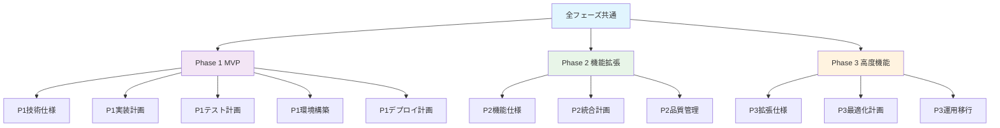
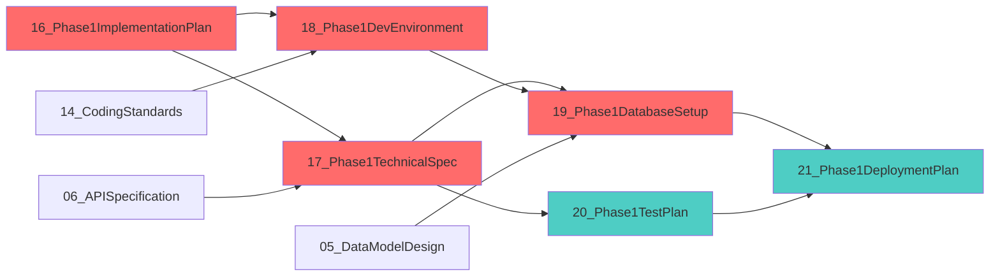

# ERP知識RAGシステム - 開発フェーズごとのドキュメント管理計画

---
doc_type: "phased_document_management"
complexity: "high"
estimated_effort: "継続的管理プロセス"
prerequisites: ["00_ProjectCharter.md", "08_DocumentManagementSystem.md", "09_ImplementationPlan.md"]
implementation_priority: "critical"
ai_assistance_level: "full_automation_possible"
version: "1.0.0"
author: "Claude Code"
created_date: "2025-01-21"
status: "approved"
approval_authority: "Project Stakeholders"
---

## 📋 フェーズ別ドキュメント管理概要

### 管理計画の目的
本文書は「ERP知識RAGシステム（ERPFTS）」の開発フェーズごとに必要なドキュメント体系、管理戦略、更新プロセスを定義する。各フェーズの特性に応じた最適なドキュメント管理により、効率的な開発進行と品質確保を実現する。

### フェーズ別管理基本方針
```yaml
管理原則:
  段階的詳細化: フェーズごとに必要な詳細レベルでの管理
  継続性確保: フェーズ間でのドキュメント整合性維持
  実用性重視: 開発チームが実際に使用する実践的な文書
  品質保証: フェーズゲートでの文書品質確認

更新戦略:
  プロアクティブ: フェーズ開始前の事前準備
  リアルタイム: 開発中の継続的更新
  レトロスペクティブ: フェーズ終了時の振り返り・改善
```

## 🗂️ フェーズ別ドキュメント体系

### 全体ドキュメント分類マトリクス


### フェーズ別ドキュメント要件
```yaml
Phase 0 - 基盤・共通 (14文書):
  完了済み文書:
    - 00_ProjectCharter.md
    - 01_PRD.md
    - 02_SystemArchitecture.md
    - 03_FunctionalRequirements.md
    - 04_NonFunctionalRequirements.md
    - 05_DataModelDesign.md
    - 06_APISpecification.md
    - 07_ProjectManagementPlan.md
    - 08_DocumentManagementSystem.md
    - 09_ImplementationPlan.md
    - 10_ChangeManagementRules.md
    - 11_SecurityDesign.md
    - 12_TestSpecification.md
    - 13_KnowledgeManagementOperations.md
    - 14_CodingStandardsGitWorkflow.md

Phase 1 - MVP (6+文書):
  新規作成必要文書:
    - 16_Phase1ImplementationPlan.md
    - 17_Phase1TechnicalSpecification.md
    - 18_Phase1DevelopmentEnvironmentGuide.md
    - 19_Phase1DatabaseSetupScripts.md
    - 20_Phase1TestPlan.md
    - 21_Phase1DeploymentPlan.md
  
  更新対象文書:
    - 05_DataModelDesign.md (Phase1スキーマ詳細化)
    - 06_APISpecification.md (MVP API仕様詳細化)
    - 12_TestSpecification.md (Phase1テストケース追加)

Phase 2 - 機能拡張 (4+文書):
  新規作成予定文書:
    - 22_Phase2FeatureSpecification.md
    - 23_Phase2IntegrationPlan.md
    - 24_Phase2QualityManagement.md
    - 25_Phase2AutomationPlan.md
  
  更新対象文書:
    - 03_FunctionalRequirements.md (Phase2機能詳細化)
    - 11_SecurityDesign.md (自動化セキュリティ)
    - 13_KnowledgeManagementOperations.md (運用自動化)

Phase 3 - 高度機能 (3+文書):
  新規作成予定文書:
    - 26_Phase3AdvancedFeatures.md
    - 27_Phase3OptimizationPlan.md
    - 28_Phase3OperationsMigration.md
  
  更新対象文書:
    - 02_SystemArchitecture.md (スケーリング・最適化)
    - 04_NonFunctionalRequirements.md (高度パフォーマンス要件)
    - 06_APISpecification.md (公開API仕様完成)
```

## 📊 Phase 1 - MVP ドキュメント詳細計画

### Phase 1 必須ドキュメント一覧
```yaml
実装前準備ドキュメント (Critical):
  16_Phase1ImplementationPlan.md:
    目的: Phase1の6週間実装ロードマップ
    内容: 週別タスク、マイルストーン、成果物定義
    更新頻度: 週次レビュー時
    責任者: プロジェクトマネージャー
  
  17_Phase1TechnicalSpecification.md:
    目的: MVP機能の技術実装仕様
    内容: 文書取り込み、検索、UI の詳細設計
    更新頻度: 設計変更時
    責任者: 技術リード
  
  18_Phase1DevelopmentEnvironmentGuide.md:
    目的: 開発環境の統一的セットアップ
    内容: 環境構築手順、依存関係、設定ファイル
    更新頻度: 環境変更時
    責任者: DevOpsエンジニア

技術基盤ドキュメント (Critical):
  19_Phase1DatabaseSetupScripts.md:
    目的: Phase1用データベース初期化
    内容: DDL、初期データ、マイグレーション
    更新頻度: スキーマ変更時
    責任者: バックエンドエンジニア

品質保証ドキュメント (High):
  20_Phase1TestPlan.md:
    目的: Phase1テスト戦略・実行計画
    内容: MVP機能の包括的テストケース
    更新頻度: 機能追加時
    責任者: QAエンジニア
  
  21_Phase1DeploymentPlan.md:
    目的: Phase1デプロイメント手順
    内容: CI/CD、環境設定、リリース手順
    更新頻度: デプロイ設定変更時
    責任者: DevOpsエンジニア
```

### Phase 1 ドキュメント依存関係


## 🔄 フェーズ管理プロセス

### フェーズゲート管理
```yaml
Phase Gate Process:
  フェーズ開始前 (Phase Entry):
    □ 必要ドキュメント完成度確認
    □ 前フェーズ成果物レビュー完了
    □ チーム準備状況確認
    □ リスク・依存関係確認
    □ 品質ゲート通過承認
  
  フェーズ実行中 (Phase Execution):
    □ 週次進捗レビュー
    □ ドキュメント更新状況確認
    □ 品質メトリクス監視
    □ 変更管理プロセス実行
    □ ステークホルダー報告
  
  フェーズ終了時 (Phase Exit):
    □ 全成果物品質確認
    □ テスト完了・品質基準達成
    □ ドキュメント完全更新
    □ 次フェーズ準備状況確認
    □ 振り返り・改善事項記録

Gate Criteria:
  Documentation Completeness: 100%
  Quality Score: 4.0/5.0 以上
  Test Coverage: 80% 以上
  Stakeholder Approval: 必須
```

### 更新管理プロセス
```python
# ドキュメント更新管理システム
class PhasedDocumentManager:
    def __init__(self):
        self.current_phase = "Phase1"
        self.document_registry = self._load_document_registry()
        self.update_tracker = DocumentUpdateTracker()
    
    async def prepare_phase_documents(self, phase: str):
        """フェーズ開始前のドキュメント準備"""
        phase_docs = self._get_phase_documents(phase)
        
        for doc in phase_docs:
            if doc.status == "template":
                await self._create_from_template(doc)
            elif doc.status == "needs_update":
                await self._schedule_update(doc)
        
        return self._validate_phase_readiness(phase)
    
    async def track_phase_updates(self, phase: str):
        """フェーズ実行中の更新追跡"""
        daily_updates = await self._collect_daily_changes()
        weekly_reviews = await self._schedule_weekly_reviews()
        
        return {
            "completeness": self._calculate_completeness(),
            "quality_score": self._assess_quality(),
            "update_velocity": self._track_velocity(),
            "blocker_count": self._count_blockers()
        }

# Phase1 ドキュメント管理設定
PHASE1_DOCUMENT_CONFIG = {
    "critical_documents": [
        "16_Phase1ImplementationPlan.md",
        "17_Phase1TechnicalSpecification.md", 
        "18_Phase1DevelopmentEnvironmentGuide.md",
        "19_Phase1DatabaseSetupScripts.md"
    ],
    "update_frequency": {
        "daily": ["16_Phase1ImplementationPlan.md"],
        "weekly": ["17_Phase1TechnicalSpecification.md"],
        "as_needed": ["18_Phase1DevelopmentEnvironmentGuide.md"]
    },
    "quality_gates": {
        "week_1": ["environment_setup_complete"],
        "week_3": ["database_schema_finalized"],
        "week_6": ["mvp_deployment_ready"]
    }
}
```

## 📈 品質・完成度管理

### ドキュメント品質メトリクス
```yaml
品質評価基準:
  完全性 (Completeness):
    - 必須セクション記載率: 100%
    - TODO項目残存率: 0%
    - 参照整合性: 100%
    - コード例・設定例: 完備
  
  正確性 (Accuracy):
    - 技術的正確性: レビュー合格
    - 最新性: 1週間以内更新
    - 実装可能性: 実証済み
    - 依存関係整合性: 検証済み
  
  有用性 (Usability):
    - 開発チーム満足度: 4.0/5.0以上
    - 手順実行成功率: 95%以上
    - 問い合わせ削減効果: 測定
    - 検索・発見しやすさ: 評価済み

自動品質チェック:
  - Markdown構文チェック
  - リンク切れ検出
  - 用語統一チェック
  - バージョン整合性確認
  - 必須セクション存在確認
```

### 完成度トラッキング
```python
# Phase1 ドキュメント完成度追跡
class Phase1DocumentTracker:
    def __init__(self):
        self.documents = {
            "16_Phase1ImplementationPlan.md": {
                "status": "in_progress",
                "completion": 0,
                "last_update": None,
                "quality_score": 0.0,
                "blockers": []
            },
            "17_Phase1TechnicalSpecification.md": {
                "status": "pending",
                "completion": 0,
                "dependencies": ["16_Phase1ImplementationPlan.md"]
            }
        }
    
    def calculate_phase_readiness(self):
        """Phase1開始準備度算出"""
        critical_docs = self._get_critical_documents()
        completion_rates = [doc["completion"] for doc in critical_docs]
        quality_scores = [doc["quality_score"] for doc in critical_docs]
        
        return {
            "overall_completion": sum(completion_rates) / len(completion_rates),
            "average_quality": sum(quality_scores) / len(quality_scores),
            "ready_to_start": all(rate >= 80 for rate in completion_rates),
            "blocker_count": sum(len(doc["blockers"]) for doc in critical_docs)
        }

# 週次進捗レポート生成
WEEKLY_PROGRESS_TEMPLATE = """
# Phase1 ドキュメント進捗レポート - Week {week}

## 完成度サマリー
- 全体完成度: {overall_completion}%
- 品質スコア: {quality_score}/5.0
- 完了ドキュメント: {completed_count}/{total_count}

## 今週の更新
{updates_summary}

## 来週の予定
{next_week_plan}

## ブロッカー・課題
{blockers_list}
"""
```

## 🔄 継続的改善プロセス

### フェーズ間での学習・改善
```yaml
改善プロセス:
  Phase終了時振り返り:
    - ドキュメント品質評価
    - 開発効率への貢献度測定
    - チームフィードバック収集
    - 改善提案整理
  
  次Phase計画への反映:
    - ドキュメント テンプレート改善
    - 管理プロセス最適化
    - ツール・自動化改善
    - 品質基準調整

継続的改善項目:
  - ドキュメント作成効率化
  - レビュー プロセス最適化
  - 自動化範囲拡大
  - チーム間連携改善
  - 品質メトリクス精度向上
```

## 🤖 Implementation Notes for AI

### Critical Implementation Paths
1. **Phase1ドキュメント作成**: 6つの必須文書の段階的作成
2. **依存関係管理**: ドキュメント間の整合性確保
3. **品質ゲート実装**: 各マイルストーンでの品質確認
4. **継続的更新**: 開発進行に合わせた文書更新

### Key Dependencies
- **ベースドキュメント**: 既存14文書との整合性
- **開発プロセス**: アジャイル開発との統合
- **品質保証**: テスト戦略との連携
- **変更管理**: Git workflow との統合

### Testing Strategy
- **ドキュメント品質テスト**: 構文、整合性、完全性チェック
- **プロセステスト**: 管理プロセスの有効性検証
- **ユーザビリティテスト**: 開発チームでの実用性評価

### Common Pitfalls
- **過度な詳細化**: 実装前の過剰な詳細記述
- **更新遅延**: 開発進行との同期不備
- **品質低下**: 急ぎでの文書作成による品質妥協
- **依存関係**: ドキュメント間の循環依存

### 実装優先順位
1. **Phase1必須文書**: 16-19番の Critical文書
2. **品質管理システム**: 追跡・評価メカニズム
3. **自動化**: 品質チェック・レポート生成

---

**Version**: 1.0.0 | **Last Updated**: 2025-01-21 | **Next Review**: 2025-02-21