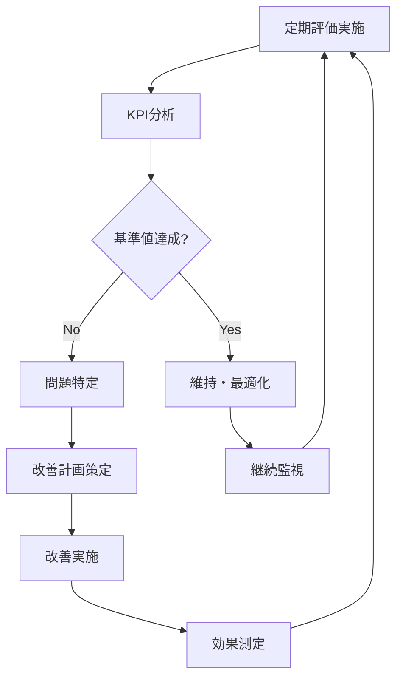

# ERP知識RAG 知識管理・品質保証フレームワーク

## 📚 知識ソース分類・評価基準

### 1. ソース分類マトリクス

| カテゴリ | 信頼度 | 更新頻度 | 管理方式 | 例 |
|----------|--------|----------|----------|-----|
| **Primary Sources** | ★★★★★ | 年次 | 手動更新 | PMBOK Guide, BABOK Guide |
| **Secondary Sources** | ★★★★☆ | 四半期 | 半自動 | 業界レポート, 学術論文 |
| **Expert Content** | ★★★★☆ | 月次 | 自動監視 | 専門家ブログ, 技術記事 |
| **Community Content** | ★★★☆☆ | 週次 | 自動取得 | Stack Overflow, Reddit |
| **Internal Knowledge** | ★★★★★ | 随時 | 手動管理 | 社内文書, プロジェクト成果物 |

### 2. ソース選定基準

#### 2.1 定量的評価基準
```yaml
評価項目:
  権威性: 
    - 著者の専門性・実績
    - 出版社・団体の信頼性
    - 引用数・被参照数
  
  正確性:
    - ファクトチェック可能性
    - 根拠・データの明示
    - 第三者検証の有無
  
  網羅性:
    - カバー範囲の広さ
    - 詳細度・深さ
    - 実践的応用例
  
  時宜性:
    - 発行・更新日
    - 最新動向への対応
    - 将来予測の妥当性
```

#### 2.2 定性的評価基準
```yaml
品質指標:
  読みやすさ: "構造化されており理解しやすい"
  実用性: "実際の業務に適用可能"
  独自性: "他では得られない知見がある"
  バランス: "複数の観点から論じている"
```

## 📋 出典メタデータ管理スキーマ

### 3. ソースメタデータ定義

#### 3.1 基本メタデータ
```json
{
  "source_id": "PMBOK-7th-2021",
  "source_type": "standard_document",
  "title": "A Guide to the Project Management Body of Knowledge (PMBOK Guide) – Seventh Edition",
  "authors": ["Project Management Institute"],
  "publisher": "PMI",
  "publication_date": "2021-08-01",
  "isbn": "9781628256642",
  "language": "en",
  "url": "https://www.pmi.org/pmbok-guide-standards",
  "access_date": "2024-01-15",
  "license": "commercial",
  "access_method": "purchased_copy"
}
```

#### 3.2 品質・評価メタデータ
```json
{
  "quality_assessment": {
    "authority_score": 95,
    "accuracy_score": 90,
    "completeness_score": 85,
    "timeliness_score": 80,
    "overall_score": 87.5,
    "last_reviewed": "2024-01-15",
    "reviewer": "senior_consultant_a",
    "review_notes": "最新版、PMの標準として最高権威"
  },
  "usage_statistics": {
    "retrieval_count": 1250,
    "positive_feedback": 45,
    "negative_feedback": 3,
    "average_rating": 4.2
  }
}
```

#### 3.3 コンテンツメタデータ
```json
{
  "content_metadata": {
    "topics": ["project_management", "methodologies", "frameworks"],
    "domains": ["erp_implementation", "digital_transformation"],
    "difficulty_level": "intermediate",
    "target_audience": ["project_managers", "consultants"],
    "key_concepts": ["agile", "waterfall", "risk_management"],
    "chunk_count": 342,
    "embedding_model": "text-embedding-3-large",
    "last_processed": "2024-01-15T10:30:00Z"
  }
}
```

### 4. 出典トレーサビリティ

#### 4.1 チャンクレベルのトレーサビリティ
```json
{
  "chunk_id": "PMBOK-7th-ch05-p123-chunk-001",
  "source_id": "PMBOK-7th-2021",
  "page_number": 123,
  "section": "5.2 Risk Identification",
  "paragraph": 3,
  "original_text": "Risk identification is an iterative process...",
  "processed_text": "リスク識別は反復的なプロセスである...",
  "confidence_score": 0.92,
  "extraction_method": "pdf_parser_v2.1",
  "processing_timestamp": "2024-01-15T10:35:22Z"
}
```

## 🔄 定期評価・改善サイクル

### 5. 評価スケジュール

| 評価タイプ | 頻度 | 対象 | 責任者 | 成果物 |
|------------|------|------|--------|--------|
| **ソース品質評価** | 四半期 | 全ソース | Knowledge Manager | 品質レポート |
| **利用統計分析** | 月次 | 利用データ | Data Analyst | 利用分析レポート |
| **ユーザーフィードバック** | 週次 | 検索結果 | UX Researcher | フィードバック集計 |
| **技術的品質評価** | 隔週 | システム性能 | Technical Lead | 性能レポート |
| **コンテンツ監査** | 年次 | 全知識ベース | Subject Matter Expert | 監査レポート |

### 6. 評価指標・KPI

#### 6.1 コンテンツ品質指標
```yaml
品質KPI:
  網羅性:
    - ドメインカバレッジ率: ">= 85%"
    - 重要トピック網羅率: ">= 90%"
  
  正確性:
    - ファクトチェック合格率: ">= 95%"
    - 専門家レビュー合格率: ">= 90%"
  
  時宜性:
    - 3年以内のソース比率: ">= 70%"
    - 定期更新実施率: ">= 95%"
  
  利用性:
    - 検索ヒット率: ">= 80%"
    - ユーザー満足度: ">= 4.0/5.0"
```

#### 6.2 システム性能指標
```yaml
性能KPI:
  検索精度:
    - Precision@5: ">= 0.8"
    - Recall@10: ">= 0.7"
    - MRR (Mean Reciprocal Rank): ">= 0.75"
  
  レスポンス:
    - 平均応答時間: "<= 2秒"
    - 95パーセンタイル応答時間: "<= 5秒"
  
  可用性:
    - システム稼働率: ">= 99.5%"
    - エラー率: "<= 0.1%"
```

### 7. 改善プロセス

#### 7.1 品質改善ワークフロー


#### 7.2 コンテンツライフサイクル管理
```yaml
ライフサイクルステージ:
  新規追加:
    - 品質チェック実施
    - メタデータ付与
    - インデックス化
  
  アクティブ:
    - 定期品質確認
    - 利用統計監視
    - ユーザーフィードバック収集
  
  レビュー:
    - 内容の妥当性確認
    - 更新の必要性判断
    - 代替ソース検討
  
  更新:
    - 新バージョン取得
    - 差分分析
    - 段階的リプレース
  
  アーカイブ:
    - 利用停止
    - 履歴保存
    - 代替情報案内
  
  削除:
    - 完全除去
    - 削除ログ記録
    - 影響範囲確認
```

## 📊 知識品質ダッシュボード

### 8. リアルタイム監視

#### 8.1 品質ダッシュボード項目
```yaml
ダッシュボード構成:
  Overview:
    - 総ソース数
    - 総チャンク数
    - 平均品質スコア
    - アクティブソース割合
  
  品質トレンド:
    - 月次品質スコア推移
    - ソース別品質分布
    - 新規追加・削除動向
  
  利用統計:
    - 検索クエリ数
    - ヒット率
    - ユーザー満足度
    - 人気ソースランキング
  
  アラート:
    - 低品質ソース検出
    - 古いソースアラート
    - システム性能異常
    - ユーザークレーム
```

#### 8.2 自動品質チェック
```python
# 自動品質チェックスクリプト例
class QualityChecker:
    def __init__(self):
        self.checks = [
            self.check_freshness,
            self.check_accuracy,
            self.check_completeness,
            self.check_usage_patterns
        ]
    
    def check_freshness(self, source):
        age_days = (datetime.now() - source.last_updated).days
        if age_days > 1095:  # 3年
            return QualityIssue("STALE_CONTENT", severity="medium")
    
    def check_accuracy(self, source):
        if source.fact_check_score < 0.8:
            return QualityIssue("LOW_ACCURACY", severity="high")
    
    def check_completeness(self, source):
        if source.chunk_count < expected_chunks * 0.9:
            return QualityIssue("INCOMPLETE_CONTENT", severity="medium")
```

## 🔧 実装・運用ガイドライン

### 9. ソース管理運用手順

#### 9.1 新規ソース追加プロセス
```
1. ソース評価 (2-3営業日)
   ├── 選定基準との照合
   ├── 品質評価実施
   └── 追加可否判定

2. メタデータ作成 (1営業日)
   ├── 基本情報入力
   ├── 品質スコア算出
   └── タグ・分類設定

3. コンテンツ処理 (1-2営業日)
   ├── テキスト抽出
   ├── チャンク分割
   └── 埋め込み生成

4. 品質確認 (1営業日)
   ├── 検索テスト実施
   ├── 回答品質確認
   └── 本番反映
```

#### 9.2 ソース更新・削除プロセス
```yaml
更新トリガー:
  - 新バージョンリリース
  - 品質スコア低下
  - ユーザーからの指摘
  - 定期レビュー結果

削除基準:
  - 情報の陳腐化
  - 信頼性の問題
  - ライセンス問題
  - 利用率の極端な低下
```

### 10. ガバナンス体制

#### 10.1 責任者・役割分担
```yaml
知識管理委員会:
  委員長: Chief Knowledge Officer
  メンバー:
    - Subject Matter Expert (各ドメイン)
    - Data Quality Manager
    - Technical Lead
    - UX Researcher
    - Legal/Compliance Officer

役割:
  戦略策定: 知識管理方針・基準設定
  品質管理: 定期評価・改善計画策定
  運用監視: 日常的な品質監視・問題対応
  意思決定: ソース追加・削除の最終判断
```

#### 10.2 エスカレーション体制
```
Level 1: 自動検知・システムアラート
   ↓
Level 2: Data Quality Manager対応
   ↓
Level 3: Subject Matter Expert判断
   ↓
Level 4: 知識管理委員会審議
```

## 📈 継続改善の仕組み

### 11. フィードバックループ

#### 11.1 ユーザーフィードバック収集
```yaml
フィードバック方法:
  明示的フィードバック:
    - 回答への星評価
    - 改善提案フォーム
    - 定期ユーザーサーベイ
  
  暗黙的フィードバック:
    - クリック率・滞在時間
    - 検索パターン分析
    - 再検索率
```

#### 11.2 改善優先度付け
```yaml
改善優先度マトリクス:
  高優先度:
    - 安全性・コンプライアンス影響
    - 多数ユーザーに影響
    - 業務クリティカル情報
  
  中優先度:
    - 特定ドメインでの課題
    - 検索精度向上
    - ユーザビリティ改善
  
  低優先度:
    - 微細な品質向上
    - 新機能要望
    - UI/UX改善
```

このフレームワークにより、知識の品質と信頼性を継続的に向上させながら、ユーザーにとって価値のある知識ベースを維持できます。