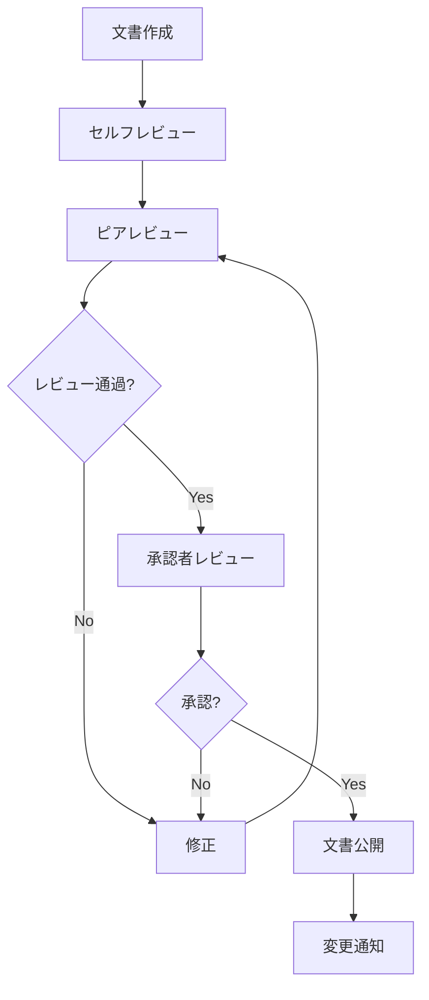

# ERP知識RAG構築 ドキュメント体系・メンテナンスルール

## 📋 必要ドキュメント一覧（優先度順）

### 🏗️ Level 1: 基盤ドキュメント（必須・最優先）

#### 1.1 プロジェクト憲章・概要
```
📄 PRD (Product Requirements Document)
├── プロジェクト目標・KPI
├── ステークホルダーマップ
├── 成功基準・受入条件
└── 制約事項・前提条件

📄 技術選定根拠書
├── アーキテクチャ比較表
├── コスト・性能・保守性評価
├── リスク評価マトリクス
└── 技術スタック決定理由
```

#### 1.2 システム要件定義書
```
📄 機能要件仕様書 (FRS)
├── UC-001: 文書取り込み機能
├── UC-002: 自動分割・チャンク化
├── UC-003: 埋め込み生成・格納
├── UC-004: セマンティック検索
├── UC-005: 自動更新・監視
└── UC-006: RAG回答生成

📄 非機能要件仕様書 (NFR)
├── 性能要件（レスポンス時間、スループット）
├── 可用性・信頼性要件
├── セキュリティ要件
├── 保守性・拡張性要件
└── 運用・監視要件
```

### 🏛️ Level 2: 設計ドキュメント（高優先）

#### 2.1 アーキテクチャ設計書
```
📄 システムアーキテクチャ設計書 (SAD)
├── 全体アーキテクチャ図
├── コンポーネント構成図
├── データフロー図
├── デプロイメント図
└── インフラ構成図

📄 詳細設計書 (DD)
├── クラス設計・モジュール構成
├── API設計仕様
├── データベース設計
├── セキュリティ設計
└── 例外処理・エラーハンドリング設計
```

#### 2.2 データ設計書
```
📄 データモデル設計書
├── 論理データモデル (ERD)
├── 物理データモデル
├── メタデータスキーマ定義
└── ベクトルストア設計

📄 データ処理仕様書
├── ETLパイプライン設計
├── データ変換ルール
├── データ品質管理方針
└── バックアップ・リストア手順
```

### 🔧 Level 3: 実装ドキュメント（中優先）

#### 3.1 開発ガイドライン
```
📄 コーディング規約
├── Python/JavaScript スタイルガイド
├── 命名規則・ディレクトリ構成
├── コメント・ドキュメンテーション規則
└── コードレビュー基準

📄 Git運用ルール
├── ブランチ戦略 (GitFlow)
├── コミットメッセージ規約
├── プルリクエスト規則
└── タグ・リリース管理
```

#### 3.2 API仕様書
```
📄 REST API仕様書 (OpenAPI/Swagger)
├── エンドポイント一覧
├── リクエスト・レスポンス仕様
├── 認証・認可方式
├── レート制限・エラーコード
└── SDKサンプルコード

📄 内部API設計書
├── マイクロサービス間通信
├── 非同期処理・キュー設計
├── イベント駆動アーキテクチャ
└── サーキットブレーカー設計
```

### 🧪 Level 4: 品質保証ドキュメント（中優先）

#### 4.1 テスト仕様書
```
📄 テスト計画書
├── テスト戦略・スコープ
├── テスト環境構成
├── テストデータ準備方針
└── 品質基準・終了条件

📄 テストケース仕様書
├── 単体テスト仕様
├── 統合テスト仕様
├── システムテスト仕様
├── 性能テスト仕様
└── セキュリティテスト仕様

📄 自動テスト設計書
├── Unit Test Strategy
├── Integration Test Framework
├── E2E Test Scenarios
└── CI/CD Pipeline Tests
```

#### 4.2 品質管理文書
```
📄 コード品質管理
├── 静的解析ルール (SonarQube)
├── カバレッジ基準
├── 複雑度・技術債務管理
└── 脆弱性スキャン設定

📄 パフォーマンス管理
├── ベンチマーク基準値
├── モニタリング設定
├── アラート・SLI/SLO定義
└── 最適化ガイドライン
```

### 🔒 Level 5: セキュリティ・コンプライアンス（高優先）

#### 5.1 セキュリティ文書
```
📄 セキュリティ設計書
├── 脅威分析 (STRIDE)
├── 認証・認可アーキテクチャ
├── データ暗号化方針
├── ネットワークセキュリティ
└── API セキュリティ

📄 プライバシー・データ保護
├── 個人情報取扱方針
├── GDPR・個情法対応
├── データ分類・ラベリング
└── データ保持・削除ポリシー
```

### 🚀 Level 6: 運用ドキュメント（中優先）

#### 6.1 デプロイ・運用手順書
```
📄 環境構築手順書
├── 開発環境セットアップ
├── ステージング環境構築
├── 本番環境構築
└── 災害復旧環境

📄 運用手順書
├── 日次・週次・月次作業
├── アップデート・パッチ適用
├── バックアップ・リストア
├── 障害対応プロシージャ
└── 容量管理・スケーリング

📄 監視・アラート設定書
├── システム監視項目
├── ログ収集・分析設定
├── アラート設定・エスカレーション
└── ダッシュボード設計
```

### 📚 Level 7: ユーザードキュメント（低優先）

#### 7.1 利用者向けドキュメント
```
📄 ユーザーマニュアル
├── 基本操作ガイド
├── 検索・フィルタリング方法
├── 高度な使い方・Tips
└── FAQ・トラブルシューティング

📄 管理者マニュアル
├── システム管理画面操作
├── ユーザー・権限管理
├── コンテンツ管理
└── レポート・分析機能
```

## 📋 ドキュメント優先度マトリクス

| カテゴリ | 緊急度 | 重要度 | 作成順序 | Claude Code実装への影響度 |
|----------|--------|--------|----------|---------------------------|
| 要件定義書 | ★★★ | ★★★ | 1 | ★★★ |
| アーキテクチャ設計 | ★★★ | ★★★ | 2 | ★★★ |
| API仕様書 | ★★★ | ★★☆ | 3 | ★★★ |
| データベース設計 | ★★★ | ★★★ | 4 | ★★★ |
| セキュリティ設計 | ★★☆ | ★★★ | 5 | ★★☆ |
| テスト仕様書 | ★★☆ | ★★☆ | 6 | ★★☆ |
| 運用手順書 | ★☆☆ | ★★☆ | 7 | ★☆☆ |
| ユーザーマニュアル | ★☆☆ | ★☆☆ | 8 | ★☆☆ |

## 🔄 ドキュメントメンテナンスルール

### 1. バージョン管理ルール

#### 1.1 バージョニング規則
```
バージョン形式: [Major].[Minor].[Patch]
- Major: 破壊的変更、アーキテクチャ大幅変更
- Minor: 機能追加、非破壊的変更
- Patch: バグ修正、軽微な修正

例: v1.2.3
```

#### 1.2 文書管理規則
```yaml
文書メタデータ:
  - document_id: "REQ-001-FRS"
  - version: "1.2.3"
  - author: "責任者名"
  - created_date: "2024-01-15"
  - last_updated: "2024-03-10"
  - review_date: "2024-04-01"
  - status: "approved|draft|obsolete"
  - dependencies: ["REQ-002", "ARCH-001"]
```

### 2. 更新トリガー・頻度

| ドキュメント種別 | 更新トリガー | 更新頻度 | 責任者 |
|------------------|--------------|----------|--------|
| **要件定義書** | 要件変更時 | 随時 | Product Owner |
| **設計書** | 設計変更時 | 随時 | Tech Lead |
| **API仕様書** | API変更時 | 随時 | Backend Dev |
| **運用手順書** | インフラ変更時 | 月次 | DevOps Engineer |
| **ユーザーマニュアル** | UI/機能変更時 | リリース時 | Frontend Dev |

### 3. レビュー・承認プロセス

#### 3.1 文書レビューマトリクス
```
┌─────────────────┬──────────┬──────────┬──────────┬──────────┐
│ ドキュメント     │ 作成者   │ レビュー │ 承認者   │ 最終確認 │
├─────────────────┼──────────┼──────────┼──────────┼──────────┤
│ 要件定義書       │ BA       │ Tech Lead│ PO       │ Architect│
│ アーキテクチャ   │ Architect│ Senior Dev│Tech Lead │ CTO      │
│ API仕様書        │ Backend  │ Frontend │ Tech Lead│ Architect│
│ セキュリティ設計 │ Security │ DevOps   │ Tech Lead│ CISO     │
│ 運用手順書       │ DevOps   │ SRE      │ Tech Lead│ Ops Mgr  │
└─────────────────┴──────────┴──────────┴──────────┴──────────┘
```

#### 3.2 承認ワークフロー


### 4. 品質基準・チェックリスト

#### 4.1 文書品質基準
```yaml
品質チェック項目:
  完全性:
    - 必須セクションが全て記載されている
    - 前提条件・制約事項が明記されている
    - 依存関係が明確に定義されている
  
  正確性:
    - 技術的内容に誤りがない
    - 最新の仕様・設計と整合している
    - 外部参照が有効である
  
  明確性:
    - 目的・対象読者が明確
    - 専門用語の定義がある
    - 図表が適切に使用されている
  
  保守性:
    - 変更履歴が記録されている
    - 更新しやすい構造になっている
    - 他文書との重複が最小限
```

#### 4.2 自動チェック設定
```yaml
# .github/workflows/docs-quality.yml
name: Documentation Quality Check
on:
  pull_request:
    paths: ['docs/**']

jobs:
  lint-docs:
    runs-on: ubuntu-latest
    steps:
      - uses: actions/checkout@v2
      - name: Markdown Lint
        run: markdownlint docs/
      - name: Link Check
        run: markdown-link-check docs/**/*.md
      - name: Spell Check
        run: cspell "docs/**/*.md"
      - name: Vale Style Check
        run: vale docs/
```

### 5. 文書廃棄・アーカイブルール

#### 5.1 ライフサイクル管理
```
文書ステータス:
  - Draft: 作成中
  - Review: レビュー中
  - Approved: 承認済み・有効
  - Deprecated: 非推奨
  - Obsolete: 廃止・アーカイブ

保持期間:
  - 要件定義書: プロジェクト終了後3年
  - 設計書: プロダクト終了後5年
  - 運用手順書: 更新後1年
  - 会議議事録: 2年
```

### 6. ツール・プラットフォーム

#### 6.1 推奨ドキュメント管理ツール
```yaml
Primary Tools:
  - Notion: 構造化文書・要件管理
  - GitBook: API仕様書・技術文書
  - Confluence: チーム協作・議事録
  - GitHub Wiki: 開発者向け文書
  - Draw.io: 図表・アーキテクチャ図

Integration:
  - GitHub Actions: 自動品質チェック
  - Slack: 更新通知
  - JIRA: 要件トレーサビリティ
```

### 7. Claude Code実装効率化のための特別ルール

#### 7.1 実装者向け情報の必須記載
```markdown
各ドキュメントに以下セクションを必須追加:

## 🤖 Implementation Notes for AI
- **Key Dependencies**: 重要な依存関係
- **Critical Paths**: 失敗しやすい実装ポイント
- **Code Examples**: 実装例・スニペット
- **Testing Strategy**: テスト観点
- **Common Pitfalls**: よくある落とし穴
```

#### 7.2 構造化メタデータ
```yaml
# 各文書にYAMLフロントマターを追加
---
doc_type: "functional_requirement"
complexity: "medium"
estimated_effort: "5-8 hours"
prerequisites: ["ARCH-001", "DB-001"]
implementation_priority: "high"
ai_assistance_level: "full_automation_possible"
---
```

このドキュメント体系により、Claude Codeが効率的かつ正確に実装を進められる環境が整備されます。